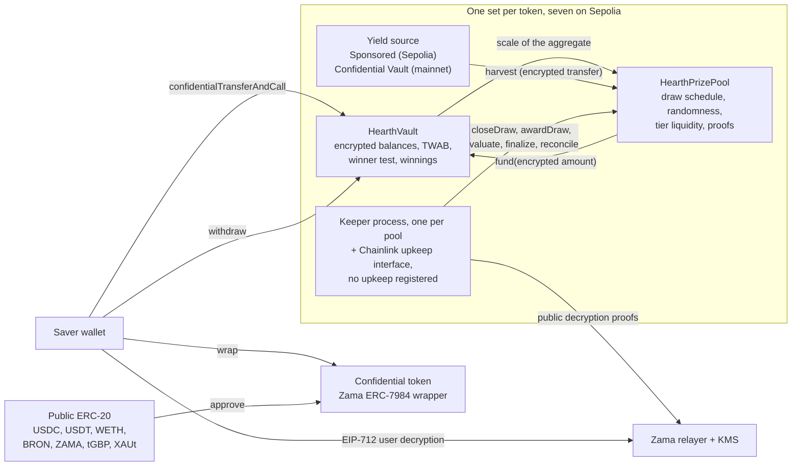

# Hearth என்றால் என்ன

Hearth என்பது உங்கள் பணத்தை இழக்க முடியாத, ஆனால் பரிசு வெல்லக்கூடிய ஒரு சேமிப்புப் பூல். Sepolia மீது
அவற்றில் ஏழு இயங்குகின்றன, ஒரு ரகசிய டோக்கனுக்கு ஒன்று. ஒரு சேமிப்புக் கணக்கைத் தேர்வு செய்வதுபோலவே
டோக்கனைத் தேர்வு செய்கிறீர்கள்.

நீங்கள் ஒரு ரகசிய டோக்கனைப் போடுகிறீர்கள்: USDC, USDT, WETH, BRON, ZAMA, tGBP அல்லது XAUt. அந்தப்
பணத்தை பூல் வேலைக்கு அனுப்பி வருவாய் ஈட்டுகிறது. ஒவ்வொரு
காலகட்டத்திலும் பூல் ஈட்டிய வருவாய் பரிசுகளாக வழங்கப்படுகிறது, நீங்கள் வெல்லும் வாய்ப்பு எவ்வளவு
வைத்திருந்தீர்கள், எவ்வளவு நேரம் வைத்திருந்தீர்கள் என்பதற்கு நேர் விகிதத்தில் இருக்கும். உங்கள் அசலை
எப்போது வேண்டுமானாலும் முழுமையாகத் திரும்பப் பெறலாம். PoolTogether கண்டுபிடித்த "இழப்பில்லா லாட்டரி"
யோசனை அதுதான், Hearth அதன் ரகசிய வடிவம்.

PoolTogether இலிருந்து வேறுபாடு இதுதான்: சாதாரண பிளாக்செயினில் எல்லாமே பொதுவானது. ஒவ்வொரு
சேமிப்பாளரிடமும் எவ்வளவு இருக்கிறது, ஒவ்வொரு வாலட்டின் வாய்ப்புகள் என்ன, ஒவ்வொரு குலுக்கலிலும் யார்
வென்றார்கள் என்பதை யார் வேண்டுமானாலும் படிக்கலாம். அது மக்களின் செல்வத்தை வெளியிடுகிறது, பெரிய தொகை
வைத்திருப்பவர் மீது ஒரு இலக்கை வரைகிறது. Hearth முழுச் செயல்பாட்டையும் Zama இன் Protocol ஐப்
பயன்படுத்தி மறையாக்கப்பட்ட எண்கள் மீது நடத்துகிறது. அதனால் உங்கள் இருப்பை செயின் சைஃபர்டெக்ஸ்ட்டாக
(சாவி இல்லாமல் படிக்க முடியாத தரவு) வைத்திருக்கிறது, ஒப்பந்தம் அதன் மீதே கணக்கீட்டைச் செய்கிறது.
உங்கள் இருப்பு என்பது நாங்கள் உட்பட யாரும் இதுவரை பார்த்திராத ஒரு எண், ஆனாலும் குலுக்கலை ஒரு
அந்நியர் சரிபார்க்க முடியும்.

## அமைப்பு ஒரே படத்தில்

வேலையை இரண்டு ஒப்பந்தங்கள் செய்கின்றன. `HearthVault` ஒவ்வொரு சேமிப்பாளரின் மறையாக்கப்பட்ட அசலையும்,
மறையாக்கப்பட்ட வென்ற தொகையையும், எதை எவ்வளவு நேரம் வைத்திருந்தார்கள் என்ற பதிவையும் வைத்திருக்கிறது,
வெற்றிச் சோதனையையும் நடத்துகிறது. `HearthPrizePool` கடிகாரத்தை இயக்குகிறது, தற்செயல் சீட்டை எடுக்கிறது,
வருவாயைச் சேகரிக்கிறது, பரிசுப் பணத்தை அடுக்குகளில் வைத்திருக்கிறது. ஒரு கீப்பர் செயல்முறை குலுக்கலை
முன்னகர்த்துகிறது, அது எடுக்கும் ஒவ்வொரு படியையும் அதற்குப் பதிலாக வேறு யார் வேண்டுமானாலும் எடுக்கலாம்.

நடுவில் இருக்கும் பெட்டி ஒரு டோக்கனின் பூல். அப்படி ஏழு இருக்கின்றன, அவை எதையும் பகிர்ந்து கொள்வதில்லை:
உங்கள் USDC நிலையும் உங்கள் WETH நிலையும் தனித்தனி வால்ட்களில் இருக்கும் தனித்தனிச் சேமிப்பாளர்கள்,
ஒரு பூல் அமைதியானாலும் மற்றவை இயங்கும். நீங்கள் எந்தப் பூலைப் பார்க்கிறீர்கள் என்பது முகவரிப் பட்டியின்
முதல் பகுதி, `/app/usdc` அல்லது `/app/weth`. முகவரிகளுடன் கூடிய முழுப் பட்டியல்
[பூல்களும் டோக்கன்களும்](../concepts/pools-and-tokens.md) பக்கத்தில்.

## நான்கு நகர்வுகள்

ஒரு சேமிப்பாளர் நான்கு நகர்வுகளைச் செய்கிறார். ஒவ்வொன்றும் என்ன செய்கிறது, என்ன வெளிப்படுத்துகிறது
என்பது இங்கே.

### 1. டெபாசிட்

அந்தப் பூலின் ரகசிய டோக்கனை ஒரே பரிவர்த்தனையில் அதன் வால்ட்டுக்கு அனுப்புகிறீர்கள். தொகை ஒரு
சைஃபர்டெக்ஸ்ட் ஹேண்டிலாகப் பயணிக்கிறது, அதாவது மதிப்பாக அல்லாமல் மறையாக்கப்பட்ட மதிப்பைச் சுட்டும் ஒரு
சுட்டியாக. வால்ட் அதை உங்கள் மறையாக்கப்பட்ட அசலுடன் சேர்த்து, காலப்போக்கில் உங்கள் இருப்பின் பதிவைப்
புதுப்பிக்கிறது, எதையும் மறைநீக்கம் செய்யாமலேயே.

- மறைக்கப்படுவது: தொகை, உங்கள் நடப்பு இருப்பு, அதனால் பூலில் உங்கள் பங்கு.
- பொதுவானது: உங்கள் முகவரி, நீங்கள் அதைச் செய்த பிளாக், ஒரு டெபாசிட் நடந்தது என்ற உண்மை.

ஒரு இணைப்பு உண்டு. சாதாரணப் பொது டோக்கனை ரகசியத் டோக்கனாக மாற்றுவது ஒரு பொது ERC-20 பரிமாற்றம்,
எனவே ரேப் செய்யப்பட்ட தொகை தெரியும். 5,000 USDC ஐ ரேப் செய்து இரண்டு பிளாக்குகள் கழித்து டெபாசிட்
செய்தால், கவனிப்பவரிடம் மிகச் சரியான யூகம் இருக்கும். Hearth ரேப் செய்வதையும் டெபாசிட் செய்வதையும்
வேண்டுமென்றே இரு தனிப் படிகளாக வைத்திருக்கிறது, அப்படியானால் அவற்றுக்கு இடையே தூரம் வைக்கலாம்.
[ரேப் இணைப்பு](../security/what-stays-private.md) பார்க்கவும்.

### 2. குலுக்கல்

ஒவ்வொரு காலகட்டத்தின் முடிவிலும் பூல் அந்தக் காலகட்டத்துக்கான குலுக்கலை மூடுகிறது. ஒரே பரிவர்த்தனையில்
ஒவ்வொரு அடுக்கின் பரிசு அளவையும் நிர்ணயிக்கிறது, பிறகு Zama இன் கோ-ப்ராசஸரின் உள்ளே ஒரு மறையாக்கப்பட்ட
தற்செயல் சீட்டை எடுக்கிறது, பிறகு பூல் எவ்வளவு பெரியது என்று வால்ட்டைக் கேட்கிறது, பிறகு அந்தக்
காலகட்டத்தின் வருவாயைச் சேகரிக்கிறது. வரிசை முக்கியம்: தற்செயல் எண் இருப்பதற்கு முன்பே பரிசுகளின்
அளவு நிர்ணயிக்கப்படுகிறது, எனவே ஒரு சீட்டைப் பார்த்துவிட்டு வெல்வதன் மதிப்பை யாரும் மறுசீரமைக்க முடியாது.

"பூல் எவ்வளவு பெரியது" என்பது வேண்டுமென்றே தெளிவற்றது, அதுதான் வடிவமைப்பு. ஒவ்வொரு சேமிப்பாளரின்
கால எடையிட்ட இருப்பையும் கூட்டிய மொத்தத்தை வால்ட் வெளியிடுவதில்லை. அந்த மொத்தம் விழும் இரண்டின்
அடுக்கு அளவுக் கட்டத்தை மட்டுமே வெளியிடுகிறது. எனவே உலகம் அறிவது பூலின் சரியான அளவு அல்ல, தோராயமான
அளவு. சரியான எண்ணை வெளியிட்டால், தொடர்ச்சியான இரு குலுக்கல்களைக் கழித்து ஒரே ஒரு சேமிப்பாளரின்
டெபாசிட்டை அந்த வித்தியாசத்திலிருந்து படித்துவிட முடியும்.

பிறகு நான்கு சிறிய மதிப்புகள் Zama இன் சாவி மேலாண்மைச் சேவையின் சாவியால் கையொப்பமிடப்பட்ட ஆதாரத்துடன்
வெளியே வருகின்றன, அதனால் யார் வேண்டுமானாலும் அவற்றைச் சரிபார்க்கலாம்: சீட், அளவுக் கட்டம், பூலில்
யாராவது இருந்தார்களா என்பது, சேகரிக்கப்பட்ட வருவாய். அந்த எண்கள் சரிபார்க்கப்படும் தருணத்தில் அந்தக்
குலுக்கலுக்கான ஒவ்வொரு சேமிப்பாளரின் முடிவும் நிர்ணயமாகிவிடுகிறது.

- மறைக்கப்படுவது: ஒவ்வொரு தனிச் சேமிப்பாளரின் எடை, பூலின் சரியான மொத்தம், ஒவ்வொரு தனி முடிவும்.
- பொதுவானது: சீட், அளவுக் கட்டம், சேகரிக்கப்பட்ட வருவாய், ஒவ்வொரு அடுக்கின் பரிசு அளவு, மேலும் ஓர்
  அடுக்கு சரிக்கட்டும்போது ஒரு குலுக்கல் கழித்து, அது எத்தனை பரிசுகள் வழங்கியது என்பது.

### 3. கிளெய்ம்

கிளெய்ம் பரிவர்த்தனை என்று ஒன்று இல்லை, அதுதான் விஷயம். "என் குலுக்கல்கள்" பகுதியில் அந்தக் குலுக்கலின்
அட்டையில் ஒரு கிளெய்ம் பொத்தான் செயலியில் இருக்கிறது, அது தொகையையும் காட்டுகிறது: அது நீங்கள்
திறந்துபார்த்த வென்ற தொகைக்கான ஒரு சாதாரணத் திரும்பப் பெறுதல், செயினில் அது வேறெந்தத் திரும்பப்
பெறுதலைப் போலவே தெரியும்.

குலுக்கல் மதிப்பிடப்படும்போது வென்ற தொகை வால்ட்டுக்குள் ஒரு தனி மறையாக்கப்பட்ட இருப்பில்
வரவு வைக்கப்படுகிறது. அது நடக்க நீங்கள் எதுவும் செய்யத் தேவையில்லை, நீங்கள் செய்யும் எதுவும் அதை
வெளிப்படுத்துவதுமில்லை. நீங்கள் வென்றீர்களா என்று தெரிந்துகொள்ள ஒரு EIP-712 செய்தியில் கையொப்பமிடுகிறீர்கள்.
அது உங்கள் முகவரி உங்களுடையது என்பதை நிரூபிக்கும், செயினுக்கு வெளியே வகைப்படுத்தப்பட்ட கையொப்பம். பிறகு
Zama இன் ரிலேயர் உங்கள் சொந்த வென்ற தொகையின் வெளிப்படை மதிப்பை உங்கள் உலாவிக்குத் திருப்பி அனுப்புகிறது.
அந்தக் கையொப்பம் செயினைத் தொடுவதே இல்லை, எனவே அதற்கு எந்தச் செலவும் இல்லை, எந்தத் தடயமும் இல்லை.
டாஷ்போர்டில் உங்கள் இருப்பும் ஒரு குலுக்கலின் முடிவும் தனித்தனிக் கண்களைக் கொண்டவை, இரண்டையும் ஒரே
நேரத்தில் திறந்து வைக்கலாம், முதலாவதின் கையொப்பமே இரண்டாவதுக்கும் உதவும்.

- மறைக்கப்படுவது: எல்லாமே. உங்கள் சொந்த வென்ற தொகையைப் படிப்பது செயினுக்கு வெளியேயான ஒரு செயல்.
- பொதுவானது: எதுவுமில்லை.

பெரும்பாலான பரிசு நெறிமுறைகளில் வென்றவர் ஒரு கிளெய்ம் பரிவர்த்தனையை அனுப்ப வேண்டும், தோற்றவருக்கு
அதற்கு எந்தக் காரணமும் இல்லை. எனவே பரிவர்த்தனைப் பட்டியல் அமைதியாக வென்றவர்களைப் பெயர் சொல்லிக்
காட்டிவிடுகிறது. Hearth இல் அப்படி அனுப்ப ஒரு பரிவர்த்தனையே இல்லை. பரிசுகளை வரவு வைக்கும் பரிவர்த்தனையான
`evaluate` ஐ உங்களை நோக்கிக் குறிவைக்க முடியாது: அது அந்தக் குலுக்கலின் சொந்த சீட் தீர்மானிக்கும்
புள்ளியிலிருந்து சேமிப்பாளர் பட்டியலில் நடக்கிறது, அழைப்பவர் எவ்வளவு தூரம் முன்னேற்ற வேண்டும் என்பதை
மட்டுமே சொல்கிறார்.

### 4. திரும்பப் பெறுதல்

ஒரே ஒரு செயல்பாடு பணத்தை வெளியே எடுக்கிறது: `withdraw`. அது முதலில் உங்கள் வென்ற தொகையிலிருந்தும்,
பிறகு உங்கள் அசலிலிருந்தும் செலுத்துகிறது, நீங்கள் வைத்திருப்பதிலும் வால்ட் வைத்திருப்பதிலும் எது
சிறியதோ அதற்குள் அடக்குகிறது. நீங்கள் பரிசைப் பெறுகிறீர்களா, சேமிப்பை வீட்டுக்கு எடுத்துச்
செல்கிறீர்களா, அல்லது இரண்டுமா, எதுவானாலும் அது ஒரே வடிவம் கொண்ட ஒரே அழைப்பு, ஒரே நிகழ்வு, ஒரு
மறையாக்கப்பட்ட தொகை.

அந்த அடக்கத்தின் இரண்டாம் பாதி இருப்பதற்குக் காரணம், ஒரு ரகசியப் பரிமாற்றம் முழுத் தொகையை நகர்த்தும்
அல்லது எதையுமே நகர்த்தாது. கேட்டதில் ஒரு பகுதியை அது ஒருபோதும் அனுப்பாது. எனவே வால்ட், டோக்கனிடம்
செலுத்தச் சொல்வதற்கு முன்பே தன்னால் உண்மையில் என்ன செலுத்த முடியும் என்பதைக் கணக்கிடுகிறது,
பின்னால் பற்றாக்குறையைச் சரிசெய்ய முயல்வதில்லை.

- மறைக்கப்படுவது: தொகை, அதில் ஏதேனும் பரிசுப் பணமா என்பது.
- பொதுவானது: உங்கள் முகவரி, பிளாக், ஒரு திரும்பப் பெறுதல் நடந்தது என்ற உண்மை.

உங்கள் அசல் ஒருபோதும் பூட்டப்படுவதில்லை. ஒரு குலுக்கல் நடந்துகொண்டிருக்கும்போதும் டெபாசிட்களும்
திரும்பப் பெறுதல்களும் திறந்தே இருக்கின்றன, இந்தத் துறையின் பல வடிவமைப்புகளில் அது உண்மை இல்லை.

## இதை நியாயமாக்குவது எது

இரண்டு விஷயங்கள், இரண்டையும் சிறப்பு அணுகல் இல்லாத ஓர் அந்நியர் சரிபார்க்க முடியும்.

தற்செயல் சீட் `FHE.randEuint64` இலிருந்து வருகிறது. அது Zama இன் கோ-ப்ராசஸருக்குள், நெட்வொர்க்கின்
FHE சாவியின் கீழ், ஒரு பொது சீட்டிலிருந்து உருவாக்கப்படுகிறது. அதை யாரும் முன்கூட்டியே கணிக்க முடியாது,
இரண்டு முறை எடுக்கவும் முடியாது: ஒரு குலுக்கலை மூடுவது சரியாக ஒரே ஒரு முறை மட்டுமே வெற்றி பெறும்.
காலகட்டம் முடிந்ததும், பூலின் மொத்தம் விழுந்த அளவுக் கட்டத்துடன் சேர்த்து அந்தச் சீட்டைப் பூல்
வெளியிடுகிறது, இரண்டுமே ஒப்பந்தம் செயினில் சரிபார்க்கும் ஆதாரத்தைச் சுமந்து வருகின்றன.

அந்த இரண்டு பொது எண்களிலிருந்து, எந்த முகவரி எந்த அடுக்கில் எந்த வரம்பைத் தாண்ட வேண்டியிருந்தது
என்பதை யார் வேண்டுமானாலும் மீண்டும் கணக்கிடலாம். வேறொரு அமலாக்கத்தை யாரும் நம்ப வேண்டியதில்லை
என்பதற்காக, அதே கணக்கீட்டை வால்ட் ஒரு view ஆகவும் வெளிப்படுத்துகிறது. அவர்களால் செய்ய முடியாதது,
அதனுடன் ஒப்பிடப்பட்ட மறையாக்கப்பட்ட எடையைப் பார்ப்பது. எனவே விதி பொதுவானது, தணிக்கை செய்யக்கூடியது,
உள்ளீடு மட்டுமே ரகசியம். விவரங்கள்
[தற்செயல் எண்ணும் சரிபார்ப்பும்](../security/randomness-and-verification.md) பக்கத்தில்.

## Hearth எதை மறைக்கவில்லை

சுருக்கமாக, முழுமையாக [எது ரகசியமாக இருக்கிறது](../security/what-stays-private.md) பக்கத்தில்:

- சேமிப்பாளர்கள் யார், அவர்களில் ஒவ்வொருவரும் எப்போது டெபாசிட் செய்தார்கள், திரும்பப் பெற்றார்கள்,
  மதிப்பிடப்பட்டார்கள் என்பது.
- ஒவ்வொரு காலகட்டத்திலும் பூலின் மொத்தம் விழுந்த அளவுக் கட்டம், சீட், சேகரிக்கப்பட்ட வருவாய்.
- ஒவ்வொரு அடுக்கின் பரிசு அளவு, ஒரு குலுக்கல் கழித்து வெளியிடப்படும் அது வழங்கிய பரிசுகளின் எண்ணிக்கை.
- ரகசியத் டோக்கனுக்குள் நீங்கள் ரேப் செய்த, அல்லது வெளியே அன்ரேப் செய்த தொகை.
- ஒரே ஒரு சேமிப்பாளர் இருந்தால், வெளியிடப்பட்ட அளவுக் கட்டமே அந்தச் சேமிப்பாளரின் எடை, இரண்டு மடங்குக்குள்
  சரியாக. இரண்டு பேர் இருந்தால், ஒவ்வொருவரும் மற்றவரின் அளவை வரையறுக்கலாம். இங்கே தனியுரிமைக்கு மூன்று
  அல்லது அதற்கு மேற்பட்ட சேமிப்பாளர்கள் தேவை, செயலி அதைச் சொல்கிறது.
- வரம்புகள் பொதுவானவை, எனவே உங்கள் இருப்பை முடக்கிப் பிடிக்கக்கூடிய யாரும் ஒவ்வொரு குலுக்கலிலும் உங்கள்
  முடிவைக் கணக்கிட முடியும். அது நடக்கும் வழக்கமான வழி, ரேப் செய்துவிட்டு சில நிமிடங்களில் அதே தொகையை
  டெபாசிட் செய்வது. அதனால்தான் செயலி இரண்டையும் தள்ளி வைக்கிறது.
- முழுமையாக ரேப் செய்து முழுமையாக அன்ரேப் செய்வது, நீங்கள் இதுவரை வென்ற எல்லாவற்றுக்கும் ஒரு கீழ்
  வரம்பை வெளியிடுகிறது, ஏனெனில் டோக்கன் அடுக்கில் இரு நகர்வுகளும் பொதுவானவை.
- வென்ற ஒவ்வொரு குலுக்கலுக்கும் பிறகு உடனே திரும்பப் பெறும் ஒரு சேமிப்பாளர், தன் சொந்த நடத்தையால்
  ஒரு புள்ளியியல் குறிப்பைக் கசியவிடுகிறார். அதை எந்த ஒப்பந்தமும் சரிசெய்ய முடியாது.
