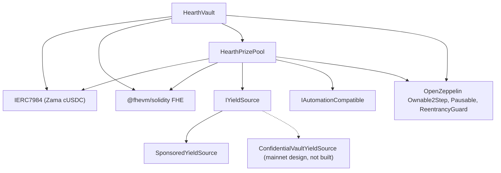

# டெப்ளாய் செய்தல்

மீண்டும் மீண்டும் இயக்கக்கூடிய ஒரே ஒரு ஸ்கிரிப்ட், கையால் கிளிக் செய்வது ஒருபோதும் இல்லை. டெப்ளாய்
செய்யப்பட்ட கன்ஸ்ட்ரக்டர் வாதங்களைப் படிக்கும் ஒரு மறுஆய்வாளர், அவை பொருந்துகின்றன என்று அறியும்படி,
வரிசையும், அளவுருக்களும், ஒவ்வொன்றின் பொருளும் இந்தப் பக்கத்தில்.

Hearth ஒரு ரகசிய டோக்கனுக்கு ஒரு பூலைத் டெப்ளாய் செய்கிறது: ஒரு டோக்கனுக்கு ஒரு வால்ட், ஒரு பரிசுப்
பூல், ஒரு வருவாய் மூலம், வேறெந்தப் பூலுடனும் எதையும் பகிராமல். ஒரு டெப்ளாயர் நான்ஸ் ஒரு டெப்ளாயை
இயக்குவதால், ஒரு ஓட்டம் ஒரு பூலைத் திறக்கிறது, டோக்கன் `HEARTH_TOKEN` ஆல் தேர்வு செய்யப்படுகிறது.
அதற்குப் பிறகு ஒவ்வொரு பணியும் `--token` ஐ எடுக்கிறது:

```
cd packages/contracts
HEARTH_TOKEN=weth npx hardhat deploy --network sepolia
npx hardhat hearth:verify  --network sepolia --token weth
npx hardhat hearth:seed    --network sepolia --token weth
npx hardhat hearth:status  --network sepolia --token weth
```

இரண்டையும் விட்டுவிட்டால் நெட்வொர்க்கின் இயல்புத் டோக்கனான `usdc` கிடைக்கும். தெரியாத ஒரு ஸ்லக்,
அந்த நெட்வொர்க்கில் இருக்கும் பூல்களின் பட்டியலுடன் தோற்கிறது. ஒவ்வொரு பூலின் அளவுருக்களும் ஒரே
கோப்பில், `packages/contracts/hearth.config.ts` இல் இருக்கின்றன: சொத்து ஜோடி, காலகட்டம், அடுக்குத்
தொகுப்பு, தொடக்க அளவுக் கட்டம், சொட்டு விகிதம், நிதியுதவி, ஐந்து டெமோ தொகைகள், அதன் கீப்பர் கையொப்பமிடும்
கணக்கு எண். கீழுள்ள அட்டவணைகளுக்கு அருகிலேயே அந்தக் கோப்பைப் படியுங்கள்; அவை அதே எண்கள்.

ஏற்கெனவே ஒரு சேமிக்கப்பட்ட டெப்ளாய்மென்ட் இருக்கும் எந்த ஒப்பந்தத்தையும் டெப்ளாய் மாற்றாமல் மீண்டும்
பயன்படுத்துகிறது, எனவே இரண்டாவது ஓட்டம் எதுவும் செய்யாது. சேமிப்பாளர்களின் பணத்தையும் பல நாட்களின்
குலுக்கல் வரலாற்றையும் வைத்திருக்கும் ஒரு நேரடிப் பூலை, ஸ்கிரிப்டை மீண்டும் இயக்குவதன் மூலம் ஒரு புதிய
முகவரிக்கு ஒருபோதும் நகர்த்த முடியாது. ஒன்றை வேண்டுமென்றே மாற்ற, முதலில் `deployments/<network>/` இன்
கீழ் அதன் கோப்பை நீக்குங்கள்.

அது `deployments/sepolia/hearth.<slug>.json` ஐ எழுதுகிறது, அதுதான் `HEARTH_ADDRESSES_FILE` ஆல் ஒரு
கீப்பர் சுட்டப்படுவது, அதிலிருந்தே செயலியின் பூல் பட்டியல் உருவாக்கப்படுகிறது.

## எது எதைச் சார்ந்திருக்கிறது



தொடர்ச்சியான விளிம்புகள் இந்தக் களஞ்சியத்தில் இருக்கும் ஒப்பந்தங்கள். புள்ளியிட்ட முனை மெயின்நெட் வருவாய்
வழி: அடாப்டர் Zama இன் வெளியிடப்பட்ட பேட்ச்சர் இடைமுகத்துக்கு எதிராக விவரிக்கப்பட்டுள்ளது, இங்கே எந்த
அடாப்டர் ஒப்பந்தமும் எழுதப்படவில்லை, எனவே கீழே `SponsoredYieldSource` மட்டுமே டெப்ளாய் செய்யப்படுகிறது.

வால்ட்டுக்கும் பூலுக்கும் ஒன்று மற்றொன்று தேவை, எனவே இரு இணைப்புகளில் ஒன்று ஒரு கன்ஸ்ட்ரக்டரில்
அல்லாமல் டெப்ளாய்மென்ட்டுக்குப் பிறகு செய்யப்படுகிறது. அதனால்தான் கீழே மூன்று அல்ல, ஐந்து படிகள்
இருக்கின்றன.

## வரிசை

| படி | செயல் | ஏன் இங்கே |
| --- | --- | --- |
| 1 | `HearthVault` ஐத் டெப்ளாய் செய்யுங்கள் | அது சேமிப்பாளர்களின் பணத்தை வைத்திருக்கிறது, டோக்கன் இருப்பதைத் தவிர அதற்கு எதுவும் தேவையில்லை. |
| 2 | வால்ட்டைச் சுட்டி `HearthPrizePool` ஐத் டெப்ளாய் செய்யுங்கள் | பூல் வால்ட்டின் கடிகாரத்தையும் அளவு எண்ணிக்கையையும் படிக்கிறது, வால்ட்டுக்குச் செலுத்துகிறது. |
| 3 | இணைப்பு: `vault.setPrizePool(pool)` | `PrizePoolSet` ஐ வெளியிடுகிறது. இந்த முகவரியிலிருந்து மட்டுமே வால்ட் நிதியளிப்பை ஏற்கும். |
| 4 | பூலைப் பெறுநராகச் சுட்டி வருவாய் மூலத்தைத் டெப்ளாய் செய்யுங்கள் | அறுவடைகளை எங்கே அனுப்புவது என்று அதற்குத் தெரிய வேண்டும். |
| 5 | இணைப்பு: `pool.setYieldSource(source)` | `YieldSourceSet` ஐ வெளியிடுகிறது. இது நடக்கும் வரை ஒரு மூடுதல் எதையும் அறுவடை செய்யாமல் `HarvestFailed` ஐ வெளியிடும். |

படி 5 க்குப் பிறகு பூலை விதையுங்கள்: `hearth:seed --token <slug>` பரிசுகள் இருக்கும்படி வருவாய்
மூலத்துக்கு நிதியுதவி செய்து, கணக்குகள் 2 முதல் 6 வரையிலிருந்து வெவ்வேறு அளவுகளில் ஐந்து டெமோ
சேமிப்பாளர்களைச் சேர்க்கிறது, அதனால் முதல் பார்வையாளர் காலியான ஒரு பூலில் அல்ல, நிரம்பிய ஒரு பூலில்
இறங்குகிறார். அதன் ஒவ்வொரு படியும் ஏற்கெனவே என்ன செய்யப்பட்டிருக்கிறது என்று செயினைச் சரிபார்க்கிறது,
எனவே ஒரு ரிலேயர் இடையூறால் தடைபட்ட ஒரு விதைப்பை மீண்டும் இயக்குவது பாதுகாப்பானது.

அந்தப் பூலின் கீப்பருக்கும் அதற்கே உரிய Sepolia ETH தேவை, ஐந்து டெமோ சேமிப்பாளர்களுக்கும் அப்படியே:

```
npx hardhat hearth:spread-gas --network sepolia --token weth
npx hardhat hearth:spread-gas --network sepolia --keepers 10,11,12,13,14,15 --savers false
```

முதலாவது ஒரு பூலின் கீப்பருக்கும் சேமிப்பாளர்களுக்கும் நிதியளிக்கிறது; இரண்டாவது ஒரே சுற்றில் பல கீப்பர்
கணக்குகளுக்கு நிதியளிக்கிறது, ஆறு பூல்களை ஒரே நேரத்தில் திறக்க அதுவே தேவை.

பிறகு டெப்ளாய் செய்யப்பட்டதை நோக்கிச் செயலியைச் சுட்டுங்கள்:

```
cd ../web
node scripts/sync-pools.mjs
```

## அளவுருக்கள்

```
HearthVault(IERC7984 asset, uint256 periodLength, uint256 firstPeriodAt, address owner)
HearthPrizePool(IHearthVault vault, IERC7984 asset, Tier[3] tiers, uint8 initialScaleBits, address owner)
    Tier = { uint32 prizeCount; uint64 oddsNumerator; uint64 oddsDenominator; uint16 shares; uint16 reconcileEvery }
SponsoredYieldSource(IERC7984ERC20Wrapper asset, address recipient, uint64 ratePerSecond, address owner)
```

### HearthVault

| அளவுரு | பொருள் | தவறாக அமைத்தால் |
| --- | --- | --- |
| `asset` | சேமிப்பாளர்கள் டெபாசிட் செய்யும் ERC-7984 ரகசியத் டோக்கன், Zama இன் ஏழில் ஒன்று. | ஒவ்வொரு ரேப்பரும் ஆறு தசம இடங்களைக் காட்டுகிறது, கட்டமைப்புடன் செயின் ஒத்துப்போகாவிட்டால் டெப்ளாய் தொடர மறுக்கிறது. அடியில் இருக்கும் பொது டோக்கனுக்கான விகிதம் ஒவ்வொரு பூலிலும் 1 அல்ல: 18 தசம இட WETH மாக்கில் அது ஒரு மில்லியன் மில்லியன், எனவே பொது டோக்கனைப் படிக்கும் எதுவும் அதைப் பயன்படுத்த வேண்டும். |
| `periodLength` (`L`) | ஒரு காலகட்டத்தில் வினாடிகள். மாற்ற முடியாதது. | ஒரு சேமிப்பாளருக்கான உச்சவரம்பையும் இது நிர்ணயிக்கிறது, `(2^64 - 1) / L`. `L` மிகச் சிறியதென்றால் உச்சவரம்பு பெரிது ஆனால் குலுக்கல்கள் சத்தமானவை; மிகப் பெரியதென்றால் உச்சவரம்பு இறுகுகிறது. |
| `firstPeriodAt` | காலகட்டம் 1 தொடங்கும் நேர முத்திரை. மாற்ற முடியாதது, டெப்ளாய்மென்ட்டில் அல்லது அதற்கு முன் இருக்க வேண்டும். | எதிர்கால ஒரு மதிப்பு, அது கடக்கும் வரை `period(now)` ஐ வரையறுக்கப்படாததாக ஆக்குகிறது. |
| `owner` | இரு படி உரிமையாளர். கைவிடுதல் முடக்கப்பட்டிருக்கிறது. | அதிகாரங்கள் [அச்சுறுத்தல் மாதிரி](../security/threat-model.md) இல் பட்டியலிடப்பட்டுள்ளன. |

`maxPrincipal` அமைக்கப்படுவதில்லை, `periodLength` இலிருந்து பெறப்படுகிறது. ஒரு மணி நேரத்தில் அது சுமார்
5 பில்லியன் டோக்கன்கள், ஆறு மணி நேரத்தில் சுமார் 854 மில்லியன், ஒரு நாளில் சுமார் 213 மில்லியன்.

கடிகாரம் வால்ட்டுக்குச் சொந்தம். பூல் வால்ட் முகவரியை எடுத்து அதிலிருந்து காலகட்டங்களைப் படிக்கிறது,
எனவே எந்தக் காலகட்டம் என்பதில் இரு ஒப்பந்தங்களும் முரண்பட வழியே இல்லை.

### HearthPrizePool

| அளவுரு | பொருள் |
| --- | --- |
| `vault` | இந்தப் பூல் சேவை செய்யும் வால்ட், அது படிக்கும் கடிகாரம். |
| `asset` | வால்ட் பயன்படுத்தும் அதே ரகசியத் டோக்கன். அவை பொருந்த வேண்டும். |
| `prizeCount[t]` | அடுக்கு `t` இல் ஒரு குலுக்கலுக்கான பரிசுகள். |
| `oddsNumerator[t]`, `oddsDenominator[t]` | அடுக்கின் வாய்ப்பு ஒரு பின்னமாக, `oddsDenominator / oddsNumerator` குலுக்கல்களில் ஒன்று. |
| `shares[t]` | ஒவ்வொரு அறுவடையிலும் அடுக்கின் பங்கு. பங்குகள் ஒப்பீட்டளவிலானவை, எனவே 40/20/40 உம் 2/1/2 உம் ஒன்றே. |
| `reconcileEvery[t]` | அந்த அடுக்கின் கேரி வெளியிடப்படுவதற்கு இடையே எத்தனை குலுக்கல்கள் கடக்கின்றன. |
| `initialScaleBits` | முதல் காலகட்டத்தின் மொத்த எடையின் எதிர்பார்க்கப்படும் பிட் நீளம், அளவுக் கட்டக் கண்காணிப்பானின் தொடக்க யூகம். |
| `owner` | மேலே சொன்னபடி. |

`UTILISATION` ஒரு வாதம் அல்ல, ஒரு மாறிலி: 50 சதவீதம், PoolTogether V5 ஐப் பின்பற்றி. ஒவ்வொரு பரிசின்
அளவை நிர்ணயிக்க ஓர் அடுக்கின் வெளிப்படை நிதி இருப்பில் பயன்படுத்தப்படும் பின்னம் அது.

அவற்றில் இரண்டுக்கு ஒரு வார்த்தை தேவை.

`reconcileEvery` ஒரு கேஸ் அமைப்பு அல்ல, ஒரு தனியுரிமை அமைப்பு, அது பரிசுக் குவியல் எப்படித் தெரிகிறது
என்பதற்கு எதிராக ஈடுகொடுக்கிறது. ஓர் அடுக்கின் கேரியை வெளியிடுவது அந்த அடுக்கின் பரிசு எண்ணிக்கையைப்
பொதுவாக்குகிறது, ஒரு குலுக்கலுக்கான ஓர் எண்ணிக்கை, அந்தக் குலுக்கலில் தகுதி பெற்ற சிறு தொகுப்பைச்
சுட்டுகிறது. அதை உயர்த்துவது, ஏறக்குறைய எல்லாரும் ஏதோ ஒரு தருணத்தில் தகுதி பெற்றிருந்த ஓர் இடைவெளியில்
எண்ணிக்கையைப் பரப்புகிறது. அதன் விலை கண்ணுக்குத் தெரியும் ஜாக்பாட்: ஒரு மூடுதல் ஓர் அடுக்கின் பொது நிதி
இருப்பு முழுவதையும் குலுக்கலுக்குள் நகர்த்துகிறது, அது ஒரு சரிக்கட்டலில் மட்டுமே திரும்பி வருகிறது,
எனவே 24 இடைவெளியில் இருக்கும் ஓர் அடுக்கு, 24 இல் 23 குலுக்கல்களில் ஒரு குலுக்கலின் அறுவடைப் பங்கிலிருந்து
அளவிடப்பட்ட ஒரு பரிசை வெளியிடுகிறது, திரட்டப்பட்ட குவியல் சரிக்கட்டல் குலுக்கலில் மட்டுமே வெளிச்சத்துக்கு
வருகிறது. மறையாக்கப்பட்ட கேரிக்குள் அந்தப் பணம் முழு நேரமும் முன்வைக்கப்பட்டு வெல்லக்கூடியதாகவே
இருக்கிறது; அது கண்ணுக்குத் தெரிவதில்லை, அவ்வளவே. அந்தக் காரணத்துக்காகவே Sepolia மூன்று அடுக்குகளையும்
1 இல் இயக்கி, ஒரு குலுக்கல் வாரியான எண்ணிக்கையை ஓர் எஞ்சிய கசிவாகச் சொல்கிறது. வரம்பு 14 பார்க்கவும்.

`initialScaleBits` அருகில் இருந்தால் போதும். ஒவ்வொரு மூடுதலிலும் நடப்பு யூகத்தைச் சுற்றியிருக்கும் ஐந்து
இரண்டின் அடுக்குகளுடன் நிஜமான மொத்தத்தைக் கண்காணிப்பான் ஒப்பிட்டு, ஒரு குலுக்கலுக்கு மூன்று பிட்டுகள்
வரை தன்னைத் திருத்திக்கொள்கிறது, எனவே சில பிட்டுகள் விலகிய ஒரு யூகம், சற்று தவறாக அளவிடப்பட்ட
வாய்ப்புகளுடன் ஒன்றிரண்டு குலுக்கல்களைச் செலவழித்து, பிறகு நிலைத்துவிடுகிறது.

### SponsoredYieldSource

| அளவுரு | பொருள் |
| --- | --- |
| `asset` | அது வைத்திருந்து அனுப்பும் ERC-7984 ரேப்பர். நிதியுதவியாளர்கள் செலுத்தும் பொது டோக்கன் ரேப்பரின் சொந்த அடிப்படைத் டோக்கனே, எனவே அது தனி வாதம் அல்ல. |
| `recipient` | அறுவடைகளைப் பெறும் பரிசுப் பூல். |
| `ratePerSecond` | நிதியுதவி பெற்ற இருப்பு எவ்வளவு வேகமாக வருவாயாகச் சொட்டுகிறது. |
| `owner` | விகிதத்தை அமைக்கிறது, `RateChanged` ஐ வெளியிடுகிறது. |

நிதியுதவி செய்வது ஒரு கன்ஸ்ட்ரக்டர் வாதம் அல்ல, டெப்ளாய்மென்ட்டுக்குப் பிறகான ஒரு தனி அழைப்பு.
நிதியுதவியாளர் கேட்டதை அல்ல, ரேப்பர் மின்ட் செய்ததைச் சரியாக அது பதிவு செய்கிறது, அதைத் திரும்பப் பெற
முடியாது.

## மூன்று அளவுருத் தொகுப்புகள்

பூல்கள் இரு கடிகாரங்களில் இயங்குவதால், Sepolia அவற்றில் இரண்டை இயக்குகிறது.

| அமைப்பு | Sepolia `usdc` | Sepolia, மற்ற ஆறு | மெயின்நெட், வேட்பாளர் |
| --- | --- | --- | --- |
| காலகட்ட நீளம் | 1 மணி நேரம் | 6 மணி நேரம் | 1 நாள் |
| சாளரம் | 2 மணி நேரம் (இரு காலகட்டங்கள்) | 12 மணி நேரம் | 2 நாட்கள் |
| மூடும் கெடு | காலகட்டம் முடிந்து 1 மணி 30 நிமிடம் | முடிந்து 9 மணி நேரம் | முடிந்து 1 நாள் 12 மணி நேரம் |
| ஒரு சேமிப்பாளருக்கான உச்சவரம்பு | சுமார் 5 பில்லியன் டோக்கன்கள் | சுமார் 854 மில்லியன் | சுமார் 213 மில்லியன் |
| பெரும் அடுக்கு | எண்ணிக்கை 1, வாய்ப்பு 1/24, பங்குகள் 40, ஒவ்வொரு குலுக்கலிலும் சரிக்கட்டல் | எண்ணிக்கை 1, வாய்ப்பு 1/4, பங்குகள் 40, ஒவ்வொரு குலுக்கலிலும் சரிக்கட்டல் | எண்ணிக்கை 1, வாய்ப்பு 1/30, பங்குகள் 50, ஒவ்வொரு குலுக்கலிலும் சரிக்கட்டல் |
| நடு அடுக்கு | எண்ணிக்கை 1, வாய்ப்பு 1/6, பங்குகள் 20, ஒவ்வொரு குலுக்கலிலும் சரிக்கட்டல் | எண்ணிக்கை 1, வாய்ப்பு 1/2, பங்குகள் 20, ஒவ்வொரு குலுக்கலிலும் சரிக்கட்டல் | எண்ணிக்கை 1, வாய்ப்பு 1/7, பங்குகள் 25, ஒவ்வொரு குலுக்கலிலும் சரிக்கட்டல் |
| அடிக்கடி அடுக்கு | எண்ணிக்கை 4, வாய்ப்பு 1, பங்குகள் 40, ஒவ்வொரு குலுக்கலிலும் சரிக்கட்டல் | எண்ணிக்கை 4, வாய்ப்பு 1, பங்குகள் 40, ஒவ்வொரு குலுக்கலிலும் சரிக்கட்டல் | எண்ணிக்கை 4, வாய்ப்பு 1, பங்குகள் 25, ஒவ்வொரு குலுக்கலிலும் சரிக்கட்டல் |
| பயன்பாட்டு விகிதம் | 50 சதவீதம் | 50 சதவீதம் | 50 சதவீதம் |
| வருவாய் மூலம் | `SponsoredYieldSource` | `SponsoredYieldSource` | Zama இன் பேட்ச்சர் மீது `ConfidentialVaultYieldSource` |
| பெரும் பரிசு வெளிப்படுவது | நாளொன்றுக்குச் சுமார் ஒரு முறை | நாளொன்றுக்குச் சுமார் ஒரு முறை | தேர்வு செய்யப்பட்ட வாய்ப்புகளால் நிர்ணயிக்கப்படுகிறது |

ஒரு பார்வையாளர் ஒரே அமர்வில் ஒரு முழுச் சுழற்சியைப் பார்க்க வேண்டும் என்பதற்காகவே Sepolia எண்கள்
இருக்கின்றன: ஒவ்வொரு குலுக்கலிலும் நான்கு சிறிய பரிசுகள், இரு கடிகாரங்களிலும் நாளொன்றுக்கு ஒரு பெரும்
பரிசு. ஒரு நிஜமான டெப்ளாய்மென்ட் இவற்றைப் பயன்படுத்தாது.

ஏன் இரு கடிகாரங்கள். ஐந்து சேமிப்பாளர்களில் ஒரு குலுக்கல் `8,456,388` கேஸ், எனவே ஏழு பூல்களும் மணிநேரம்
குலுக்கினால் Sepolia இல் நாளொன்றுக்குச் சுமார் `1.43 ETH` செலவாகும், பொது ஃபாசெட்களால் அதைச் சமாளிக்க
முடியாது. ஆறு மணி நேரம் அதை ஒரு பூலுக்கு நாளொன்றுக்கு நான்கு குலுக்கல்களாக, ஏழுக்கும் சேர்த்து
நாளொன்றுக்குச் சுமார் `0.41 ETH` ஆகக் குறைக்கிறது. வாய்ப்புகள் ஒவ்வொரு பூலின் சொந்தக் காலகட்டத்துக்கு
எதிராக நிர்ணயிக்கப்படுகின்றன, அப்படியே எடுத்துச் செல்லப்படுவதில்லை, அதனால்தான் முதல் நெடுவரிசை 1/24 உம்
1/6 உம் சொல்லும் இடத்தில் நடு நெடுவரிசை 1/4 உம் 1/2 உம் சொல்கிறது, இரண்டிலும் பெரும் பரிசு
நாளொன்றுக்கு ஒரு முறை வருவதற்கும் அதுவே காரணம். USDC பூல் முதலில் டெப்ளாய் செய்யப்பட்டதாலும், அதன்
குலுக்கல் வரலாறு அதன் கீழ் பதிவாகியிருப்பதாலும் அது தன் மணிநேரக் கடிகாரத்தை வைத்திருக்கிறது.

மெயின்நெட் நெடுவரிசை ஒரு வேட்பாளர், ஒரு டெப்ளாய்மென்ட் அல்ல. அதை நிரப்பும் விதி, Sepolia நெடுவரிசையை
உருவாக்கிய அதே விதிதான்: பெரும் பரிசுகளுக்கு இடையே எத்தனை குலுக்கல்கள் வேண்டும் என்று தேர்வு செய்து,
பெரும் அடுக்கின் வாய்ப்பை அந்த எண்ணில் ஒன்றாக அமையுங்கள்; பிறகு மூலம் உண்மையில் ஈட்டும் வருவாய்க்கு
எதிராகப் பரிசு அளவுகள் நியாயமாகத் தெரியும்படி பங்குகளை அமையுங்கள்; பிறகு யாரையும் பெயர் சொல்லாத ஒரு
பரிசு எண்ணிக்கைக்கும், சேமிப்பாளர்கள் திரள்வதைப் பார்க்கக்கூடிய ஒரு குவியலுக்கும் இடையே எடைபோட்டு
ஒவ்வொரு அடுக்கின் சரிக்கட்டல் இடைவெளியைத் தீர்மானியுங்கள். Sepolia இரண்டாவதை எடுத்தது; ஒரு மெயின்நெட்
டெப்ளாய்மென்ட் முதலாவதை எடுக்கலாம், ஒவ்வொரு பக்கத்தின் விலையையும் மேலுள்ள பத்தி சொல்கிறது. 365 இல் 1
பெரும் வாய்ப்புடன் கூடிய ஒரு நாள் காலகட்டம் ஓர் ஆண்டுக்கு ஒரு பெரும் பரிசைத் தருகிறது, V5 பயன்படுத்தும்
வடிவம் அதுவே.

## டெப்ளாய் செய்யப்பட்ட முகவரிகள்

Sepolia இல் ஏழு பூல்கள், ஒவ்வொரு ஒப்பந்தமும் Etherscan இல் சரிபார்க்கப்பட்டது. ஒவ்வொன்றும் வைத்திருக்கும்
டோக்கன் ஜோடி Zama இன்னுடையது, அது ஒவ்வொரு பூலின் விதைக்கப்பட்ட தொகைகள் மற்றும் சொட்டு விகிதத்துடன்
சேர்த்து [பூல்களும் டோக்கன்களும்](../concepts/pools-and-tokens.md) பக்கத்தில் பட்டியலிடப்பட்டுள்ளது.

| பூல் | HearthVault | HearthPrizePool | SponsoredYieldSource | டெப்ளாய் செய்யப்பட்ட பிளாக் |
| --- | --- | --- | --- | --- |
| `usdc` | `0x0F93e5db6027b4FB1C76566d24aA2D2E417fAF52` | `0xA0785AacF30B6FE46EDc53CD8A9db1d94FeF5Df2` | `0xCC49DF69eAB6884fD8DD9260902B8A0Abc9D6b91` | `11622398` |
| `usdt` | `0xe54F44dE64F8A7abc0647eaae547dD59ce0EFfac` | `0x6a83Beb2Dc3f258107Cad5e17BC57657fAd4fbd1` | `0x5bb1Cd5380Cb9f2B15569030fF0dB7a445cF54cA` | `11641314` |
| `weth` | `0x3D1A182782B68fE270A66294C9adaC7F005c4f14` | `0x1a11e7C689F244fA8Dd5f4abA8F2F3131090cc1C` | `0x40DF298f15c6136294eC651aD7b0c1C6F221DE8F` | `11641366` |
| `bron` | `0x18086DC8271f8A73c5Ea985fd519527Dbb991279` | `0x2Ed982979CD184494B947a1E38E597494a38ACe4` | `0x0cD1155D752bD81b3a437a6f0B3965CAA2A1C8e9` | `11641408` |
| `zama` | `0xEEC26386F273c6678cA538AcA18e1d9384eA9F09` | `0x873B285404199D46325a294Aa0EC7a79C30A7fF7` | `0xdD352D70311E834ab75307f53d5C276060081d23` | `11641447` |
| `tgbp` | `0xCe95dAa01f5354aA8887A5952E403D26d452c323` | `0xC531D54ee2c695e0eBfe8b8258e9Fd80fd507095` | `0xDEa2BD6351072F735B6ea83c357bF157d83c01af` | `11641484` |
| `xaut` | `0x77f701101d66FbD522A3bFdC2c00DB09a4F57daE` | `0x9a2888aca42c707A3BC0D561FdF6ff8Abfda5201` | `0x03fDdAA7C4323C53CE511CC49D4c33B26B492af7` | `11641523` |

முதல் காலகட்டத் தொடக்கம்: `usdc` க்கு `1788386400 (2 September 2026, 22:00:00 UTC)`,
`usdt` க்கு `1788620400 (5 September 2026, 15:00:00 UTC)`, மீதி ஐந்துக்கும்
`1788624000 (5 September 2026, 16:00:00 UTC)`. `firstPeriodAt` மாற்ற முடியாதது, டெப்ளாய்மென்ட்
பிளாக்கில் அல்லது அதற்கு முன் இருக்க வேண்டும், எனவே இயந்திரத்தின் கடிகாரத்தை அல்ல, செயினின் சொந்தக்
கடிகாரத்தை டெப்ளாய் படித்து, மணியின் தொடக்கத்துக்குக் கீழ்நோக்கி வட்டமிடுகிறது.

## சரிபார்ப்பு

சரிபார்ப்பு டெப்ளாயின் ஒரு பகுதி, பின்னால் செய்யும் ஒன்று அல்ல. டெப்ளாய் செய்யப்பட்ட மூலத்தைப் படிக்க
முடியாத ஒரு மறுஆய்வாளர், இந்த ஆவணங்கள் முழுவதற்கும் எங்கள் வார்த்தையை நம்ப வேண்டியிருக்கும்.

1. டெப்ளாய் ஸ்கிரிப்ட் பதிவு செய்த கன்ஸ்ட்ரக்டர் வாதங்களுடன், அந்தப் பூலின் மூன்று ஒப்பந்தங்களையும்
   Etherscan இல் சரிபாருங்கள்: `hearth:verify --token <slug>` அதை ஒப்பந்தம் ஒப்பந்தமாகச் செய்து, எவை
   ஏற்கெனவே சரிபார்க்கப்பட்டன என்று சொல்கிறது.
2. சரிபார்க்கப்பட்ட கன்ஸ்ட்ரக்டர் வாதங்கள் மேலுள்ள அளவுரு அட்டவணைகளுடன் பொருந்துகின்றனவா என்று பாருங்கள்.
   குறிப்பாக, பூலுக்கு அதன் சொந்த வால்ட்டும் அதே `asset` உம் கொடுக்கப்பட்டனவா, அடுக்குத் தொகுப்பு அந்தப்
   பூலின் கடிகாரத்துக்கான நெடுவரிசையுடன் பொருந்துகிறதா என்று.
3. `vault.prizePool()` அந்தப் பூலின் பரிசுப் பூலா, `pool.yieldSource()` அந்தப் பூலின் மூலமா, இரண்டும்
   இன்னொரு பூலின் ஒப்பந்தங்களைச் சுட்டவில்லையா என்று பாருங்கள்.
4. டோக்கனைப் பாருங்கள்: `asset`, Zama இன் வெளியிடப்பட்ட Sepolia பட்டியலிலிருந்து அந்தப் பூலுக்கான ரகசிய
   ரேப்பராக இருக்க வேண்டும், `underlying()` அதற்கு அடியில் இருக்கும் பொது மாக்காக இருக்க வேண்டும்.
   பொது டோக்கனும் ஆறு தசம இடங்களைக் காட்டும் இடத்தில் மட்டுமே ரேப்பரின் `rate()` 1; WETH பூலில் அது
   ஒரு மில்லியன் மில்லியன், 1 அல்லாத ஒரு விகிதம், பொது டோக்கனைத் தொடும் எதற்கும் ஓர் அடிப்படை அலகின்
   பொருளை மாற்றுகிறது.
5. சில குலுக்கல்களுக்குப் பிறகு `pool.scaleBits()` ஐப் படித்து, பூலின் நிஜமான அளவு குறிக்கும் பிட்
   நீளத்துக்கு அருகில் அது நிலைத்திருக்கிறதா என்று பாருங்கள். அதிலிருந்து வெகு தொலைவில் சிக்கிக்கொண்ட
   ஒரு கண்காணிப்பான், தொடக்க யூகம் மிகவும் தவறாக இருந்தது என்றும் திருத்தம் இன்னும் பிடிக்கவில்லை என்றும்
   அர்த்தம்.

## ரகசியங்கள்

முக்கியமான எதுவும் ஒருபோதும் நேரடியாகக் குறியீட்டில் எழுதப்படுவதில்லை. டெப்ளாய் ஒரு `.env` கோப்பிலிருந்து
படிக்கிறது, `.env.example` ஒவ்வொரு சாவியையும், அதன் மதிப்பு எங்கிருந்து வருகிறது என்ற குறிப்புடன்
பட்டியலிடுகிறது. டெப்ளாயரின் சாவியும் கீப்பரின் சாவியும் தனித்தனிக் கணக்குகள், எனவே கீப்பரின் சூடான
சாவிக்கு எந்த உரிமையாளர் அதிகாரமும் இல்லை.

## செயலியை ஹோஸ்ட் செய்தல்

செயலி என்பது ஒரு Next.js workspace தொகுப்பு, களஞ்சியத்தின் மூலம் அல்ல. பெரும்பாலான ஹோஸ்ட்கள் தவறாகச்
செய்யும் ஒரே அமைப்பு அதுதான்.

| அமைப்பு | மதிப்பு | ஏன் |
| --- | --- | --- |
| Framework preset | Next.js | `packages/web/package.json` இலிருந்து கண்டறியப்படுகிறது |
| Root directory | `packages/web` | செயலி ஒரு npm workspace இல் இருக்கிறது |
| Include source files outside the root directory | On | சார்புகள் களஞ்சியத்தின் மூலத்துக்கு உயர்த்தப்படுகின்றன, பில்டுக்கு மூல `package.json` உம் லாக்ஃபைலும் தேவை |
| Install command | இயல்பு, `npm install` | களஞ்சியத்தின் மூலத்தில் இயங்கி முழு workspace ஐயும் நிறுவுகிறது |
| Build command | இயல்பு, `next build` | ரூட் டைரக்டரி அமைக்கப்பட்டிருந்தால், அது `packages/web` க்குள் இயங்குகிறது |
| Output directory | இயல்பு, `.next` | கீழுள்ள எச்சரிக்கையைப் பார்க்கவும் |
| Node version | 20 அல்லது அதற்கு மேல் | மூல `package.json` `engines.node` ஐ அமைக்கிறது |

ஹோஸ்ட் செய்யப்பட்ட ஒரு சூழலில் `NEXT_DIST_DIR` ஐ அமைக்காதீர்கள். `packages/web/next.config.ts` அதைப்
படித்து, இருந்தால் பில்ட் வெளியீட்டை நகர்த்துகிறது. உள்ளூர் சரிபார்ப்புப் பில்ட், இயங்கும் ஒரு dev
சர்வருடன் அதே `.next` டைரக்டரிக்காகச் சண்டையிடாமல் இருக்கவே அது இருக்கிறது. ஹோஸ்ட் செய்யப்பட்ட ஒரு
பில்டில், ஹோஸ்ட் தேடும் இடத்திலிருந்து அது வெளியீட்டை நகர்த்திவிடும், சுட்டிக்காட்ட எந்தத் தெளிவான
காரணமும் இல்லாமல் டெப்ளாய் தோற்கும்.

### சூழல் மாறிகள்

| மாறி | உலாவியில் பொதுவா | அதன் மதிப்பு எங்கிருந்து வருகிறது |
| --- | --- | --- |
| `SEPOLIA_RPC_URL` | இல்லை | உங்கள் சொந்த Sepolia முனை. இறங்கு பக்கமும் `/api/activity` வழியும் சர்வரில் செயினைப் படிக்கின்றன, எனவே இது ஒருபோதும் ஒரு உலாவியை அடைவதில்லை. இலவசப் பொது நோடு `eth_getLogs` வரம்புகளை ஒரு நாள் பிளாக்குகளுக்கு நன்கு கீழே வரம்பிடுவதால், பதிவு வினவல்களுக்கு இது தேவை |
| `NEXT_PUBLIC_SEPOLIA_RPC_URL` | ஆம் | விருப்பத்துக்குரியது. வாலட் படிப்புகள் இதைப் பயன்படுத்துகின்றன, அமைக்கப்படாவிட்டால் `https://ethereum-sepolia-rpc.publicnode.com` க்குத் திரும்புகின்றன. பண்டிலில் தெரியும், எனவே இது நீங்கள் வெளியிட மகிழ்ச்சியாக இருக்கும் ஒன்றாக இருக்க வேண்டும் |
| `NEXT_PUBLIC_CHAIN_ID` | ஆம் | Ethereum Sepolia க்கு `11155111`. அமைக்கப்படாவிட்டால் செயலி அதையே இயல்பாகக் கொள்கிறது |
| `NEXT_PUBLIC_WALLETCONNECT_PROJECT_ID` | ஆம் | விருப்பத்துக்குரியது, Reown இன் டாஷ்போர்டான https://dashboard.reown.com இல் இலவசமாகக் கிடைக்கிறது. இதை அமைத்தால் ஒவ்வொரு இணைப்புத் திரையும் உலாவி நீட்டிப்புக்குப் பக்கத்தில் "Scan with a phone" என்பதையும் வழங்குகிறது, தொலைபேசி வாலட்டும் நீட்டிப்பே இல்லாத ஒரு கணினியும் உள்ளே வருவது இப்படித்தான். காலியாக விட்டால் இணைப்பான் உருவாக்கப்படுவதே இல்லை, எனவே ஸ்கேன் செய்யும் தருணத்தில் தோற்கும் ஒரு பொத்தான் யாருக்கும் வழங்கப்படுவதில்லை |

எந்த ஒப்பந்த முகவரியும் இனி ஒரு சூழல் மாறி அல்ல. டெப்ளாய் ஸ்கிரிப்ட் எழுதிய முகவரிக் கோப்புகளிலிருந்து
`node scripts/sync-pools.mjs` உருவாக்கும் `packages/web/src/lib/chain/pools.json` இலிருந்தே செயலி
ஒவ்வொரு பூலையும் படிக்கிறது, எனவே செயலி காட்டும் ஒரு முகவரியை, யாரோ தட்டச்சு செய்த ஒன்றுக்கு அல்ல,
எப்போதும் ஒரு டெப்ளாய்மென்ட் பதிவுக்குக் கண்டறிய முடியும். ஒவ்வொரு டெப்ளாய்க்குப் பிறகும் அந்த
ஸ்கிரிப்டை இயக்கி முடிவை commit செய்யுங்கள். ஒரே பூலின் வால்ட், பரிசுப் பூல், வருவாய் மூல முகவரிகளை
வைத்திருந்த மூன்று பொது மாறிகள் இப்போது இல்லை; அவற்றை இன்னும் அமைக்கும் எந்தச் சூழலிலிருந்தும் அவற்றை
நீக்குங்கள், ஏனெனில் அவற்றை எதுவும் படிப்பதில்லை.

ரகசியச் சொத்தும் அதன் அடிப்படை ERC-20 உம் வால்ட்டிலிருந்தும் ரேப்பரிலிருந்தும் செயினில்
படிக்கப்படுகின்றன, எனவே வால்ட் மறுக்கும் ஒரு டோக்கனுடன் செயலியால் பேச முடியாது.

### முதல் டெப்ளாய்க்குப் பிறகு

1. உற்பத்தி URL ஐ ஒரு தொலைபேசியில் திறங்கள். ஒவ்வொரு பக்கமும் 375 பிக்சல் அகலத்தில் வேலை செய்ய வேண்டும்.
2. Sepolia இல் ஒரு வாலட்டை இணைத்து, localhost க்குப் பதிலாக டெப்ளாய் செய்யப்பட்ட தளத்துக்கு எதிராக
   README இல் இருக்கும் இரு நிமிட வழியை நடந்து பாருங்கள்.
3. `/verify?pool=<slug>` ஐத் திறந்து ஒரு சேமிப்பாளரின் முகவரியை ஒட்டுங்கள். வரம்புகள் ஒரு ஒப்பந்த
   அழைப்பிலிருந்து வருகின்றன, எனவே அவை காட்டப்பட்டால், டெப்ளாய் செய்யப்பட்ட செயலி அந்தப் பூலின்
   டெப்ளாய் செய்யப்பட்ட வால்ட்டுடன் பேசுகிறது.
4. பூல் தேர்வாளரைத் திறந்து, ஒவ்வொரு ஸ்லக்கும் தன் சொந்த டாஷ்போர்டை ஏற்றுகிறதா, வரையறுக்கப்பட்ட டோக்கன்
   ஒரு உடைந்த திரைக்குப் பதிலாக அதன் மறுப்புப் பக்கத்தைக் காட்டுகிறதா என்று பாருங்கள்.

---

## இந்தப் பக்கம் எதை உள்ளடக்கவில்லை

டெப்ளாய்மென்ட்டுக்குப் பிறகு பூல்களை இயக்குவதை இது உள்ளடக்கவில்லை, அது [கீப்பர்](keeper.md), ஒரு
பூலுக்கு ஒரு கீப்பர் செயல்முறை என்பதும் அந்தப் பக்கத்தின் பகுதி. மெயின்நெட் செயல்பாட்டுத் தயார்நிலையையும்
இது உள்ளடக்கவில்லை: Confidential Vault அடாப்டர் Zama இன் வெளியிடப்பட்ட பேட்ச்சர் இடைமுகத்துக்கு எதிராக
விவரிக்கப்பட்டுள்ளது, இந்தக் களஞ்சியத்தில் அமல்படுத்தப்படவில்லை, அதை நேரடியாகக் கொண்டுவருவது
[வருவாய் மூலம்](../concepts/yield-source.md) பக்கத்தில் விவரிக்கப்பட்டுள்ளது.
