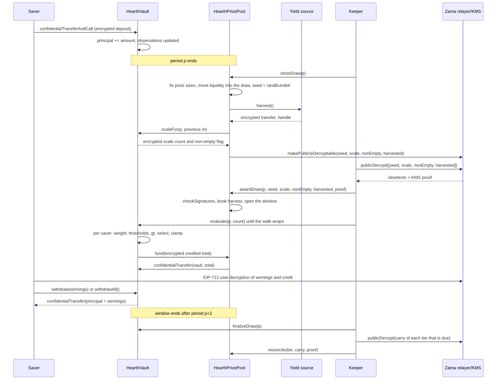

# Bir çekiliş nasıl işler

Çekiliş, havuzun getirisinin ödüle dönüştüğü andır. Bu sayfa önce her şeyi düz bir dille
anlatıyor, sonra aynı hikayeyi bir diyagram olarak gösteriyor.

## Dönemler

Zaman, `L` saniyelik eşit dönemlere bölünür. 1. dönem, dağıtım sırasında sabitlenen ve
sonrasında hiç değişmeyen `firstPeriodAt` zaman damgasında başlar. Oradan sonrası sadece
bölme işlemidir:

```
period(t)      = (t - firstPeriodAt) / L + 1
periodStart(p) = firstPeriodAt + (p - 1) * L
periodEnd(p)   = periodStart(p + 1)
```

Her havuzun kendi `L` değeri vardır. Sepolia'da USDC havuzu bir saat, diğer altısı altı saat
kullanır, böylece bir ziyaretçi tek oturuşta tam bir döngü görür. Ana ağda gerçek bir
dağıtım bir gün kullanırdı, ki PoolTogether V5'in kullandığı da budur. Dönem bir constructor
argümanıdır, dolayısıyla aynı kod üçüne de hizmet eder, ve her havuzun kademe şansları kendi
dönemine göre ayarlanır. Bakınız: [havuzlar ve tokenler](pools-and-tokens.md).

`p` çekilişi `p` dönemini kapsar. Tamamen `p` dönemi boyunca tutulan bakiyelerle belirlenir.
`p` dönemi bittikten sonra olan hiçbir şey sonucunu değiştiremez.

## Pencere ve kapatmanın son tarihi

`p` çekilişinin her adımı `p+1` ve `p+2` dönemleri sırasında gerçekleşir. Pencere budur ve
`periodEnd(p + 2)` anında biter. Bu USDC havuzunda iki saat, diğerlerinde yarım gün eder.

Kapatmanın, pencerenin geri kalanından daha sıkı bir son tarihi vardır:

```
closeDeadline(p) = periodStart(p + 2) + L / 2
```

Bu, pencerenin ikinci döneminin ortası, yani pencerenin dörtte üçü. Bundan sonraki bir
kapatma reddedilir.

Sebebi şu: kapatma ile ödül adımı aynı bloğu paylaşamaz. Kapatma, zincir üzerinde bazı
değerleri şifresi çözülebilir olarak işaretler, açık metinler Zama'nın relayer'ından zincir
dışında geri gelir, ve ödül adımı onları zincir üzerinde doğrular. Pencerenin son
saniyelerinde yapılan bir kapatma, bu gidiş dönüşe inecek yer bırakmazdı ve çekiliş sonsuza
kadar `Closed` durumunda takılı kalırdı. Son tarih, gidiş dönüş, ödül adımı ve her
değerlendirme partisi için en az yarım dönem garanti eder.

Pencere ayrıca kasanın bakiyeleri ne kadar geriye dönük hatırlaması gerektiğini de
sınırlar, ki tasarruf sahibi başına üç kayıtlı gözlemin yetmesini sağlayan da budur.
Bakınız: [zaman ağırlıklı bakiye](time-weighted-balance.md).

## Beş adım

Her adım herkese açıktır. Herhangi birini herkes çağırabilir, uygulamadan bir tasarruf
sahibi de dahil. Keeper yalnızca genelde oraya ilk varan adrestir.

### 1. Kapatma

`closeDraw(p)`, `p` dönemi bittikten sonra ve `closeDeadline(p)` gelmeden önce.

Bu tek işlemde beş şey olur, şu sırayla:

- **Ödül büyüklükleri sabitlenir.** Her kademenin ödül büyüklüğü ve bu çekiliş için ortaya
  koyduğu likidite, o kademenin şu an tuttuğu paradan hesaplanır, ve o likidite çekilişin
  içine taşınır. Bu, rastgele tohum var olmadan önce olur.
- **Tohum çekilir.** `FHE.randEuint64()` Zama'nın yardımcı işlemcisi içinde çalışır,
  dolayısıyla sayı yalnızca şifreli veri olarak vardır ve kimse onu görmemiştir.
- **Kasa, dönemin toplam ağırlığının nerede durduğunu bildirir**, tek bir küçük şifreli sayı
  ile birlikte, kimsenin bakiye tutup tutmadığını söyleyen şifreli bir bayrak olarak.
  Toplamın kendisini değil, ve henüz açık halde değil. Sonraki bölüme bakın.
- **Getiri kaynağı hasat edilir**, havuza tek bir şifreli transfer olarak. Kaynak geri
  dönerse kapatma yine de başarılı olur: hasat, önemsiz şekilde şifrelenmiş bir sıfır olarak
  ele alınır ve bir `HarvestFailed` olayı yayılır. Bozuk bir getiri kaynağı saati
  durduramaz.
- **Dört handle genel olarak şifresi çözülebilir işaretlenir:** tohum, ölçek sayısı, boş
  olmama bayrağı ve hasat. Bu, Zama'nın erişim kontrol listesinde tek yönlü bir bayraktır. O
  andan itibaren herkes relayer'dan bunların açık halini isteyebilir, ve bayrak geri
  alınamaz. Çekilişle ilgili başka hiçbir şey asla böyle işaretlenmez.

Çekilişin durumu `Closed` olur. Kapatma tam olarak bir kez başarılı olur, ve kimsenin tohumu
yeniden atamamasının sebebi budur.

İşlemin içindeki sıra asıl meseledir. Ödül büyüklükleri tohum var olmadan sabitlenir,
dolayısıyla kimse bir tohumun belirmesini izleyip kazandığını anlayıp sonra havuzun parasını
o kazancı daha değerli kılacak şekilde yeniden düzenleyemez.

### Kasa toplamın yerine ne yayımlıyor

Havuzun döneme ait toplam zaman ağırlıklı bakiyesi, `W` ile yazılır, asla yayımlanmaz. Onu
tam olarak yayımlamak 3 Eylül 2026'ya kadar tasarımdı ve bir inceleme bunu kırdı: `W` arka
arkaya iki dönem için açıkken, artı bir tasarruf sahibinin kendi yatırma ya da çekme
işleminin herkese açık zaman damgasıyla, o dönemde para hareketi yapan tek kişi olan
tasarruf sahibinin tam tutarı aritmetikle geri elde ediliyor. Sınırlanmıyor, geri elde
ediliyor. Bu şurada anlatılıyor:
[gizli kalanlar](../security/what-stays-private.md).

Şimdi yayımlanan şey, `W` değerinin düştüğü aralıktır: onun üzerindeki ya da ona eşit en
küçük ikinin kuvveti, `M = 2^m` ile yazılır. Kasa bunu şifre altında takip eder. Her
kapatmada `W` değerini bir önceki çekilişin `m` değerinin etrafındaki beş ikinin kuvvetiyle
karşılaştırır, sonuçları tek bir küçük şifreli sayıda toplar, ve o sayıyı genel olarak
şifresi çözülebilir işaretler. Havuz, doğrulanmış sayıdan yeni `m` değerini çıkarır. 1'e
karşı ayrı bir şifreli karşılaştırma da boş olmama bayrağını verir, ki bu kimsenin bakiye
tutup tutmadığını söyler.

Yani izleyen biri çekiliş başına tek bir şey öğrenir: havuzun bir ikinin kuvvetini geçip
geçmediğini. Geçişler arasında yeni hiçbir şey öğrenmez. Her çekiliş `W` yerine `M`
üzerinden yürür, ve aşağıda anlatılan ödül sayılarının o şekilde toplanmasının sebebi de
budur.

### 2. Ödül adımı

`awardDraw(p, seed, scaleCount, nonEmpty, harvested, proof)`.

Onu kim çağırıyorsa dört açık metni Zama'nın relayer'ından alır, relayer da bunları anahtar
yönetim servisinin (KMS), yani ağın şifre çözme anahtarını tutan taraflar kümesinin imzasıyla
döndürür. Sözleşme tek bir sayıya inanmadan önce o imzayı zincir üzerinde
`FHE.checkSignatures` ile doğrular. Kanıt, handle'lara sabit bir sırada bağlıdır,
`[seed, scaleCount, nonEmpty, harvested]`, dolayısıyla dört değer karıştırılamaz ya da başka
bir çekilişe karşı tekrar oynatılamaz.

Sonra:

- Doğrulanmış hasat, kademelere pay ağırlıklarına göre işlenir. Ödül parasının içeri girdiği
  tek yol budur, ve bu çekilişe değil kademelere iner, dolayısıyla bir sonraki kapatmada
  teklif edilir. Havuz, getiri kaynağının kendisi hakkında bildirdiği bir tutarı asla kayda
  geçmez.
- Boş olmama bayrağı `p` döneminde kimsenin bakiye tutmadığını söylüyorsa çekiliş `Empty`
  işaretlenir ve teklif ettiği likidite doğrudan kademelere geri döner.
- Aksi halde çekiliş açılır. Tohum ve `M` aralığı artık açık sayılardır.
- Biri ödül adımını çalıştırdığında pencere çoktan kapanmışsa hasat yine de işlenir, teklif
  edilen likidite yine kademelere geri döner, ve çekiliş `Skipped` işaretlenir. O dönem
  hiçbir ödül ödemez, ve ne getiri ne likidite kaybolur.

Beş çekiliş durumu şunlardır: `None`, `Closed`, `Awarded`, `Empty` ve `Skipped`.

**Kazananların belirlendiği an budur.** Buradan sonra tohum açık bir sayıdır, aralık açık bir
sayıdır, ve her tasarruf sahibinin `p` dönemine ait ağırlığı artık değişemez. Her tasarruf
sahibinin aşması gereken eşikler, açık girdiler üzerinde yapılan aritmetiktir. Sırada olan
değerlendirme hiçbir şey belirlemez. Zaten var olan bir sonucu yazıya döker.

### 3. Değerlendirme

Kasa üzerinde `evaluate(p, count)`, pencere açıkken, gerektiği kadar kez.

Çağıran kaç tasarruf sahibinin ilerletileceğini söyler. Hangilerinin olduğunu söylemez. Kasa
tasarruf sahipleri listesinde, `seed mod saverCount` ile başlayan çekiliş başına bir imleçten
yürür ve liste sırasında ilerler, en fazla `count` tasarruf sahibi ve şifreli iş gerektiren
en fazla `4` tanesi için çalışır. `p` döneminde ya da öncesinde gözlemi olmayan tasarruf
sahiplerinin ağırlığı sıfırdır, ve açık zaman damgalarından, hiçbir şifreli maliyet olmadan
atlanırlar.

Yürüyüşün ulaştığı her tasarruf sahibi için kasa, o kişinin `p` dönemine ait şifreli
ağırlığını okur, açık eşiklere karşı kazanan testini çalıştırır, ve sonucu şifreli kazancına
ekler. O tasarruf sahibinin o çekilişe ait şifreli ağırlığını ve hesabına geçen şifreli
tutarı saklar, ikisini de yalnızca o kişi okuyabilir, böylece uygulama "p çekilişinde X
kazandınız" diyebilir ve karşılaştırmayı kontrol etmesine izin verebilir. Sonra o partinin
hesaplara geçirdiği şifreli toplamı ödül havuzundan çeker.

Kimin, hangi sırayla değerlendirileceğini kimse seçmez. Kendi sonucunu isteyen bir tasarruf
sahibi, herkesin ilerlettiği aynı yürüyüşü ilerletir, dolayısıyla bir değerlendirme işlemi
göndermek kazanıp kazanmadığınız hakkında hiçbir şey söylemez. Başlangıç noktası her
çekilişte değişir, çünkü o çekilişin tohumundan gelir, dolayısıyla hiçbir adres kalıcı olarak
kuyruğun sonunda kalmaz.

`evaluate`, `Empty`, `Skipped` ya da henüz ödül adımı yapılmamış bir çekiliş için geri döner.

### 4. Sonlandırma

`finalizeDraw(p)`, pencere kapandıktan sonra.

Her kademenin teklif edip ödemediği ne kaldıysa o kademenin şifreli devrine katlanır. Devir,
şifreli kalan ve çekilişten çekilişe taşınan yürüyen bir toplamdır. Her kapatmada o
kademenin teklif ettiği likiditeye eklenir, dolayısıyla ödenmemiş para büyüklüğü hala gizli
olsa bile hemen yeniden oyundadır.

Sonlandırma ayrıca, havuzun karşılayamadığı her şeyi tutan tek bir genel şifreli sayacın
güncel handle'ını yayımlar. Doğrulanmış hasatlarla bu her zaman sıfırdır.

### 5. Mutabakat

Havuz üzerinde `reconcile(tier, carry, proof)`, kademeler tek tek ve yalnızca o kademenin
sırası geldiğinde.

Her kademe, dağıtımda `reconcileEvery[t]` çekiliş olarak belirlenen sıklıkta mutabakat
yapar. Sepolia'da her kademenin sırası her çekilişte gelir. Bir kademenin sırası geldiğinde
`finalizeDraw` onun devrini genel olarak şifresi çözülebilir işaretler ve `CarryPublished`
yayar. Açık metni herkes alabilir, `reconcile`'ı KMS kanıtıyla çağırır, ve doğrulanmış sayı o
kademenin açık likiditesine geri işlenir. Kasa aynı sayıyı, bu arada büyümüş olabilecek
devirden düşer, ve `TierReconciled` yayılır.

O kademenin ödül sayısını herkese açık kılan şey mutabakattır, çünkü devir, teklif edilenin
kimsenin kazanmadığı kısmıdır. Sıklık bir olduğunda, her kademenin sayısı ait olduğu
çekilişten bir çekiliş sonra açık hale gelir, ve her kademenin bütün kasası uygulamanın
büyümesini gösterebileceği şekilde açığa çıkar. Sıklığı yükseltmek o sayıyı o kadar çekiliş
boyunca gizler ve büyüyen kasayı da onunla birlikte gizler, ki bu ödünleşim şurada
anlatılıyor: [ödüller ve kademeler](prizes-and-tiers.md). Hangi yolda olursanız olun hiçbir
şey buharlaşmaz, ve hangi sıklıkta olursa olsun kimin kazandığını asla öğrenmezsiniz.

## Bir adım hiç gerçekleşmezse ne olur

- **Kapatma hiç gerçekleşmez.** Çekiliş `None` kalır ve atlanır. Likiditesi hiç
  taşınmamıştır, dolayısıyla kademelerde kalır ve bir sonraki çekilişte teklif edilir. Hasat
  bir sonraki kapatmada toplanır.
- **Ödül adımı pencere içinde hiç gerçekleşmez.** Geç bir ödül adımı hasadı yine kayda
  geçirir, teklif edilen likiditeyi yine kademelere döndürür, ve çekilişi `Skipped`
  işaretler.
- **Kimse değerlendirme yapmaz.** Her kademenin bütün teklifi sonlandırmada devrine katlanır
  ve bir sonraki mutabakatta geri gelir.

Hiçbir şey mahsur kalmaz ve hiçbir şey kaybolmaz. Takılmış bir keeper havuza bir çekilişe mal
olur, paraya değil. Bakınız: [keeper sayfası](../operations/keeper.md).

## Para asla bir bildirime dayanarak hareket etmez

İki kural muhasebeyi kandırmayı zorlaştırır.

Getiri asla güven üzerine alınmaz. Kaynak havuza şifreli bir transfer yapar, havuz alıcıdır
ve dolayısıyla o şifreli veri üzerinde yetkilidir, ve ancak ondan sonra havuz onu yayımlar ve
KMS tarafından doğrulanmış açık değeri kayda geçirir. Hatalı ya da düşmanca bir getiri
kaynağı iddia ettiğinden azını gönderebilir, ama havuza hiç gelmemiş bir ödül parasına
inandıramaz. Bunun önemi şu: hayali ödül likiditesi eninde sonunda birinin anaparasından
ödenirdi.

Ödemeler itilmez, çekilir. Her değerlendirme partisinden sonra kasa havuza şifreli parti
toplamı üzerinde kısa ömürlü bir harcama izni verir, havuz aynısını tokene verir, ve token
tam olarak o tutarı havuzdan kasaya taşır. Havuzun parası yetmezse kasa açığı genel şifreli
karşılanmayan tutar sayacına yazar, ki bu sayaç sonlandırmada herkesin kontrol edebilmesi
için yayımlanır. Doğrulanmış hasatlarla o sayaç her zaman sıfırdır.

## Baştan sona bütün çekiliş



## Bu sayfanın kapsamadıkları

Bir tasarruf sahibinin ağırlığının bir dönem boyunca nasıl biriktiğini kapsamaz, o şurada:
[zaman ağırlıklı bakiye](time-weighted-balance.md). Kazanan testinin aritmetiğini de
kapsamaz, o şurada: [kazananın belirlenmesi](winner-selection.md). Her ödülün ne kadar
büyük olduğunu da kapsamaz, o şurada: [ödüller ve kademeler](prizes-and-tiers.md).
