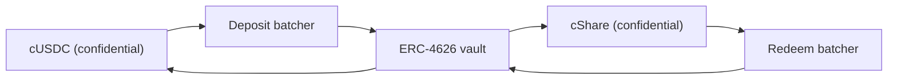

# Ödül parası nereden geliyor

Ödüller getiridir. Kimsenin anaparası asla ödül olarak ödenmez, ve havuzu kayıpsız kılan da
budur. Bu sayfa her kaynağın uyguladığı tek arayüzü, bugün Sepolia'da çalışan kaynağı,
havuzun bir kaynağın sözüne neden hiçbir konuda güvenmediğini, ve Zama'nın kendi Confidential
Vault'unun ana ağda nasıl devreye girdiğini anlatıyor.

## Arayüz

```solidity
interface IYieldSource {
    function harvest() external returns (euint64 transferred); // confidential transfer to the recipient
    function harvestable() external view returns (uint64);      // display only
}
```

İki fonksiyon. `harvest`, birikmiş getiriyi ödül havuzuna gizli bir transfer olarak taşır ve
gerçekten hareket eden şifreli tutarı döndürür. `harvestable` uygulamanın gösterimi içindir ve
havuz onu muhasebede asla kullanmaz.

`harvest` bilinçli olarak senkrondur. O anda kaynağın hazır olan neyi varsa onu taşır, ve
asenkron kazanan bir kaynağın, havuzu bekletmek yerine o tutarı önceden hazırlamış olması
beklenir.

Kaynağı değiştirmek havuz üzerinde tek bir sahip çağrısıdır, `setYieldSource`, ve
`YieldSourceSet` yayar. Sistemdeki başka hiçbir şey hangi kaynağın bağlı olduğunu bilmez ya da
umursamaz.

Geri dönen bir kaynak çekilişi durdurmaz. Havuz hatayı yakalar, o çekilişin hasadını önemsiz
şekilde şifrelenmiş bir sıfır olarak ele alır, ve `HarvestFailed` yayar. Kapatma başarılı olur,
çekiliş kademelerin zaten tuttuğu likidite üzerinden yürür, ve hareket edemeyen getiri daha
sonraki bir hasatta toplanır. Bozuk ya da yanlış bağlanmış bir kaynak ödül tarafını aç bırakır,
saati durduramaz.

Bir hasat gerçekleştiğinde, o çekilişin ödül adımında kayda geçer ve bir sonraki kapatmada
teklif edilir. Yani `p` döneminin getirisi `p` çekilişinin değil `p+1` çekilişinin ödüllerini
finanse eder. Ödül büyüklüklerinin tohum var olmadan sabitlenebilmesini sağlayan da budur.

## Sepolia: sponsorlu kaynak

Her canlı havuzda çalışan şey `SponsoredYieldSource`'tur, her birinde bir örnek, dolayısıyla
yedi kaynak yedi farklı tokenin yedi ayrı bakiyesidir. USDC havuzununki şu adreste:
`0xCC49DF69eAB6884fD8DD9260902B8A0Abc9D6b91`. Diğer altısı burada:
[havuzlar ve tokenler](pools-and-tokens.md).

Bir sponsor, havuzun açık tokeniyle kaynağın kendi `sponsor` fonksiyonunu çağırır. Kaynak onu
gizli olana sarmalar ve sponsorun istediği tutarı değil, sarmalayıcının bastığı tutarı kayda
geçirir. Oradan sonra bakiye `ratePerSecond` hızıyla damlar, ki bu USDC havuzunda
`5,555 base units a second, which is 19.998 USDC a period` değerindedir,
ve `harvest` birikmiş olanı havuza gönderir. Her havuzun hızı saatte tam token cinsinden
ayarlanır, böylece farklı saatlerde çalışan iki havuz bir bakışta karşılaştırılabilir, ve her
sponsorluk seksen çekilişten fazlasını karşılayacak büyüklüktedir.

Sponsorluk bir bağıştır. Sponsorun onu geri alacağı bir yol yoktur, ve damlama hızını yalnızca
kaynağın sahibi değiştirebilir, ki bu `RateChanged` yayar.

Sponsorluk tutarları, damlama hızı ve her hasat herkese açıktır. Bu bir taviz değil:
PoolTogether'da da bir kasanın katkıda bulunduğu getiri miktarı herkese açıktır, ve her ödül
büyüklüğü ondan çıkar. Hearth'te gizli olan, kimin ne kadar biriktirdiği ve kimin kazandığıdır,
havuzun ne kadar para kazandığı asla.

Havuzda bir süre hiç tasarruf sahibi olmazsa getiri yine birikir ve tasarruf sahibi olan ilk
çekilişlere ödenir. Boş bir havuzda hiçbir şey mahsur kalmaz.

### Neden taklit bir kaynak

Çünkü taklit bir kaynak ancak dokümantasyon nasıl çalıştığını ve gerçek olanın nasıl
bağlandığını söylüyorsa dürüsttür, ikisi de aşağıda. Önce gerçeğini aradık, ve Sepolia'da
Zama'nın taklit tokenlerine getiri ödeyen bir yer yok:

| Yer | Neden olmadı |
| --- | --- |
| Aave | Sepolia'da USDC yatırmayı reddediyor, arz üst sınırı aşılmış |
| Compound | Zama'nın taklidini değil, Circle'ın kendi USDC'sini istiyor |
| Zama'nın Confidential Vault'u | Sepolia kasası, getiri adaptörü olmayan yalnızca atıl bir VaultV2, ki bu Zama'nın kendi tanımı |

Yani dürüst seçenekler şunlardı: yükselen sahte bir sayı, ya da zincir üzerinde gerçekten var
olan ve gerçekten damlayan sponsor destekli bir bakiye. İkincisini aldık. Yedi canlı havuzun
her birindeki her birim ödül parası gerçekten sarmalandı, gerçekten transfer edildi ve
gerçekten doğrulandı.

## Havuz bildirilen bir sayıyı asla kayda geçmez

Sponsorlu kaynağın zayıf nokta olmasını engelleyen kural budur.

Kaynak havuza şifreli bir transfer yapar. Havuz, alıcı olarak o şifreli veri üzerinde
yetkilidir, dolayısıyla transfer edilen tutarı genel olarak şifresi çözülebilir olarak kendisi
işaretleyebilir. Havuz kademelere ancak ödül adımı sırasında, `FHE.checkSignatures` açık metin
üzerindeki anahtar yönetim servisi imzasını doğruladıktan sonra bir şey işler.

Ne kadar gönderdiği hakkında yalan söyleyen bir kaynak hiçbir yere varamaz. Havuz gelen tutarı
kayda geçirir, çünkü baktığı tek tutar odur.

Bu teorik bir ihtiyat değil. Önceki tasarımımızda havuz, rezerv takviyelerini çağıranın
gönderdiği tutardan kayda geçiriyordu, oysa sarmalayıcı `amount / rate()` kadar basar. Canlı
dağıtımda `rate()` tesadüfen 1 olduğu için ikisi uyuşuyordu ve hata gizli kalmıştı. 18
ondalıklı bir dayanakta, sarmalayıcının oranının bir milyon kere bir milyon olduğu yerde,
havuz var olandan bir milyon kere bir milyon kat fazla ödül parasına inanırdı. Bunu 2 Eylül
2026'da 18 ondalıklı bir test tokenine karşı fiilen çalıştırdık ve olurken izledik. Kayıpsız
bir havuzdaki hayali ödül likiditesi eninde sonunda birinin anaparasından ödenir, ki bu ürünün
bozamayacağı tek sözdür. Transferi doğrulamak bu sınıfın tamamını ortadan kaldırır.

## Ana ağ: Zama'nın Confidential Vault'u

Zama'nın, bütün işi gizli bakiyeler üzerinde getiri kazanmak olan bir protokolü var, ve doğal
ana ağ kaynağı odur. Bu tasarımdaki adaptör `ConfidentialVaultYieldSource`'tur. Aşağıdaki, onun
şartnamesidir, bu depodaki bir sözleşme değil.

Buradaki her şey gibi havuz başına bir adaptördür, ve her birinin kendi tokeni için bir
toplayıcıya ve bir getiri kasasına ihtiyacı vardır. Zama'nın ana ağ dağıtımı bugün USDC'yi
kapsıyor, dolayısıyla ana ağdaki bir Hearth, USDC havuzunu Confidential Vault üzerinde açar ve
başka her tokeni onun için var olan kaynak neyse onun üzerinde, ya da hiçbirinde açmaz.

Tasarım, gizli tokenler ile sıradan bir ERC-4626 getiri kasası arasında duran bir toplayıcıdır.
Bir ERC-4626 kasası yalnızca açık transferleri kabul eder, dolayısıyla tek başına yatıran biri
tam tutarını yayımlardı. Toplayıcı bunun yerine birçok şifreli yatırmayı bir araya toplar,
yalnızca toplamın şifresini çözer, kasaya tek bir açık yatırma yapar, ve gizli payları geri
dağıtır. Zama'nın kendi ifadesiyle: "İzleyenler kimin katıldığını görür, kimin ne kadar katkı
yaptığını değil."



Adaptör, yatırma toplayıcısına havuzun gizli tokeniyle katılır ve gizli paylar tutar. Geri alma
kendi takviminde, hasattan önce çalışır: keeper düzenli olarak geri alma toplayıcısından
büyümeyi ister ve o isteği dört aşamasından geçirir, böylece havuz bir sonraki kez `harvest`
çağırdığında geri alınmış gizli USDC zaten adaptörün içinde durur ve hasat, diğerleri gibi tek
bir transfer olur. Asenkron bir yerin senkron bir arayüzle buluşması böyle olur. Dört aşamanın
her biri herkese açıktır, dolayısıyla kimsenin bunları çalıştırmak için Zama'nın operatörünü
beklemesi gerekmez.

### Adresler

Zama'nın kendi adres referansından, 2 Eylül 2026'da alındı.

**Ethereum ana ağı, zincir kimliği 1.** Dayanak varlık USDC. Getiri kaynağı: Morpho
"Steakhouse Confidential Prime USDC" VaultV2, yatırma toplayıcısı kasanın tek yatırıcısı
olacak şekilde kısıtlanmış.

| Sözleşme | Adres |
| --- | --- |
| Yatırma toplayıcısı | `0x324EA89FD3784036673BfE6Ffee2334A088F40Cc` |
| Geri alma toplayıcısı | `0x96Cd3Faa7483783Ac2Eb715f6333361500F1eec9` |
| cUSDC sarmalayıcısı | `0xe978F22157048E5DB8E5d07971376e86671672B2` |
| cShare sarmalayıcısı | `0x66Bf74E96900D1a19c7070D939D124f2F565C458` |
| ERC-4626 kasası | `0xbEEF00A59B577423653A1526c7009bdE103F542B` |
| USDC | `0xA0b86991c6218b36c1d19D4a2e9Eb0cE3606eB48` |

**Sepolia, zincir kimliği 11155111.** Bir hazırlık ortamı: USDC, açık bir `mint` fonksiyonu
olan bir taklit, ve kasa getiri adaptörü olmayan, yalnızca atıl bir kasa.

| Sözleşme | Adres |
| --- | --- |
| Yatırma toplayıcısı | `0x48758559c14d4d92b4C74A99660B6a8dbe85F53b` |
| Geri alma toplayıcısı | `0xe94E9afdDd43a19C2914739e9279cb6Fe287BEb0` |
| cUSDC sarmalayıcısı | `0x7c5BF43B851c1dff1a4feE8dB225b87f2C223639` |
| cShare sarmalayıcısı | `0x7E93d5c150A2178B1fCde0278582Acf59478eA5f` |
| ERC-4626 kasası (atıl) | `0x6AB54988261AEC573a2CA13cF802d3B1114f864C` |
| Mock USDC | `0x9b5Cd13b8eFbB58Dc25A05CF411D8056058aDFfF` |

Sepolia kasası atıl olduğu için, adaptör burada Zama'nın yayımladığı toplayıcı arayüzüne göre
tarif edildi ve henüz yazılmadı. Hiçbir şey kazanmazken canlı olduğunu söylemek, herkesin bir
dakikada kontrol edebileceği bir yalan olurdu.

### Onu bağlamak pratikte ne demek

Toplayıcı dört aşamada ilerler: katılım, sevk, sonlandırma, talep. Bir parti asgari bir yaşa
ulaşana kadar bekler, sonra toplamının şifresi çözülür, sonra kasa hesaplaşır, sonra
katılımcılar talep eder. Bu aşamaların her biri herkese açıktır, dolayısıyla havuz asla
Zama'nın operatörünü beklerken takılmaz, ve talepler asla zaman aşımına uğramaz.

O ritim, sponsorlu kaynağın anlık damlamasından daha yavaştır, ve keeper'ın geri almayı
`harvest` içinde değil önceden çalıştırmasının sebebi budur. Havuzun sözleşmesi asla beklemez:
adaptörden, zaten geri talep edilmiş olan neyse onu ister. Bunu canlıya almakta gerçek iş
olarak kalan şey, bu deponun tarif ettiği ama uygulamadığı adaptör sözleşmesinin kendisi, ve
onun keeper tarafı, yani bir geri almanın ne sıklıkta başlatılacağına ve pozisyonun ne kadarının
geri alınacağına karar vermektir, ki bu geç kalırsa zincir üzerinde hiçbir sonucu olmayan bir
politika tercihidir.

### Hearth neyi devralırdı

Bunu düzgün adlandırmak, konuda güvenilir olmanın bir parçası.

- **Kasa riski, tamamıyla.** Toplayıcı parayı üçüncü taraf bir ERC-4626 kasasına iletir. O
  kasa değer kaybederse, havuzun getiri taşıyan bakiyesi de onunla birlikte değer kaybeder.
  "Kayıpsız" ifadesinin başka birinin sözleşmesine bağlı olacağı tek yer burasıdır, ve ana ağ
  dağıtımının orada yalnızca getiri taşıyan kısmı tutması gerekmesinin sebebi budur.
- **Parti gizliliği, havuz gizliliği değil.** Toplayıcı tutarları diğer katılımcılar arasında
  gizler ve toplamın şifresini çözer. Hearth bir partideki tek katılımcı olsaydı, yatırdığı
  tutar herkese açık olurdu. Bu bize hiçbir şeye mal olmaz, çünkü Hearth'ün hasatları zaten
  yayımlanıyor, ama toplayıcının olduğundan fazlasını gizlediğini varsaymadan önce bilmeye
  değer.
- **Sınırlı sahip yetkileri.** Toplayıcının sahibi asgari parti yaşını (7 günle sınırlı), geri
  çağrı son tarihini (30 günle sınırlı) ve yatırma kayma toleransını değiştirebilir, ve
  katılımları ve sevkleri duraklatabilir. Zama'nın dokümantasyonu, sahibin kullanıcı fonlarını
  taşıyamayacağını ya da donduramayacağını, bir sonucu sansürleyemeyeceğini, kimsenin tutarının
  şifresini çözemeyeceğini ve sözleşmeyi yükseltemeyeceğini belirtiyor. Geri alma kayma
  koruması kodda kapalıdır, böylece bir kasa düşüşü sırasında bile çıkışlar çalışır.

## Bu sayfanın kapsamadıkları

Getiri kaynağının sızıntı tablosuna etkisini kapsamaz, o şurada:
[gizli kalanlar](../security/what-stays-private.md). Morpho kasasının getirisini de
kıyaslamaz, o başkasının sayısıdır ve her gün değişir. Ve adaptörün çalıştığını iddia etmez:
Sepolia'da bağlı olan sponsorlu kaynaktır, ve gösterge panelindeki "Havuzun şu anki durumu"
kartı onu adıyla söyler.
