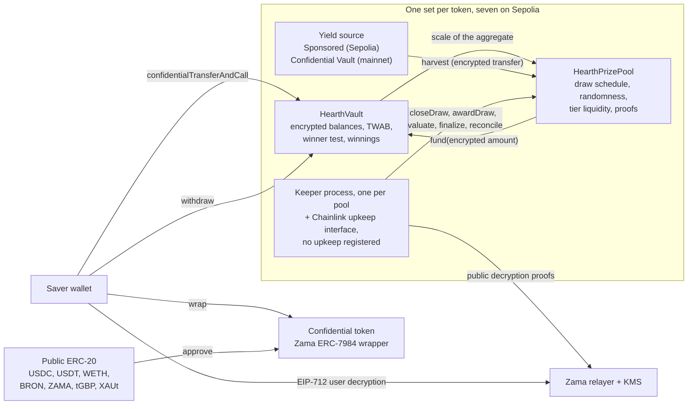

# Hearth nedir

Hearth, paranızı kaybedemeyeceğiniz ve ödül kazanabileceğiniz bir tasarruf havuzudur.
Sepolia üzerinde bunlardan yedi tane çalışıyor, her gizli token için bir tane, ve bir token
seçmeniz bir tasarruf hesabı seçmenize benzer.

İçine bir gizli token koyarsınız: USDC, USDT, WETH, BRON, ZAMA, tGBP veya XAUt. Havuz o
parayı çalıştırır ve getiri kazanır. Her dönemin sonunda havuzun kazandığı getiri ödül
olarak dağıtılır ve kazanma şansınız, ne kadar tuttuğunuzla ve ne kadar süre tuttuğunuzla
orantılıdır. Anaparanızı istediğiniz an, tamamen geri alabilirsiniz. PoolTogether'ın icat
ettiği "kayıpsız piyango" fikri budur, ve Hearth onun gizli sürümüdür.

PoolTogether'dan farkı şu: sıradan bir blok zincirinde her şey herkese açıktır. Herkes hangi
tasarruf sahibinin ne kadarı olduğunu, her cüzdanın şansını ve her çekilişi kimin
kazandığını okuyabilir. Bu, insanların servetini yayımlar ve büyük olan herkesin sırtına
hedef çizer. Hearth işin tamamını Zama Protocol'ü kullanarak şifreli sayılar üzerinde
yürütür, yani zincir bakiyenizi şifreli veri olarak tutar (anahtar olmadan okunamayan veri)
ve sözleşme yine de onun üzerinde aritmetik yapar. Bakiyeniz, biz dahil kimsenin görmediği
bir sayıdır, ve çekiliş yine de bir yabancı tarafından kontrol edilebilir.

## Sistem tek resimde

İşi iki sözleşme yapar. `HearthVault` her tasarruf sahibinin şifreli anaparasını, şifreli
kazancını ve neyi ne kadar süre tuttuğunun kaydını saklar, kazanan testini de o çalıştırır.
`HearthPrizePool` saati yürütür, rastgele tohumu çeker, getiriyi toplar ve ödül parasını
kademelerde tutar. Bir keeper süreci çekilişi ileri iter, ve attığı her adımı bunun yerine
başka herkes de atabilir.

Ortadaki kutu tek bir tokenin havuzudur. Bunlardan yedi tane var ve hiçbir şeyi
paylaşmıyorlar: USDC pozisyonunuz ile WETH pozisyonunuz, ayrı kasalarda ayrı tasarruf
sahipleridir, ve bir havuzun susması diğerlerini çalışır halde bırakır. Hangi havuza
baktığınız adres çubuğunun ilk parçasıdır, `/app/usdc` ya da `/app/weth`. Adresleriyle
birlikte tam liste burada: [havuzlar ve tokenler](../concepts/pools-and-tokens.md).

## Dört hareket

Bir tasarruf sahibi dört hareket yapar. Her birinin ne yaptığı ve neyi ele verdiği şöyle.

### 1. Yatırma

O havuzun gizli tokenini tek bir işlemle kasasına gönderirsiniz. Tutar, şifreli bir handle
olarak yolculuk eder, yani değerin kendisi değil şifreli değere işaret eden bir gösterge
olarak. Kasa bunu şifreli anaparanıza ekler ve bakiyenizin zaman içindeki kaydını günceller,
hiçbir şeyin şifresini çözmeden.

- Gizli: tutar, yürüyen bakiyeniz ve dolayısıyla havuzdaki payınız.
- Açık: adresiniz, işlemi yaptığınız blok ve bir yatırma olduğu gerçeği.

Tek bir dikiş var. Sıradan açık tokeni gizli olana çevirmek herkese açık bir ERC-20
transferidir, dolayısıyla sarmalanan tutar görünür. 5,000 USDC sarmalayıp iki blok sonra
yatırırsanız, izleyen birinin elinde çok iyi bir tahmin olur. Hearth sarmalama ile yatırmayı
tam da aralarına mesafe koyabilesiniz diye iki ayrı adım olarak tutar. Bakınız:
[sarmalama dikişi](../security/what-stays-private.md).

### 2. Çekiliş

Her dönemin sonunda havuz o döneme ait çekilişi kapatır. Tek bir işlemde önce her kademenin
ödül büyüklüğünü sabitler, sonra Zama'nın yardımcı işlemcisi içinde şifreli bir rastgele
tohum çeker, sonra kasaya havuzun ne kadar büyük olduğunu sorar, sonra dönemin getirisini
toplar. Sıra önemlidir: ödüller rastgele sayı var olmadan önce boyutlandırılır, dolayısıyla
kimse bir tohumu görüp ardından kazanmanın ne değerde olduğunu yeniden düzenleyemez.

"Havuzun ne kadar büyük olduğu" bilinçli olarak muğlaktır, ve tasarım da budur. Kasa, bütün
tasarruf sahiplerinin zaman ağırlıklı bakiyelerinin toplamını yayımlamaz. Yalnızca bu
toplamın hangi ikinin kuvveti aralığına düştüğünü yayımlar, dolayısıyla dünyanın öğrendiği
şey havuzun tam büyüklüğü değil, kabaca büyüklüğüdür. Tam sayıyı yayımlamak, birinin arka
arkaya iki çekilişi birbirinden çıkarıp aradaki farktan tek bir tasarruf sahibinin yatırdığı
tutarı okumasına imkan verirdi.

Sonra dört küçük değer, Zama'nın anahtar yönetim servisinin imzaladığı bir kanıtla birlikte
dışarı çıkar, böylece herkes onları kontrol edebilir: tohum, aralık, havuzda hiç kimsenin
olup olmadığı ve toplanan getiri. Her tasarruf sahibinin o çekilişteki sonucu, bu sayılar
doğrulandığı anda sabitlenir.

- Gizli: her tasarruf sahibinin ağırlığı, havuzun tam toplamı ve her bireysel sonuç.
- Açık: tohum, aralık, toplanan getiri, her kademenin ödül büyüklüğü ve bir çekiliş sonra,
  kademe mutabakatı yapıldığında, kaç ödül ödediği.

### 3. Talep

Bir talep işlemi yoktur, ve asıl mesele de budur. Uygulamada bir talep düğmesi vardır,
"Çekilişlerim" ekranında o çekilişin kartında, ve tutarı üzerinde yazar: bu, az önce
açtığınız kazancın sıradan bir çekimidir ve zincirde tıpkı başka herhangi bir çekim gibi
görünür.

Kazançlar, çekiliş değerlendirilirken kasa içinde ayrı bir şifreli bakiyeye eklenir. Bunun
olması için yaptığınız bir şey yoktur ve yaptığınız hiçbir şey onu ele vermez. Kazanıp
kazanmadığınızı öğrenmek için bir EIP-712 mesajı imzalarsınız, yani adresinizi kontrol
ettiğinizi kanıtlayan zincir dışı bir tipli imza, ve Zama'nın relayer'ı kendi kazancınızın
açık halini tarayıcınıza döndürür. O imza zincire hiç dokunmaz, dolayısıyla hiçbir şeye mal
olmaz ve iz bırakmaz. Gösterge panelindeki bakiyeniz ile bir çekilişin sonucunun kendi
gözleri vardır, ikisi aynı anda açık olabilir, ve ilkinin imzası ikincisine de yeter.

- Gizli: her şey. Kendi kazancınızı okumak zincir dışı bir işlemdir.
- Açık: hiçbir şey.

Çoğu ödül protokolünde kazananın bir talep işlemi göndermesi gerekir, kaybedenin ise bunun
için bir sebebi yoktur, dolayısıyla işlem listesi sessizce kazananların adını verir.
Hearth'te gönderilecek böyle bir işlem yok. Ödülleri hesaba geçiren işlem olan `evaluate`
kendinize doğrultulamaz: tasarruf sahipleri listesinde, çekilişin kendi tohumunun belirlediği
bir noktadan yürür, ve çağıran yalnızca ne kadar ilerleteceğini söyler.

### 4. Çekim

Parayı dışarı tek bir fonksiyon çıkarır: `withdraw`. Önce kazancınızdan, sonra anaparanızdan
öder, ve elinizde olan ile kasada olanın küçüğüne kırpar. İster bir ödül alıyor olun, ister
birikiminizi eve götürüyor olun, ister ikisini birden, aynı çağrı, aynı biçim, aynı olay ve
şifreli bir tutar.

Bu kırpmanın ikinci yarısı şundan var: gizli bir transfer tutarın ya tamamını taşır ya da
hiçbirini. İstenenin bir kısmını asla göndermez. Bu yüzden kasa, tokenden ödeme yapmasını
istemeden önce gerçekte ne kadar ödeyebileceğini hesaplar, açığı sonradan onarmaya çalışmak
yerine.

- Gizli: tutar ve bunun herhangi bir kısmının ödül parası olup olmadığı.
- Açık: adresiniz, blok ve bir çekim olduğu gerçeği.

Anaparanız asla kilitlenmez. Bir çekiliş sürerken para yatırma ve çekme açık kalır, ki bu bu
alandaki birçok tasarım için doğru değildir.

## Onu adil kılan ne

İki şey, ve ikisi de özel erişimi olmayan bir yabancı tarafından kontrol edilebilir.

Rastgele tohum `FHE.randEuint64` ile gelir, Zama'nın yardımcı işlemcisi içinde, ağın FHE
anahtarı altında herkese açık bir tohumdan üretilir. Kimse onu tahmin edemez ve kimse onu
iki kez çekemez: bir çekilişin kapatılması tam olarak bir kez başarılı olur. Dönem bittikten
sonra havuz o tohumu, havuzun toplamının düştüğü aralıkla birlikte yayımlar, ikisi de
sözleşmenin zincir üzerinde doğruladığı bir kanıt taşır.

Bu iki açık sayıdan herkes, herhangi bir adresin herhangi bir kademede aşması gereken tam
eşiği yeniden hesaplayabilir, ve kasa aynı aritmetiği bir view olarak sunar, böylece
kimsenin bir yeniden uygulamaya güvenmesi gerekmez. Yapamadıkları şey, karşılaştırıldığı
şifreli ağırlığı görmektir. Yani kural açık ve denetlenebilir, gizli olan yalnızca girdidir.
Ayrıntılar: [rastgelelik ve doğrulama](../security/randomness-and-verification.md).

## Hearth neyi gizlemiyor

Kısa hali şöyle, tamamı burada: [gizli kalanlar](../security/what-stays-private.md).

- Tasarruf sahiplerinin kim olduğu, ve her birinin ne zaman para yatırdığı, çektiği ya da
  değerlendirildiği.
- Havuzun toplamının her dönem hangi aralığa düştüğü, tohum ve toplanan getiri.
- Her kademenin ödül büyüklüğü ve kaç ödül ödediği, bir çekiliş sonra yayımlanır.
- Gizli tokene sarmaladığınız ya da ondan çözdüğünüz tutar.
- Tek bir tasarruf sahibiyle, yayımlanan aralık o kişinin ağırlığını iki kat hata payıyla
  verir. İki kişiyle, her biri diğerini sınırlayabilir. Buradaki gizlilik üç veya daha fazla
  tasarruf sahibi ister, ve uygulama bunu söyler.
- Eşikler açıktır, dolayısıyla bakiyenizi sabitleyebilen herkes her çekilişteki sonucunuzu
  hesaplayabilir. Bu genelde şöyle olur: sarmalarsınız, sonra dakikalar içinde aynı tutarı
  yatırırsınız. Uygulamanın bu ikisini ayrı tutmasının sebebi budur.
- Parayı sarmalayıp sonra tamamının sarmalamasını çözmek, o güne kadar kazandığınız her şey
  için bir alt sınır yayımlar, çünkü her iki hareket de token katmanında herkese açıktır.
- Kazandığı her çekilişten hemen sonra parasını çeken bir tasarruf sahibi, kendi davranışı
  üzerinden istatistiksel bir ipucu sızdırır. Bunu hiçbir sözleşme düzeltemez.
