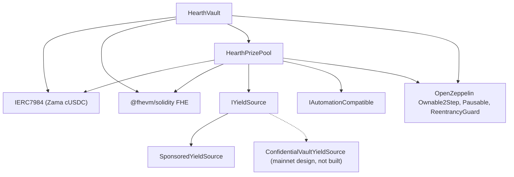

# Dağıtım

Tek ve tekrarlanabilir bir betik, asla elle tıklama yok. Bu sayfa sırayı, parametreleri ve her
birinin ne anlama geldiğini veriyor, böylece bir inceleyici dağıtılmış constructor argümanlarını
okuyup uyuştuklarını görebilir.

Hearth, gizli token başına bir havuz dağıtır: token başına bir kasa, bir ödül havuzu ve bir
getiri kaynağı, başka hiçbir havuzla hiçbir şey paylaşmadan. Bir çalıştırma bir havuz açar, çünkü
bir dağıtıcı nonce'u bir dağıtım yürütür, ve token `HEARTH_TOKEN` ile seçilir. Sonraki her görev
`--token` alır:

```
cd packages/contracts
HEARTH_TOKEN=weth npx hardhat deploy --network sepolia
npx hardhat hearth:verify  --network sepolia --token weth
npx hardhat hearth:seed    --network sepolia --token weth
npx hardhat hearth:status  --network sepolia --token weth
```

İkisini de vermezseniz ağın varsayılan tokeni olan `usdc` gelir. Bilinmeyen bir kısa ad, o ağda
var olan havuzların listesiyle birlikte hata verir. Her havuzun parametreleri tek bir dosyada
yaşar, `packages/contracts/hearth.config.ts`: varlık çifti, dönem, kademe seti, başlangıç aralığı,
damlama hızı, sponsorluk, beş örnek bakiye ve keeper'ının imza attığı hesap indeksi. O dosyayı
aşağıdaki tabloların yanında okuyun, sayılar aynı sayılardır.

Dağıtım, kayıtlı bir dağıtımı zaten olan her sözleşmeyi değiştirmek yerine yeniden kullanır,
dolayısıyla ikinci bir çalıştırma hiçbir şey yapmaz. Tasarruf sahiplerinin parasını ve günlerce
çekiliş geçmişini tutan canlı bir havuz, betik yeniden çalıştırılarak asla yeni bir adrese
taşınamaz. Bir havuzu bilerek değiştirmek için önce `deployments/<network>/` altındaki dosyasını
silin.

Dağıtım `deployments/sepolia/hearth.<slug>.json` dosyasını yazar, ki bir keeper'ın
`HEARTH_ADDRESSES_FILE` ile yönlendirildiği ve uygulamanın havuz listesinin üretildiği dosya
odur.

## Ne neye bağlı



Düz çizgiler bu depodaki sözleşmelerdir. Noktalı düğüm ana ağ getiri yoludur: adaptör, Zama'nın
yayımladığı toplayıcı arayüzüne göre tarif edildi ve burada hiçbir adaptör sözleşmesi yazılmadı,
dolayısıyla aşağıda yalnızca `SponsoredYieldSource` dağıtılıyor.

Kasa ile havuzun her biri diğerine ihtiyaç duyar, dolayısıyla iki bağlantıdan biri bir
constructor içinde değil dağıtımdan sonra kurulur. Aşağıda üç değil beş adım olmasının sebebi
budur.

## Sıra

| Adım | Eylem | Neden burada |
| --- | --- | --- |
| 1 | `HearthVault` dağıtılır | Tasarruf sahiplerinin parasını tutar ve var olmak için tokenden başka bir şeye ihtiyacı yoktur. |
| 2 | `HearthPrizePool` kasayı göstererek dağıtılır | Havuz kasanın saatini ve ölçek sayısını okur, ve kasaya öder. |
| 3 | Bağlama: `vault.setPrizePool(pool)` | `PrizePoolSet` yayar. Kasa yalnızca bu adresten fonlama kabul eder. |
| 4 | Getiri kaynağı, alıcı olarak havuzu göstererek dağıtılır | Hasatları nereye göndereceğini bilmesi gerekir. |
| 5 | Bağlama: `pool.setYieldSource(source)` | `YieldSourceSet` yayar. Bu gerçekleşene kadar bir kapatma hiçbir şey hasat etmez ve `HarvestFailed` yayar. |

5. adımdan sonra havuzu başlatın: `hearth:seed --token <slug>` getiri kaynağına sponsorluk
sağlar, böylece ödüller var olur, ve 2 ile 6 arasındaki hesaplardan farklı büyüklüklerde beş
örnek tasarruf sahibi ekler, böylece ilk ziyaretçi boş bir havuza değil dolu bir havuza düşer.
Her adımı zaten yapılmış olanı zincirden kontrol eder, dolayısıyla bir relayer aksaklığıyla
yarıda kalan bir başlatmayı tekrar çalıştırmak güvenlidir.

O havuzun keeper'ının da kendi Sepolia ETH'sine ihtiyacı var, beş örnek tasarruf sahibinin de:

```
npx hardhat hearth:spread-gas --network sepolia --token weth
npx hardhat hearth:spread-gas --network sepolia --keepers 10,11,12,13,14,15 --savers false
```

Birincisi tek bir havuzun keeper'ını ve tasarruf sahiplerini fonlar, ikincisi ise tek geçişte
birden fazla keeper hesabını fonlar, ki altı havuzu birden açmak için gereken budur.

Sonra uygulamayı dağıtılana yönlendirin:

```
cd ../web
node scripts/sync-pools.mjs
```

## Parametreler

```
HearthVault(IERC7984 asset, uint256 periodLength, uint256 firstPeriodAt, address owner)
HearthPrizePool(IHearthVault vault, IERC7984 asset, Tier[3] tiers, uint8 initialScaleBits, address owner)
    Tier = { uint32 prizeCount; uint64 oddsNumerator; uint64 oddsDenominator; uint16 shares; uint16 reconcileEvery }
SponsoredYieldSource(IERC7984ERC20Wrapper asset, address recipient, uint64 ratePerSecond, address owner)
```

### HearthVault

| Parametre | Anlamı | Yanlış ayarlarsanız |
| --- | --- | --- |
| `asset` | Tasarruf sahiplerinin yatırdığı ERC-7984 gizli token, Zama'nın yedisinden biri. | Her sarmalayıcı altı ondalık okur, ve zincir yapılandırmayla uyuşmazsa dağıtım devam etmeyi reddeder. Altındaki açık tokene oran her havuzda 1 değildir: 18 ondalıklı WETH taklidinde bir milyon kere bir milyondur, dolayısıyla açık tokeni okuyan her şeyin bunu uygulaması gerekir. |
| `periodLength` (`L`) | Bir dönemdeki saniye. Değiştirilemez. | Aynı zamanda tasarruf sahibi başına üst sınırı da belirler, `(2^64 - 1) / L`. `L` çok küçükse üst sınır devasa olur ama çekilişler gürültülü olur, çok büyükse üst sınır daralır. |
| `firstPeriodAt` | 1. dönemin başladığı zaman damgası. Değiştirilemez, ve dağıtım anında ya da öncesinde olmalıdır. | Gelecekteki bir değer, o an gelene kadar `period(now)` değerini tanımsız bırakır. |
| `owner` | İki adımlı sahip. Sahiplikten vazgeçmek kapalıdır. | Yetkiler [tehdit modelinde](../security/threat-model.md) listeleniyor. |

`maxPrincipal` ayarlanmaz, `periodLength` değerinden türetilir. Bir saatte yaklaşık 5 milyar
token, altı saatte yaklaşık 854 milyon, bir günde ise yaklaşık 213 milyondur.

Saat kasaya aittir. Havuz kasanın adresini alır ve dönemleri ondan okur, dolayısıyla iki
sözleşmenin hangi dönemde olunduğu konusunda anlaşmazlığa düşmesinin yolu yoktur.

### HearthPrizePool

| Parametre | Anlamı |
| --- | --- |
| `vault` | Bu havuzun hizmet ettiği kasa, ve okuduğu saat. |
| `asset` | Kasanın kullandığı gizli tokenin aynısı. Uyuşmak zorundadırlar. |
| `prizeCount[t]` | `t` kademesinde çekiliş başına ödül sayısı. |
| `oddsNumerator[t]`, `oddsDenominator[t]` | Kademenin olasılığı kesir olarak, `oddsDenominator / oddsNumerator` çekilişte bir. |
| `shares[t]` | Kademenin her hasattan aldığı dilim. Paylar görecelidir, dolayısıyla 40/20/40 ile 2/1/2 aynı şeydir. |
| `reconcileEvery[t]` | O kademenin devrinin yayımlanmaları arasında kaç çekiliş geçtiği. |
| `initialScaleBits` | İlk dönemin toplam ağırlığının beklenen bit uzunluğu, yani aralık takipçisinin başlangıç tahmini. |
| `owner` | Yukarıdaki gibi. |

`UTILISATION` bir argüman değil bir sabittir: PoolTogether V5'i takiben yüzde 50. Her ödülü
boyutlandırmak için kullanılan, kademenin açık likiditesinin kesridir.

Bunlardan ikisi bir açıklamayı hak ediyor.

`reconcileEvery` bir gas ayarı değil bir gizlilik ayarıdır, ve ödül kasasının nasıl göründüğüyle
ödünleşir. Bir kademenin devrini yayımlamak o kademenin ödül sayısını herkese açık kılar, ve tek
bir çekiliş üzerindeki bir sayı, o çekilişte uygun olan küçük tasarruf sahibi kümesini işaret
eder. Onu yükseltmek, sayıyı neredeyse herkesin bir noktada uygun olduğu bir aralığa yayar. Bunun
bedeli görünür büyük ödüldür: bir kapatma, bir kademenin bütün açık likiditesini çekilişe taşır ve
o para ancak bir mutabakatta geri gelir, dolayısıyla 24 sıklığındaki bir kademe, 24 çekilişin
23'ünde tek bir çekilişin hasat payına göre boyutlandırılmış bir ödül yayımlar, ve biriken kasa
yalnızca mutabakat çekilişinde açığa çıkar. Para bu süre boyunca şifreli devrin içinde teklif
edilir ve kazanılabilir, sadece görünmez. Sepolia bu yüzden üç kademeyi de 1'de çalıştırıyor ve
çekiliş başına sayıyı bir artık olarak beyan ediyor. Bakınız: 14. kısıt.

`initialScaleBits` yalnızca yakın olmak zorundadır. Takipçi, her kapatmada gerçek toplamı güncel
tahminin etrafındaki beş ikinin kuvvetiyle karşılaştırır ve kendini çekiliş başına en fazla üç
bit düzeltir, dolayısıyla birkaç bit sapmış bir tahmin, bir iki çekilişlik hafif yanlış
ölçeklenmiş şansa mal olur ve sonra oturur.

### SponsoredYieldSource

| Parametre | Anlamı |
| --- | --- |
| `asset` | Tuttuğu ve gönderdiği ERC-7984 sarmalayıcı. Sponsorların ödediği açık token, sarmalayıcının kendi dayanağıdır, dolayısıyla ayrı bir argüman değildir. |
| `recipient` | Hasatları alan ödül havuzu. |
| `ratePerSecond` | Sponsorlu bakiyenin getiri olarak ne hızla damladığı. |
| `owner` | Hızı ayarlar, `RateChanged` yayar. |

Sponsorluk, bir constructor argümanı değil, dağıtımdan sonra ayrı bir çağrıdır. Sponsorun
istediği tutarı değil, sarmalayıcının bastığı tutarı tam olarak kayda geçirir, ve geri alınamaz.

## Üç parametre seti

Sepolia bunlardan ikisini çalıştırıyor, çünkü havuzlar iki farklı saatte işliyor.

| Ayar | Sepolia `usdc` | Sepolia, diğer altısı | Ana ağ, aday |
| --- | --- | --- | --- |
| Dönem uzunluğu | 1 saat | 6 saat | 1 gün |
| Pencere | 2 saat (iki dönem) | 12 saat | 2 gün |
| Kapatma son tarihi | Dönem bittikten 1 saat 30 dakika sonra | 9 saat sonra | 1 gün 12 saat sonra |
| Tasarruf sahibi başına üst sınır | Yaklaşık 5 milyar token | Yaklaşık 854 milyon | Yaklaşık 213 milyon |
| Büyük ödül kademesi | sayı 1, şans 1/24, pay 40, her çekilişte mutabakat | sayı 1, şans 1/4, pay 40, her çekilişte mutabakat | sayı 1, şans 1/30, pay 50, her çekilişte mutabakat |
| Orta kademe | sayı 1, şans 1/6, pay 20, her çekilişte mutabakat | sayı 1, şans 1/2, pay 20, her çekilişte mutabakat | sayı 1, şans 1/7, pay 25, her çekilişte mutabakat |
| Sık kademe | sayı 4, şans 1, pay 40, her çekilişte mutabakat | sayı 4, şans 1, pay 40, her çekilişte mutabakat | sayı 4, şans 1, pay 25, her çekilişte mutabakat |
| Kullanım oranı | yüzde 50 | yüzde 50 | yüzde 50 |
| Getiri kaynağı | `SponsoredYieldSource` | `SponsoredYieldSource` | Zama'nın toplayıcısı üzerinde `ConfidentialVaultYieldSource` |
| Büyük ödül ne sıklıkla düşer | Günde bir kez civarında | Günde bir kez civarında | Seçilen olasılığa göre |

Sepolia sayıları, bir ziyaretçinin tek oturuşta tam bir döngü görmesi için var: her çekilişte dört
küçük ödül ve her iki saatte de günde bir civarında bir büyük ödül. Gerçek bir dağıtımın
kullanacağı sayılar bunlar değil.

Neden iki saat. Beş tasarruf sahibinde bir çekiliş `8,456,388` gas tutuyor, dolayısıyla saatlik
çekiliş yapan yedi havuz Sepolia'da günde yaklaşık `1.43 ETH` harcardı, ki herkese açık
faucet'ler buna yetişemez. Altı saat bunu havuz başına günde dört çekilişe, yedisi için günde
yaklaşık `0.41 ETH` seviyesine indiriyor. Şans, taşınmak yerine her havuzun kendi dönemine göre
ayarlanır, ve ilk sütun 1/24 ile 1/6 okurken orta sütunun 1/4 ile 1/2 okumasının, ve büyük ödülün
ikisinde de hala günde bir kez civarında düşmesinin sebebi budur. USDC havuzu saatlik saatini
korudu, çünkü ilk dağıtılan oydu ve çekiliş geçmişi onun altında dosyalanmıştır.

Ana ağ sütunu bir dağıtım değil, bir adaydır. Onu doldurma kuralı, Sepolia sütununu üreten
kuralın aynısıdır: büyük ödüller arasında kaç çekiliş olmasını istediğinizi seçin ve büyük ödül
kademesinin olasılığını o sayının tersi yapın, sonra payları, ortaya çıkan ödül büyüklükleri
kaynağın gerçekten kazandığı getiriye karşı makul okunacak şekilde ayarlayın, sonra her kademenin
mutabakat sıklığına, kimsenin adını vermeyen bir ödül sayısı ile tasarruf sahiplerinin birikişini
izleyebileceği bir kasa arasında tartarak karar verin. Sepolia ikincisini seçti, bir ana ağ
dağıtımı birincisini seçebilir, ve yukarıdaki paragraf her iki tarafın bedelini söylüyor. Büyük
ödül olasılığı 365'te 1 olan günlük bir dönem, yıllık bir büyük ödül verir, ki V5'in kullandığı
biçim budur.

## Dağıtılmış adresler

Sepolia'da yedi havuz, her sözleşme Etherscan'de doğrulanmış. Her birinin tuttuğu token çifti
Zama'nındır ve havuz başına başlangıç bakiyeleri ve damlama hızıyla birlikte şurada
listeleniyor: [havuzlar ve tokenler](../concepts/pools-and-tokens.md).

| Havuz | HearthVault | HearthPrizePool | SponsoredYieldSource | Dağıtıldığı blok |
| --- | --- | --- | --- | --- |
| `usdc` | `0x0F93e5db6027b4FB1C76566d24aA2D2E417fAF52` | `0xA0785AacF30B6FE46EDc53CD8A9db1d94FeF5Df2` | `0xCC49DF69eAB6884fD8DD9260902B8A0Abc9D6b91` | `11622398` |
| `usdt` | `0xe54F44dE64F8A7abc0647eaae547dD59ce0EFfac` | `0x6a83Beb2Dc3f258107Cad5e17BC57657fAd4fbd1` | `0x5bb1Cd5380Cb9f2B15569030fF0dB7a445cF54cA` | `11641314` |
| `weth` | `0x3D1A182782B68fE270A66294C9adaC7F005c4f14` | `0x1a11e7C689F244fA8Dd5f4abA8F2F3131090cc1C` | `0x40DF298f15c6136294eC651aD7b0c1C6F221DE8F` | `11641366` |
| `bron` | `0x18086DC8271f8A73c5Ea985fd519527Dbb991279` | `0x2Ed982979CD184494B947a1E38E597494a38ACe4` | `0x0cD1155D752bD81b3a437a6f0B3965CAA2A1C8e9` | `11641408` |
| `zama` | `0xEEC26386F273c6678cA538AcA18e1d9384eA9F09` | `0x873B285404199D46325a294Aa0EC7a79C30A7fF7` | `0xdD352D70311E834ab75307f53d5C276060081d23` | `11641447` |
| `tgbp` | `0xCe95dAa01f5354aA8887A5952E403D26d452c323` | `0xC531D54ee2c695e0eBfe8b8258e9Fd80fd507095` | `0xDEa2BD6351072F735B6ea83c357bF157d83c01af` | `11641484` |
| `xaut` | `0x77f701101d66FbD522A3bFdC2c00DB09a4F57daE` | `0x9a2888aca42c707A3BC0D561FdF6ff8Abfda5201` | `0x03fDdAA7C4323C53CE511CC49D4c33B26B492af7` | `11641523` |

İlk dönem başlangıcı: `usdc` için `1788386400 (2 September 2026, 22:00:00 UTC)`, `usdt` için
`1788620400 (5 September 2026, 15:00:00 UTC)`, ve kalan beşi için
`1788624000 (5 September 2026, 16:00:00 UTC)`. `firstPeriodAt` değiştirilemez ve dağıtım
bloğunda ya da öncesinde olmalıdır, dolayısıyla dağıtım makinenin saatini değil zincirin kendi
saatini okur ve saat başına aşağı yuvarlar.

## Doğrulama

Doğrulama, sonradan akla gelen bir iş değil, dağıtımın parçasıdır. Dağıtılmış kaynağı
okuyamayan bir inceleyici, bu dokümantasyonun tamamı için bizim sözümüze güvenmek zorunda
kalır.

1. O havuzun üç sözleşmesini de, dağıtım betiğinin kaydettiği constructor argümanlarıyla
   Etherscan'de doğrulayın: `hearth:verify --token <slug>` bunu sözleşme sözleşme yapar ve
   hangilerinin zaten doğrulanmış olduğunu söyler.
2. Doğrulanmış constructor argümanlarının yukarıdaki parametre tablolarıyla uyuştuğunu kontrol
   edin. Özellikle havuza kendi kasasının ve aynı `asset` değerinin verildiğini, ve kademe
   setinin o havuzun saatine ait sütunla uyuştuğunu.
3. `vault.prizePool()` değerinin o havuzun ödül havuzu, `pool.yieldSource()` değerinin ise o
   havuzun kaynağı olduğunu, ve hiçbirinin başka bir havuzun sözleşmelerini göstermediğini
   kontrol edin.
4. Tokeni kontrol edin: `asset`, o havuz için Zama'nın yayımladığı Sepolia listesindeki gizli
   sarmalayıcı olmalı, ve `underlying()` onun altındaki açık taklit olmalı. Sarmalayıcının
   `rate()` değeri yalnızca açık token da altı ondalık okuduğunda 1'dir. WETH havuzunda bir
   milyon kere bir milyondur, ve 1'den farklı bir oran, açık tokene dokunan her şey için bir
   temel birimin anlamını değiştirir.
5. Birkaç çekilişten sonra `pool.scaleBits()` değerini okuyun ve havuzun gerçek büyüklüğünün ima
   ettiği bit uzunluğuna yakın oturduğunu kontrol edin. Ondan uzakta takılı kalan bir takipçi,
   başlangıç tahmininin çok sapmış olduğu ve düzeltmenin henüz yetişemediği anlamına gelirdi.

## Gizli bilgiler

Hassas hiçbir şey asla koda gömülmez. Dağıtım bir `.env` dosyasından okur, ve `.env.example`
her anahtarı, değerinin nereden geldiğine dair bir yorumla listeler. Dağıtıcının anahtarı ile
keeper'ın anahtarı ayrı hesaplardır, dolayısıyla keeper'ın sıcak anahtarının hiçbir sahip yetkisi
yoktur.

## Uygulamayı barındırmak

Uygulama, deponun kökü değil bir Next.js çalışma alanı paketidir, ki çoğu barındırma
hizmetinin yanlış yaptığı tek ayar budur.

| Ayar | Değer | Neden |
| --- | --- | --- |
| Çerçeve ön ayarı | Next.js | `packages/web/package.json` dosyasından algılanır |
| Kök dizin | `packages/web` | Uygulama bir npm çalışma alanında yaşıyor |
| Kök dizin dışındaki kaynak dosyaları dahil et | Açık | Bağımlılıklar depo köküne yükseltiliyor, ve derleme kökteki `package.json` ile kilit dosyasına ihtiyaç duyuyor |
| Kurulum komutu | varsayılan, `npm install` | Depo kökünde çalışır ve bütün çalışma alanını kurar |
| Derleme komutu | varsayılan, `next build` | Kök dizin ayarlandığında `packages/web` içinde çalışır |
| Çıktı dizini | varsayılan, `.next` | Aşağıdaki uyarıya bakın |
| Node sürümü | 20 ya da üzeri | Kökteki `package.json` dosyası `engines.node` değerini belirler |

Barındırılan bir ortamda `NEXT_DIST_DIR` ayarlamayın. `packages/web/next.config.ts` onu okur ve
varsa derleme çıktısını taşır. Bu değişken, yerelde yapılan bir doğrulama derlemesinin çalışan bir
geliştirme sunucusuyla aynı `.next` dizini için kavga etmemesi için var. Barındırılan bir
derlemede çıktıyı barındırma hizmetinin baktığı yerden uzaklaştırır, ve dağıtım işaret edilecek
belirgin bir sebep olmadan başarısız olur.

### Ortam değişkenleri

| Değişken | Tarayıcıda görünür mü | Değeri nereden gelir |
| --- | --- | --- |
| `SEPOLIA_RPC_URL` | Hayır | Kendi Sepolia ucunuz. Açılış sayfası ve `/api/activity` yolu zinciri sunucuda okur, dolayısıyla bu değişken hiçbir tarayıcıya ulaşmaz. Kayıt sorguları buna ihtiyaç duyar, çünkü ücretsiz açık düğüm `eth_getLogs` aralıklarını bir günlük bloğun epey altında sınırlıyor |
| `NEXT_PUBLIC_SEPOLIA_RPC_URL` | Evet | İsteğe bağlı. Cüzdan okumaları bunu kullanır ve ayarlı değilse `https://ethereum-sepolia-rpc.publicnode.com` adresine düşer. Paket içinde görünür, dolayısıyla yayımlamaktan memnun olacağınız bir uç olmalı |
| `NEXT_PUBLIC_CHAIN_ID` | Evet | Ethereum Sepolia için `11155111`. Ayarlı değilse uygulama bunu varsayar |
| `NEXT_PUBLIC_WALLETCONNECT_PROJECT_ID` | Evet | İsteğe bağlı, ve Reown'un https://dashboard.reown.com adresindeki panosundan ücretsiz. Ayarlayın, her bağlanma ekranı tarayıcı eklentisinin yanında "Telefonla tarayın" seçeneğini de sunar, telefon cüzdanları ve eklentisi olmayan makineler buradan girer. Boş bırakılırsa bağlayıcı hiç kurulmaz, böylece kimseye tam tarama anında başarısız olacak bir düğme sunulmaz |

Artık hiçbir sözleşme adresi bir ortam değişkeni değil. Uygulama her havuzu
`packages/web/src/lib/chain/pools.json` dosyasından okur, ki onu `node scripts/sync-pools.mjs`
dağıtım betiğinin yazdığı adres dosyalarından üretir, dolayısıyla uygulamanın gösterdiği bir
adres her zaman birinin yazdığı bir şeye değil bir dağıtım kaydına kadar izlenebilir. O betiği
her dağıtımdan sonra çalıştırın ve sonucu commit'leyin. Eskiden tek bir havuzun kasa, ödül havuzu
ve getiri kaynağı adreslerini tutan üç herkese açık değişken artık yok. Onları hala ayarlayan her
ortamdan silin, çünkü hiçbir şey onları okumuyor.

Gizli varlık ve onun dayanak ERC-20'si de zincir üzerinde kasadan ve sarmalayıcıdan okunur,
dolayısıyla uygulama kasanın kabul etmeyeceği bir tokenle konuşamaz.

### İlk dağıtımdan sonra

1. Üretim URL'sini bir telefonda açın. Her sayfanın 375 piksel genişlikte çalışması gerekiyor.
2. Sepolia'da bir cüzdan bağlayın ve README'deki iki dakikalık yolu localhost'ta değil dağıtılmış
   sitede yürüyün.
3. `/verify?pool=<slug>` adresini açın ve bir tasarruf sahibinin adresini yapıştırın. Eşikler bir
   sözleşme çağrısından geliyor, dolayısıyla ekrana geliyorlarsa dağıtılmış uygulama o havuzun
   dağıtılmış kasasıyla konuşuyor demektir.
4. Havuz seçicisini açın ve her kısa adın kendi gösterge panelini yüklediğini, ve kısıtlı tokenin
   bozuk bir ekran yerine ret sayfasını gösterdiğini kontrol edin.

---

## Bu sayfanın kapsamadıkları

Havuzların dağıtımdan sonra çalıştırılmasını kapsamaz, o şurada: [keeper](keeper.md), ve havuz
başına bir keeper süreci o sayfanın parçasıdır. Ana ağ operasyonel hazırlığını da kapsamaz:
Confidential Vault adaptörü Zama'nın yayımladığı toplayıcı arayüzüne göre tarif edildi ve bu
depoda uygulanmadı, ve onu canlıya almak şurada anlatılıyor:
[getiri kaynağı](../concepts/yield-source.md).
