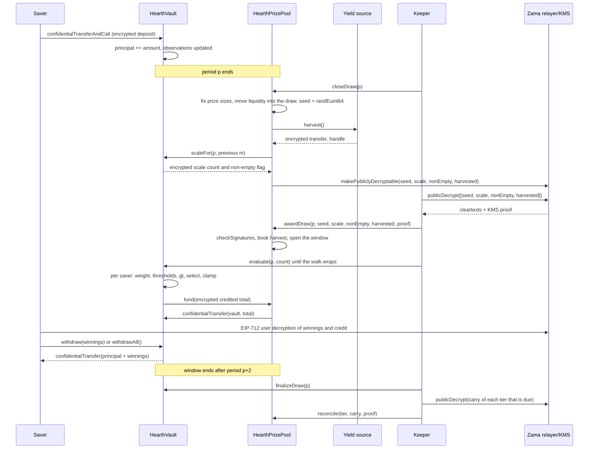

# Một kỳ quay diễn ra thế nào

Kỳ quay thưởng là lúc lợi suất của pool biến thành giải thưởng. Trang này đi qua toàn bộ quá
trình bằng lời lẽ giản dị, rồi kể lại đúng câu chuyện đó bằng một sơ đồ.

## Các kỳ

Thời gian được cắt thành các kỳ bằng nhau, mỗi kỳ `L` giây. Kỳ 1 bắt đầu tại `firstPeriodAt`,
một dấu thời gian được cố định lúc triển khai và không bao giờ đổi về sau. Từ đó trở đi, phép
tính chỉ là chia:

```
period(t)      = (t - firstPeriodAt) / L + 1
periodStart(p) = firstPeriodAt + (p - 1) * L
periodEnd(p)   = periodStart(p + 1)
```

Mỗi pool có `L` riêng. Trên Sepolia, pool USDC chạy một giờ còn sáu pool kia chạy sáu giờ, để
khách ghé thăm thấy trọn một vòng trong một lần ngồi. Trên mainnet, một bản triển khai thật sẽ
dùng một ngày, đúng như PoolTogether V5. Kỳ là một tham số khởi tạo, nên cùng đoạn mã phục vụ
được cả ba, và tỷ lệ trúng theo hạng giải của mỗi pool được đặt theo chính kỳ của pool đó. Xem
[pool và token](pools-and-tokens.md).

Kỳ quay `p` bao phủ kỳ `p`. Nó được quyết định hoàn toàn bởi số dư giữ trong kỳ `p`. Không có
gì xảy ra sau khi kỳ `p` kết thúc mà thay đổi được kết quả của nó.

## Cửa sổ, và hạn chót để đóng

Mọi bước của kỳ quay `p` đều diễn ra trong kỳ `p+1` và `p+2`. Đó là cửa sổ, và nó kết thúc tại
`periodEnd(p + 2)`. Tức là hai giờ ở pool USDC và nửa ngày ở các pool khác.

Việc đóng có hạn chót chặt hơn phần còn lại của cửa sổ:

```
closeDeadline(p) = periodStart(p + 2) + L / 2
```

Đó là giữa kỳ thứ hai của cửa sổ, tức ba phần tư chặng đường của cửa sổ. Đóng sau mốc đó sẽ bị
từ chối.

Lý do là việc đóng và việc trao giải không thể nằm chung một block. Đóng sẽ đánh dấu các giá
trị là giải mã được trên chuỗi, bản rõ quay về từ relayer của Zama ở ngoài chuỗi, rồi việc
trao giải kiểm chứng chúng trên chuỗi. Một lần đóng vào những giây cuối của cửa sổ sẽ khiến
vòng đi về đó không còn chỗ hạ cánh, và kỳ quay sẽ kẹt mãi ở trạng thái `Closed`. Hạn chót bảo
đảm dành ít nhất nửa kỳ cho vòng đi về, cho việc trao giải và cho mọi lô duyệt.

Cửa sổ cũng chặn luôn việc vault phải nhớ số dư lùi lại xa tới đâu, và đó là thứ khiến ba mốc
quan sát lưu cho mỗi người gửi là đủ. Xem
[số dư bình quân theo thời gian](time-weighted-balance.md).

## Năm bước

Mọi bước đều không cần cấp phép. Ai cũng gọi được bất kỳ bước nào, kể cả một người gửi ngay
trong ứng dụng. Keeper chỉ là địa chỉ thường tới đó trước.

### 1. Đóng

`closeDraw(p)`, khi kỳ `p` đã kết thúc và trước `closeDeadline(p)`.

Năm việc xảy ra trong đúng giao dịch này, theo thứ tự sau:

- **Giá trị giải được chốt.** Giá trị giải của từng hạng và phần thanh khoản hạng đó góp cho
  kỳ quay này được tính từ số tiền hạng đó đang giữ ngay lúc ấy, rồi phần thanh khoản đó
  chuyển vào kỳ quay. Việc này xảy ra trước khi seed ngẫu nhiên tồn tại.
- **Seed được rút.** `FHE.randEuint64()` chạy bên trong coprocessor của Zama, nên con số chỉ
  tồn tại dưới dạng bản mã và chưa ai nhìn thấy nó.
- **Vault báo tổng trọng số của kỳ nằm ở đâu**, dưới dạng một con đếm nhỏ đã mã hoá cùng một
  cờ mã hoá cho biết có ai giữ số dư hay không. Không phải bản thân tổng đó, và cũng chưa ở
  dạng bản rõ. Xem mục kế tiếp.
- **Nguồn lợi suất được thu hoạch**, dưới dạng một lần chuyển mã hoá về pool. Nếu nguồn bị
  revert, việc đóng vẫn thành công: phần thu hoạch được coi là số không mã hoá tầm thường và
  một sự kiện `HarvestFailed` được phát ra. Một nguồn lợi suất hỏng không dừng được đồng hồ.
- **Bốn handle được đánh dấu là giải mã công khai được:** seed, con đếm thang, cờ khác rỗng và
  phần thu hoạch. Đó là một lá cờ một chiều trên danh sách kiểm soát truy cập của Zama. Từ
  giây phút đó, ai cũng hỏi relayer để lấy bản rõ của chúng được, và lá cờ không thu hồi lại
  được. Không thứ gì khác của kỳ quay từng được đánh dấu như vậy.

Trạng thái kỳ quay chuyển sang `Closed`. Việc đóng chỉ thành công đúng một lần, và đó là lý do
không ai quay lại seed được.

Thứ tự bên trong giao dịch mới là điểm mấu chốt. Giá trị giải được chốt trước khi seed tồn
tại, nên không ai ngồi rình seed hiện ra, tính ra rằng mình trúng, rồi sắp xếp lại tiền của
pool cho cái giải ấy đáng giá hơn.

### Vault công bố gì thay cho tổng

Tổng số dư bình quân theo thời gian của pool trong kỳ, ký hiệu `W`, không bao giờ được công
bố. Công bố chính xác nó từng là thiết kế cho tới ngày 3 tháng 9 năm 2026 và một lượt rà soát
đã phá vỡ nó: khi `W` công khai ở hai kỳ liên tiếp, cộng với dấu thời gian công khai của chính
lần gửi hay rút của một người gửi, thì người gửi nào là người duy nhất dịch chuyển tiền trong
một kỳ sẽ bị moi ra con số chính xác chỉ bằng số học. Không phải chặn khoảng, mà là moi ra
đúng số. Chuyện đó được mô tả trong
[những gì được giữ kín](../security/what-stays-private.md).

Thứ được công bố bây giờ là bậc mà `W` rơi vào: luỹ thừa hai nhỏ nhất bằng hoặc lớn hơn nó, ký
hiệu `M = 2^m`. Vault theo dõi nó dưới dạng mã hoá. Ở mỗi lần đóng, nó so `W` với năm luỹ thừa
hai quanh giá trị `m` của kỳ quay trước, cộng các kết quả lại thành một con đếm nhỏ đã mã hoá,
rồi đánh dấu con đếm đó là giải mã công khai được. Pool tính ra `m` mới từ con đếm đã được
kiểm chứng. Một phép so mã hoá riêng với 1 cho ra cờ khác rỗng, cho biết có ai giữ số dư hay
không.

Vậy nên mỗi kỳ quay người quan sát biết được đúng một điều: pool có vượt qua một luỹ thừa hai
hay không. Giữa hai lần vượt, họ không biết thêm gì mới. Mọi kỳ quay đều chạy trên `M` chứ
không phải `W`, và đó là thứ khiến số đếm giải thưởng mô tả bên dưới cộng lại đúng như vậy.

### 2. Trao giải

`awardDraw(p, seed, scaleCount, nonEmpty, harvested, proof)`.

Người gọi lấy bốn bản rõ từ relayer của Zama, và relayer trả về kèm chữ ký của dịch vụ quản lý
khoá (KMS), tức nhóm các bên nắm khoá giải mã của mạng. Hợp đồng kiểm chữ ký đó ngay trên
chuỗi bằng `FHE.checkSignatures` trước khi tin bất kỳ con số nào. Bằng chứng được gắn với các
handle theo một thứ tự cố định, `[seed, scaleCount, nonEmpty, harvested]`, nên bốn giá trị đó
không thể bị xáo trộn hay phát lại cho một kỳ quay khác.

Rồi:

- Phần thu hoạch đã kiểm chứng được ghi có cho các hạng giải theo trọng số phần chia của
  chúng. Đây là con đường duy nhất để tiền giải thưởng đi vào, và nó rơi vào các hạng giải chứ
  không rơi vào kỳ quay này, nên nó được đem ra ở lần đóng kế tiếp. Pool không bao giờ ghi sổ
  một con số mà nguồn lợi suất tự khai về mình.
- Nếu cờ khác rỗng nói rằng không ai giữ số dư trong kỳ `p`, kỳ quay được đánh dấu `Empty` và
  phần thanh khoản nó đang đem ra quay thẳng về các hạng giải.
- Nếu không, kỳ quay mở ra. Seed và bậc `M` giờ đã là những con số công khai.
- Nếu cửa sổ đã đóng vào lúc có người trao giải, phần thu hoạch vẫn được ghi có, phần thanh
  khoản đem ra vẫn quay về các hạng giải, và kỳ quay được đánh dấu `Skipped`. Kỳ đó không trả
  giải nào, và không mất lợi suất hay thanh khoản nào.

Năm trạng thái của kỳ quay là `None`, `Closed`, `Awarded`, `Empty` và `Skipped`.

**Đây chính là khoảnh khắc người trúng được quyết định.** Từ đây seed là một con số công khai,
bậc là một con số công khai, và trọng số của mọi người gửi cho kỳ `p` không đổi được nữa. Các
ngưỡng mà mỗi người gửi phải vượt qua chỉ là phép tính trên những đầu vào công khai. Việc
duyệt, ở bước sau, không quyết định gì cả. Nó chỉ ghi lại một kết quả vốn đã tồn tại.

### 3. Duyệt

`evaluate(p, count)` trên vault, gọi bao nhiêu lần cũng được, trong lúc cửa sổ còn mở.

Người gọi nói đi tiếp bao nhiêu người gửi. Họ không nói là những ai. Vault duyệt danh sách
người gửi từ một con trỏ riêng của mỗi kỳ quay, bắt đầu tại `seed mod saverCount` và tiến theo
thứ tự trong danh sách, xử lý tối đa `count` người gửi và tối đa `4` người cần tới phép tính
mã hoá. Người gửi nào không có mốc quan sát nào tại hoặc trước kỳ `p` thì có trọng số bằng
không, và họ bị bỏ qua dựa trên dấu thời gian bản rõ của chính họ, không tốn chút chi phí mã
hoá nào.

Với mỗi người gửi mà vòng duyệt chạm tới, vault đọc trọng số mã hoá của họ cho kỳ `p`, chạy
phép thử người trúng đối chiếu với các ngưỡng công khai, rồi cộng kết quả vào tiền thưởng đã
mã hoá của họ. Nó lưu trọng số mã hoá và khoản ghi có mã hoá của người gửi đó cho kỳ quay, cả
hai chỉ mình người gửi ấy đọc được, để ứng dụng hiện được "bạn trúng X ở kỳ quay p" và để họ
kiểm lại phép so. Rồi nó kéo tổng đã ghi có của lô đó, ở dạng mã hoá, về từ quỹ giải thưởng.

Không ai chọn được ai bị duyệt hay duyệt theo thứ tự nào. Người gửi muốn biết kết quả của mình
thì đẩy chính cái vòng duyệt mà mọi người khác cũng đẩy, nên gửi một giao dịch duyệt không nói
lên điều gì về việc bạn có trúng hay không. Điểm khởi đầu dịch chuyển mỗi kỳ quay, vì nó đến
từ seed của kỳ quay đó, nên không có địa chỉ nào vĩnh viễn đứng cuối hàng.

`evaluate` bị revert với một kỳ quay ở trạng thái `Empty`, `Skipped`, hoặc chưa được trao giải.

### 4. Chốt

`finalizeDraw(p)`, khi cửa sổ đã đóng.

Phần mà mỗi hạng giải đem ra mà không trả hết sẽ được gộp vào phần dư mã hoá của hạng đó. Phần
dư là một tổng luỹ kế, luôn ở dạng mã hoá và đi theo từ kỳ quay này sang kỳ quay khác. Nó được
cộng vào phần thanh khoản mà hạng đó đem ra ở mỗi lần đóng, nên tiền chưa trả quay lại cuộc
chơi ngay lập tức dù độ lớn của nó vẫn là bí mật.

Việc chốt cũng công bố handle hiện thời của một bộ đếm mã hoá toàn cục, đếm mọi khoản mà pool
không cấp vốn nổi. Với các lần thu hoạch đã kiểm chứng, nó luôn bằng không.

### 5. Đối soát

`reconcile(tier, carry, proof)` trên pool, mỗi lần một hạng giải, và chỉ khi hạng đó tới hạn.

Mỗi hạng giải đối soát theo nhịp đặt lúc triển khai là `reconcileEvery[t]` kỳ quay. Trên
Sepolia, mọi hạng giải đều tới hạn ở mỗi kỳ quay. Khi một hạng tới hạn, `finalizeDraw` đánh
dấu phần dư của nó là giải mã công khai được và phát ra `CarryPublished`. Ai đó lấy bản rõ,
gọi `reconcile` kèm bằng chứng KMS, và con số đã kiểm chứng được ghi ngược vào phần thanh
khoản bản rõ của hạng đó. Vault trừ đúng con số ấy khỏi phần dư, vốn có thể đã tăng lên trong
lúc chờ, rồi `TierReconciled` được phát ra.

Việc đối soát chính là thứ làm cho số giải của hạng đó thành công khai, vì phần dư đúng bằng
phần đem ra mà không ai trúng. Với nhịp bằng một, số đếm của từng hạng thành công khai một kỳ
quay sau cái kỳ quay nó thuộc về, và toàn bộ quỹ của từng hạng lại lộ ra cho ứng dụng hiển thị
là nó đang lớn dần. Nâng nhịp lên thì giấu số đếm đi bấy nhiêu kỳ quay và giấu luôn cái quỹ
đang lớn dần, đó là sự đánh đổi trình bày trong
[giải thưởng và các hạng giải](prizes-and-tiers.md). Đằng nào cũng không có gì bốc hơi, và ở
bất kỳ nhịp nào bạn cũng không bao giờ biết ai trúng.

## Chuyện gì xảy ra nếu một bước không bao giờ chạy

- **Việc đóng không bao giờ chạy.** Kỳ quay giữ nguyên `None` và bị bỏ qua. Thanh khoản của nó
  chưa hề dịch chuyển, nên nó ở lại trong các hạng giải và được đem ra ở kỳ quay sau. Phần thu
  hoạch được thu ở lần đóng kế tiếp.
- **Việc trao giải không chạy kịp trong cửa sổ.** Một lần trao giải muộn vẫn ghi sổ phần thu
  hoạch, vẫn trả phần thanh khoản đem ra về các hạng giải, và đánh dấu kỳ quay là `Skipped`.
- **Không ai duyệt.** Toàn bộ phần đem ra của mỗi hạng giải được gộp vào phần dư của nó lúc
  chốt và quay lại ở lần đối soát kế tiếp.

Không gì bị mắc kẹt và không gì bị mất. Một keeper đứng máy khiến pool mất một kỳ quay, chứ
không mất tiền. Xem [trang keeper](../operations/keeper.md).

## Tiền không bao giờ dịch chuyển theo một lời khai

Hai quy tắc làm cho phần sổ sách khó bị lừa.

Lợi suất không bao giờ được tin suông. Nguồn thực hiện một lần chuyển mã hoá về pool, pool là
bên nhận nên được cấp quyền trên bản mã đó, rồi mới đến lúc pool công bố nó và ghi sổ bản rõ
đã được KMS kiểm chứng. Một nguồn lợi suất lỗi hay có ý xấu có thể gửi ít hơn số nó tuyên bố;
nhưng nó không thể làm pool tin vào món tiền giải thưởng chưa bao giờ tới. Điều này quan trọng
vì tiền giải thưởng ảo rốt cuộc sẽ được trả bằng tiền gốc của ai đó.

Các khoản chi được kéo về, chứ không đẩy đi. Sau mỗi lô duyệt, vault cấp cho pool một hạn mức
ngắn hạn trên tổng đã mã hoá của lô, pool cấp cho token đúng như vậy, rồi token chuyển đúng số
đó từ pool sang vault. Nếu pool thiếu, vault ghi lại phần hụt vào bộ đếm mã hoá toàn cục về
khoản chưa cấp vốn, bộ đếm này được công bố lúc chốt để bất kỳ ai cũng kiểm được. Với các lần
thu hoạch đã kiểm chứng, bộ đếm đó luôn bằng không.

## Trọn một kỳ quay, từ đầu tới cuối



## Trang này không nói tới điều gì

Nó không nói tới cách trọng số của một người gửi được dựng lên trong một kỳ, chuyện đó ở
[số dư bình quân theo thời gian](time-weighted-balance.md), cũng không nói tới phép tính của
phép thử người trúng, chuyện đó ở [chọn người trúng](winner-selection.md), cũng không nói tới
mỗi giải lớn cỡ nào, chuyện đó ở [giải thưởng và các hạng giải](prizes-and-tiers.md).
