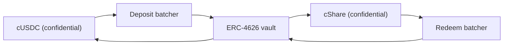

# Tiền giải thưởng đến từ đâu

Giải thưởng chính là lợi suất. Không bao giờ có tiền gốc của ai bị đem đi trả giải, và đó là
thứ làm cho pool này không thua lỗ. Trang này nói về một giao diện duy nhất mà mọi nguồn đều
phải cài đặt, nguồn đang chạy trên Sepolia hôm nay, vì sao pool từ chối tin lời một nguồn về
bất cứ điều gì, và Confidential Vault của chính Zama cắm vào ra sao trên mainnet.

## Giao diện

```solidity
interface IYieldSource {
    function harvest() external returns (euint64 transferred); // confidential transfer to the recipient
    function harvestable() external view returns (uint64);      // display only
}
```

Hai hàm. `harvest` chuyển phần lợi suất đã tích luỹ sang quỹ giải thưởng bằng một lần chuyển
bảo mật và trả về số tiền đã mã hoá thực sự dịch chuyển. `harvestable` dành cho phần hiển thị
của ứng dụng và pool không bao giờ dùng nó để ghi sổ.

`harvest` đồng bộ là có chủ ý. Nó chuyển bất cứ thứ gì nguồn đã sẵn sàng vào thời điểm đó, còn
một nguồn sinh lời bất đồng bộ thì được kỳ vọng phải chuẩn bị sẵn số tiền đó từ trước thay vì
bắt pool phải chờ.

Đổi nguồn chỉ là một lệnh gọi của chủ sở hữu trên pool, `setYieldSource`, và nó phát ra
`YieldSourceSet`. Không phần nào khác trong hệ thống biết hay quan tâm nguồn nào đang được gắn
vào.

Một nguồn bị revert không làm dừng một kỳ quay. Pool bắt lấy lỗi đó, coi phần thu hoạch của kỳ
quay ấy là số không mã hoá tầm thường, và phát ra `HarvestFailed`. Việc đóng vẫn thành công, kỳ
quay chạy trên phần thanh khoản mà các hạng giải đã giữ sẵn, và phần lợi suất không chuyển được
sẽ được gom ở một lần thu hoạch sau. Một nguồn hỏng hay nối sai làm đói phía giải thưởng; nó
không dừng được đồng hồ.

Khi một lần thu hoạch thực sự về, nó được ghi sổ lúc trao giải của kỳ quay đó và được đem ra ở
lần đóng kế tiếp. Vậy nên lợi suất của kỳ `p` tài trợ cho giải thưởng của kỳ quay `p+1`, không
phải của kỳ quay `p`. Đó là thứ cho phép chốt giá trị giải trước khi seed tồn tại.

## Sepolia: nguồn được tài trợ

`SponsoredYieldSource` là thứ đang chạy trên mọi pool đang hoạt động, mỗi pool một bản, nên bảy
nguồn là bảy số dư riêng biệt của bảy token khác nhau. Nguồn của pool USDC ở
`0xCC49DF69eAB6884fD8DD9260902B8A0Abc9D6b91`; sáu nguồn còn lại nằm trong
[pool và token](pools-and-tokens.md).

Nhà tài trợ gọi hàm `sponsor` của chính nguồn đó bằng token công khai của pool. Nguồn bọc nó
thành token bảo mật và ghi sổ đúng số mà lớp bọc đã mint, không phải số nhà tài trợ xin. Từ đó
trở đi, số dư nhỏ giọt theo `ratePerSecond`, trên pool USDC là
`5,555 base units a second, which is 19.998 USDC a period`,
và `harvest` gửi tất cả những gì đã tích luỹ sang pool. Tốc độ của mỗi pool được đặt theo số
token chẵn mỗi giờ để hai pool chạy hai đồng hồ khác nhau vẫn so sánh được ngay, và mọi khoản
tài trợ đều được tính đủ cho hơn tám mươi kỳ quay.

Một khoản tài trợ là một khoản cho hẳn. Nhà tài trợ không có đường nào lấy lại, và chỉ chủ sở
hữu của nguồn mới đổi được tốc độ nhỏ giọt, việc này phát ra `RateChanged`.

Số tiền tài trợ, tốc độ nhỏ giọt và mọi lần thu hoạch đều công khai. Đó không phải một sự thoả
hiệp: trong PoolTogether, lượng lợi suất mà một vault đóng góp cũng công khai, và mọi giá trị
giải đều suy ra từ đó. Thứ được giữ kín trong Hearth là ai tiết kiệm bao nhiêu và ai trúng, chứ
không bao giờ là pool kiếm được bao nhiêu tiền.

Nếu pool không có người gửi nào trong một thời gian, lợi suất vẫn tích luỹ và được trả cho
những kỳ quay đầu tiên có người gửi. Không có gì mắc kẹt trong một pool rỗng.

### Vì sao lại dùng bản mock

Vì một nguồn mock chỉ trung thực khi tài liệu nói rõ nó hoạt động thế nào và một nguồn thật cắm
vào ra sao, cả hai đều nằm bên dưới. Chúng tôi đã đi tìm một nguồn thật trước, và trên Sepolia
không có nguồn nào trả lợi suất trên các token mock của Zama:

| Nơi | Vì sao không được |
| --- | --- |
| Aave | Từ chối nhận USDC trên Sepolia, đã vượt trần cung |
| Compound | Muốn USDC của chính Circle, không phải bản mock của Zama |
| Confidential Vault của Zama | Bản trên Sepolia là VaultV2 chỉ để không, không có bộ nối lợi suất, và đó là mô tả của chính Zama về nó |

Nên hai lựa chọn trung thực là một con số giả cứ thế tăng lên, hoặc một số dư do nhà tài trợ
bỏ vào, thật sự tồn tại trên chuỗi và thật sự nhỏ giọt. Chúng tôi chọn cái thứ hai. Từng đơn vị
tiền giải thưởng trên cả bảy pool đang chạy đều đã thật sự được bọc, thật sự được chuyển và
thật sự được kiểm chứng.

## Pool không bao giờ ghi sổ theo một con số tự khai

Đây là quy tắc giữ cho nguồn được tài trợ không trở thành một điểm yếu.

Nguồn thực hiện một lần chuyển mã hoá về pool. Pool, với tư cách bên nhận, được cấp quyền trên
bản mã đó, nên nó tự đánh dấu được số tiền đã chuyển là giải mã công khai được. Chỉ tới lúc
trao giải, sau khi `FHE.checkSignatures` kiểm chứng chữ ký của dịch vụ quản lý khoá trên bản
rõ, pool mới ghi có bất cứ thứ gì cho các hạng giải.

Một nguồn nói dối về số tiền nó đã gửi thì chẳng đi tới đâu. Pool ghi sổ theo số đã tới, vì đó
là con số duy nhất nó từng nhìn tới.

Đây không phải sự thận trọng lý thuyết. Trong thiết kế trước của chúng tôi, pool ghi sổ các
khoản nạp thêm vào quỹ dự trữ theo số mà người gọi truyền vào, trong khi lớp bọc mint
`amount / rate()`. Trên bản triển khai đang chạy khi đó, `rate()` tình cờ bằng 1 nên hai số
trùng nhau và lỗi nằm im. Với một token cơ sở 18 chữ số thập phân, nơi tỷ lệ của lớp bọc là một
triệu triệu, pool sẽ tin vào lượng tiền giải thưởng gấp một triệu triệu lần số thực có. Chúng
tôi đã thực thi điều đó vào ngày 2 tháng 9 năm 2026 trên một token thử nghiệm 18 chữ số thập
phân và tận mắt thấy nó xảy ra. Thanh khoản giải thưởng ảo trong một pool không thua lỗ rốt
cuộc sẽ được trả bằng tiền gốc của ai đó, mà đó là lời hứa duy nhất sản phẩm này không được
phép phá. Kiểm chứng lần chuyển tiền loại bỏ trọn cả nhóm lỗi này.

## Mainnet: Confidential Vault của Zama

Zama phát hành một protocol mà toàn bộ công việc là sinh lợi suất trên các số dư bảo mật, và đó
là nguồn mainnet tự nhiên. `ConfidentialVaultYieldSource` là bộ nối trong thiết kế đó. Phần
tiếp theo là đặc tả của nó, không phải một hợp đồng có trong kho mã này.

Mỗi pool một bộ nối, như mọi thứ khác ở đây, và mỗi bộ nối cần một batcher và một vault sinh
lợi suất cho chính token của nó. Bản triển khai mainnet của Zama hiện phủ USDC, nên một Hearth
trên mainnet sẽ mở pool USDC trên Confidential Vault và mở các token khác trên bất cứ nguồn nào
có cho chúng, hoặc không mở.

Thiết kế đó là một batcher nằm giữa các token bảo mật và một vault sinh lợi suất ERC-4626 thông
thường. Một vault ERC-4626 chỉ nhận các lần chuyển công khai, nên một người gửi đơn lẻ sẽ công
bố chính xác số tiền của mình. Batcher thay vào đó gom nhiều khoản gửi đã mã hoá lại, chỉ giải
mã phần tổng, thực hiện một lần gửi công khai vào vault, rồi trả các phần vốn bảo mật ra. Chính
lời của Zama: "Người quan sát thấy ai đã tham gia, nhưng không thấy ai đóng góp bao nhiêu."



Bộ nối tham gia vào batcher gửi tiền bằng token bảo mật của pool và nắm giữ các phần vốn bảo
mật. Việc rút vốn chạy theo lịch riêng của nó, đi trước lần thu hoạch: keeper định kỳ hỏi
batcher rút vốn về phần tăng thêm rồi dắt yêu cầu đó qua bốn chặng của nó, để tới lúc pool gọi
`harvest` lần sau thì phần USDC bảo mật đã rút về sẵn đang nằm trong bộ nối và lần thu hoạch
chỉ là một lần chuyển đơn giản như mọi lần khác. Đó là cách một nơi bất đồng bộ gặp được một
giao diện đồng bộ. Cả bốn chặng đều không cần cấp phép, nên không ai phải chờ đơn vị vận hành
của Zama chạy chúng.

### Các địa chỉ

Lấy từ chính bảng tra địa chỉ của Zama, tải về ngày 2 tháng 9 năm 2026.

**Ethereum mainnet, chain id 1.** Tài sản cơ sở là USDC. Nguồn lợi suất: VaultV2 "Steakhouse
Confidential Prime USDC" của Morpho, được khoá cổng sao cho batcher gửi tiền là bên gửi duy
nhất của vault.

| Hợp đồng | Địa chỉ |
| --- | --- |
| Deposit batcher | `0x324EA89FD3784036673BfE6Ffee2334A088F40Cc` |
| Redeem batcher | `0x96Cd3Faa7483783Ac2Eb715f6333361500F1eec9` |
| Lớp bọc cUSDC | `0xe978F22157048E5DB8E5d07971376e86671672B2` |
| Lớp bọc cShare | `0x66Bf74E96900D1a19c7070D939D124f2F565C458` |
| Vault ERC-4626 | `0xbEEF00A59B577423653A1526c7009bdE103F542B` |
| USDC | `0xA0b86991c6218b36c1d19D4a2e9Eb0cE3606eB48` |

**Sepolia, chain id 11155111.** Một môi trường dàn dựng: USDC là bản mock có hàm `mint` công
khai còn vault thì chỉ để không, không có bộ nối lợi suất.

| Hợp đồng | Địa chỉ |
| --- | --- |
| Deposit batcher | `0x48758559c14d4d92b4C74A99660B6a8dbe85F53b` |
| Redeem batcher | `0xe94E9afdDd43a19C2914739e9279cb6Fe287BEb0` |
| Lớp bọc cUSDC | `0x7c5BF43B851c1dff1a4feE8dB225b87f2C223639` |
| Lớp bọc cShare | `0x7E93d5c150A2178B1fCde0278582Acf59478eA5f` |
| Vault ERC-4626 (để không) | `0x6AB54988261AEC573a2CA13cF802d3B1114f864C` |
| Mock USDC | `0x9b5Cd13b8eFbB58Dc25A05CF411D8056058aDFfF` |

Vì vault trên Sepolia chỉ để không, bộ nối ở đây mới được đặc tả dựa trên giao diện batcher mà
Zama đã công bố chứ chưa được viết. Nói rằng nó đang chạy trong khi nó chẳng sinh ra đồng nào
sẽ là một lời nói dối mà ai cũng kiểm được trong một phút.

### Cắm nó vào thì thực tế nghĩa là gì

Batcher chạy qua bốn chặng: tham gia, điều phối, chốt, nhận về. Một lô chờ tới khi đủ tuổi tối
thiểu, rồi tổng của nó được giải mã, rồi vault kết toán, rồi các bên tham gia nhận về. Cả bốn
chặng đều không cần cấp phép, nên pool không bao giờ kẹt vì chờ đơn vị vận hành của Zama, và
các lượt nhận về không bao giờ hết hạn.

Nhịp đó chậm hơn kiểu nhỏ giọt tức thời của nguồn được tài trợ, và đó là lý do keeper chạy việc
rút vốn từ trước chứ không chạy bên trong `harvest`. Hợp đồng của pool không bao giờ phải chờ:
nó hỏi bộ nối lấy bất cứ thứ gì đã nhận về xong. Phần việc thật sự còn lại để đưa cái này lên
chạy là bản thân hợp đồng bộ nối, thứ mà kho mã này đặc tả chứ chưa cài đặt, và phần keeper của
nó, tức quyết định bao lâu thì khởi động một lượt rút vốn và rút bao nhiêu phần vị thế, một lựa
chọn mang tính chính sách mà nếu có trễ cũng không gây hệ quả gì trên chuỗi.

### Hearth sẽ thừa hưởng những gì

Gọi tên chuyện này cho tử tế cũng là một phần của việc đáng tin.

- **Rủi ro vault, trọn vẹn.** Batcher chuyển tiền vào một vault ERC-4626 của bên thứ ba. Nếu
  vault đó mất giá trị, số dư sinh lợi suất của pool mất giá trị theo. Đây là chỗ duy nhất mà
  chuyện "không thua lỗ" sẽ phụ thuộc vào hợp đồng của người khác, và đó là lý do một bản triển
  khai mainnet chỉ nên để phần sinh lợi suất ở đó.
- **Bảo mật ở mức lô, không phải ở mức pool.** Batcher giấu các số tiền lẫn vào những người
  cùng tham gia rồi giải mã phần tổng. Nếu Hearth là bên duy nhất trong một lô, số tiền gửi của
  nó sẽ thành công khai. Chuyện đó không tốn của chúng tôi gì cả, vì các lần thu hoạch của
  Hearth đằng nào cũng công bố, nhưng biết trước vẫn hơn là cứ tưởng batcher giấu được nhiều
  hơn thực tế.
- **Quyền của chủ sở hữu bị giới hạn.** Chủ sở hữu batcher đổi được tuổi tối thiểu của lô (trần
  7 ngày), hạn chót gọi lại (trần 30 ngày), mức chấp nhận trượt giá khi gửi, và tạm dừng được
  việc tham gia lẫn việc điều phối. Tài liệu của Zama nêu rõ chủ sở hữu không thể dịch chuyển
  hay đóng băng tiền của người dùng, không thể kiểm duyệt một kết quả, không thể giải mã số
  tiền của ai, và không thể nâng cấp hợp đồng. Phần bảo vệ trượt giá khi rút vốn bị tắt cứng
  trong mã để lối ra vẫn chạy được ngay cả khi vault đang sụt giá.

## Trang này không nói tới điều gì

Nó không nói tới ảnh hưởng của nguồn lợi suất lên bảng rò rỉ, chuyện đó nằm ở
[những gì được giữ kín](../security/what-stays-private.md). Nó không đo lợi suất của vault
Morpho, đó là con số của người khác và thay đổi hằng ngày. Và nó không khẳng định là bộ nối
đang chạy: trên Sepolia thì thứ được gắn vào là nguồn được tài trợ, và thẻ "Pool ngay lúc này"
trên bảng điều khiển gọi tên nó.
