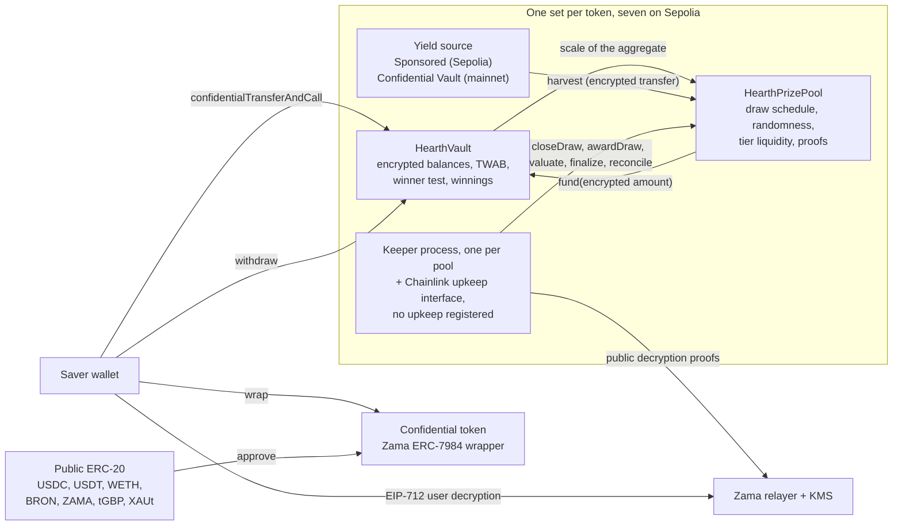

# Hearth là gì

Hearth là một pool tiết kiệm mà bạn không thể mất tiền và có thể trúng thưởng. Có bảy pool
như vậy chạy trên Sepolia, mỗi pool cho một token bảo mật, và bạn chọn token giống như chọn
một tài khoản tiết kiệm.

Bạn bỏ vào một token bảo mật: USDC, USDT, WETH, BRON, ZAMA, tGBP hoặc XAUt. Pool đem số tiền
đó đi sinh lời. Cuối mỗi kỳ, phần lợi suất pool kiếm được sẽ được chia thành giải thưởng, và
cơ hội trúng của bạn tỷ lệ thuận với việc bạn giữ bao nhiêu và giữ trong bao lâu. Bạn lấy
lại toàn bộ tiền gốc bất cứ lúc nào. Đó chính là ý tưởng "xổ số không thua lỗ" mà
PoolTogether nghĩ ra, và Hearth là phiên bản bảo mật của nó.

Khác biệt so với PoolTogether là trên một blockchain thông thường thì mọi thứ đều công khai.
Ai cũng đọc được từng người gửi có bao nhiêu tiền, tỷ lệ trúng của từng ví là bao nhiêu, và
ai trúng ở kỳ nào. Chuyện đó công bố tài sản của người ta và vẽ sẵn một cái đích lên lưng
bất kỳ ai gửi nhiều. Hearth chạy toàn bộ quy trình trên những con số đã mã hoá bằng Protocol
của Zama, nên chuỗi chỉ giữ số dư của bạn dưới dạng bản mã (dữ liệu không đọc được nếu không
có khoá) mà hợp đồng vẫn tính toán được trên đó. Số dư của bạn là một con số chưa ai từng
nhìn thấy, kể cả chúng tôi, mà kỳ quay thưởng thì người lạ vẫn kiểm chứng được.

## Toàn hệ thống trong một hình

Hai hợp đồng làm hết việc. `HearthVault` giữ tiền gốc đã mã hoá của từng người gửi, tiền
thưởng đã mã hoá của họ, bản ghi về việc họ giữ bao nhiêu trong bao lâu, và nó chạy phép thử
người trúng. `HearthPrizePool` chạy đồng hồ, rút seed ngẫu nhiên, thu lợi suất và giữ tiền
giải thưởng theo từng hạng. Một tiến trình keeper đẩy kỳ quay đi tiếp, và mọi bước nó làm
thì bất kỳ ai khác cũng làm được thay.

Cái hộp ở giữa là pool của một token. Có bảy hộp như vậy và chúng không chia sẻ gì với nhau:
vị thế USDC và vị thế WETH của bạn là hai người gửi riêng biệt trong hai vault riêng biệt, và
một pool im lìm thì sáu pool còn lại vẫn chạy. Bạn đang xem pool nào thì nhìn phần đầu của
thanh địa chỉ, `/app/usdc` hay `/app/weth`. Danh sách đầy đủ kèm địa chỉ nằm ở
[pool và token](../concepts/pools-and-tokens.md).

## Bốn thao tác

Người gửi tiết kiệm làm bốn thao tác. Đây là việc mỗi thao tác làm và điều nó để lộ.

### 1. Gửi tiền

Bạn gửi token bảo mật của pool đó vào vault bằng một giao dịch. Số tiền đi dưới dạng handle
bản mã, tức một con trỏ tới giá trị đã mã hoá chứ không phải bản thân giá trị. Vault cộng nó
vào tiền gốc đã mã hoá của bạn và cập nhật bản ghi số dư theo thời gian, tất cả mà không giải
mã gì cả.

- Được giấu: số tiền, số dư đang chạy của bạn, và do đó cả phần của bạn trong pool.
- Công khai: địa chỉ của bạn, block bạn thực hiện, và việc có một lần gửi tiền xảy ra.

Có một đường nối. Biến token công khai thông thường thành token bảo mật là một lần chuyển
ERC-20 công khai, nên số tiền bọc vào thì nhìn thấy được. Nếu bạn bọc 5.000 USDC rồi hai
block sau gửi vào pool, người quan sát đoán được rất sát. Hearth để việc bọc token và việc
gửi tiền thành hai bước tách rời đúng là để bạn tạo khoảng cách giữa chúng. Xem
[đường nối lúc bọc token](../security/what-stays-private.md).

### 2. Kỳ quay thưởng

Cuối mỗi kỳ, pool đóng kỳ quay của kỳ đó lại. Trong một giao dịch, nó chốt giá trị giải của
từng hạng, rồi rút một seed ngẫu nhiên đã mã hoá bên trong coprocessor của Zama, rồi hỏi
vault xem pool lớn cỡ nào, rồi thu lợi suất của kỳ. Thứ tự này quan trọng: giải được chốt giá
trị trước khi con số ngẫu nhiên tồn tại, nên không ai nhìn thấy seed rồi mới sắp xếp lại xem
trúng thì đáng bao nhiêu.

Chuyện "pool lớn cỡ nào" cố ý mơ hồ, và đó là chủ ý thiết kế. Vault không công bố tổng số dư
bình quân theo thời gian của tất cả người gửi cộng lại. Nó chỉ công bố bậc luỹ thừa hai mà
tổng đó rơi vào, nên thứ thế giới biết được là pool lớn cỡ nào chứ không phải chính xác bao
nhiêu. Công bố con số chính xác sẽ cho phép ai đó lấy hai kỳ liên tiếp trừ cho nhau và đọc ra
khoản gửi của một người gửi đơn lẻ từ phần chênh lệch.

Sau đó bốn giá trị nhỏ được đưa ra kèm một bằng chứng do dịch vụ quản lý khoá của Zama ký,
nên ai cũng kiểm được: seed, bậc, việc có ai trong pool hay không, và lợi suất đã thu. Kết
quả của mọi người gửi trong kỳ quay đó được chốt ngay khi những con số này được kiểm chứng.

- Được giấu: trọng số của từng người gửi, tổng chính xác của pool, và kết quả của từng người.
- Công khai: seed, bậc, lợi suất đã thu, giá trị giải của từng hạng, và, một kỳ quay sau đó
  khi hạng giải được đối soát, hạng đó đã trả bao nhiêu giải.

### 3. Nhận thưởng

Không có giao dịch nhận thưởng, và đó chính là điểm mấu chốt. Ứng dụng có nút nhận thưởng
thật, nằm trên thẻ của kỳ quay đó ở mục "Kỳ quay của tôi", và nút đó ghi rõ số tiền: nó là
một lệnh rút bình thường cho khoản tiền thưởng bạn vừa mở ra, và trên chuỗi nó trông y hệt
mọi lệnh rút khác.

Tiền thưởng được ghi có vào một số dư mã hoá riêng bên trong vault trong lúc kỳ quay đang
được duyệt. Bạn chẳng phải làm gì để chuyện đó xảy ra và cũng chẳng làm gì để lộ nó ra. Muốn
biết mình có trúng không, bạn ký một thông điệp EIP-712, tức chữ ký ngoài chuỗi theo định
dạng có kiểu chứng minh bạn kiểm soát địa chỉ của mình, rồi relayer của Zama trả bản rõ tiền
thưởng của chính bạn về trình duyệt. Chữ ký đó không hề chạm vào chuỗi, nên nó không tốn gì
và không để lại dấu vết. Số dư của bạn trên bảng điều khiển và kết quả của một kỳ quay mỗi
thứ có con mắt riêng, cả hai mở cùng lúc được, và chữ ký cho cái thứ nhất dùng được luôn cho
cái thứ hai.

- Được giấu: tất cả. Đọc tiền thưởng của chính bạn là một thao tác ngoài chuỗi.
- Công khai: không gì cả.

Ở phần lớn giao thức trúng thưởng, người trúng phải gửi một giao dịch nhận thưởng còn người
trượt thì chẳng có lý do gì để gửi, thế là danh sách giao dịch lặng lẽ gọi tên người trúng.
Hearth không có giao dịch nào như vậy để gửi. Giao dịch ghi có giải thưởng, `evaluate`, không
thể nhắm vào chính mình: nó duyệt danh sách người gửi từ một điểm do chính seed của kỳ quay
quyết định, còn người gọi chỉ nói được là đi tiếp bao xa.

### 4. Rút tiền

Chỉ một hàm rút tiền ra: `withdraw`. Nó trả từ tiền thưởng trước, rồi mới tới tiền gốc, và
kẹp xuống theo giá trị nhỏ hơn giữa số bạn đang giữ và số vault đang giữ. Dù bạn đang lĩnh
giải, đang đem tiền tiết kiệm về, hay cả hai cùng lúc, thì vẫn là một lệnh gọi đó với cùng
hình dạng, cùng sự kiện và một số tiền đã mã hoá.

Nửa sau của phép kẹp đó tồn tại vì một lần chuyển bảo mật chuyển trọn số tiền hoặc không
chuyển gì cả. Nó không bao giờ gửi một phần của số được yêu cầu. Vậy nên vault tính ra số nó
thực sự trả được trước khi bảo token trả, thay vì cố vá phần thiếu hụt sau đó.

- Được giấu: số tiền, và việc trong đó có tiền thưởng hay không.
- Công khai: địa chỉ của bạn, block, và việc có một lần rút xảy ra.

Tiền gốc của bạn không bao giờ bị khoá. Gửi và rút vẫn mở trong lúc một kỳ quay đang chạy,
điều mà nhiều thiết kế khác trong lĩnh vực này không làm được.

## Điều gì làm nên sự công bằng

Hai thứ, và người lạ không có quyền truy cập đặc biệt nào cũng kiểm được cả hai.

Seed ngẫu nhiên đến từ `FHE.randEuint64`, sinh ra bên trong coprocessor của Zama từ một seed
công khai dưới khoá FHE của mạng. Không ai đoán trước được và không ai rút hai lần được: việc
đóng một kỳ quay chỉ thành công đúng một lần. Khi kỳ đã kết thúc, pool công bố seed đó cùng
với bậc mà tổng của pool rơi vào, cả hai đều mang theo bằng chứng mà hợp đồng kiểm ngay trên
chuỗi.

Từ hai con số công khai đó, bất kỳ ai cũng tính lại được chính xác cái ngưỡng mà một địa chỉ
bất kỳ phải vượt qua ở một hạng giải bất kỳ, và vault còn phơi ra đúng phép tính ấy dưới dạng
hàm view để không ai phải tin vào một bản cài đặt lại. Thứ họ không làm được là nhìn thấy
trọng số đã mã hoá mà ngưỡng ấy được đem ra so. Vậy nên quy tắc thì công khai và kiểm được,
chỉ mỗi đầu vào là riêng tư. Chi tiết ở
[tính ngẫu nhiên và cách kiểm chứng](../security/randomness-and-verification.md).

## Những gì Hearth không che giấu

Bản ngắn, đầy đủ ở [những gì được giữ kín](../security/what-stays-private.md):

- Người gửi là ai, và mỗi người gửi tiền, rút tiền hay được duyệt vào lúc nào.
- Bậc mà tổng của pool rơi vào ở mỗi kỳ, seed, và lợi suất đã thu.
- Giá trị giải của từng hạng, và hạng đó trả bao nhiêu giải, công bố trễ một kỳ quay.
- Số tiền bạn bọc vào hoặc bọc ra khỏi token bảo mật.
- Với đúng một người gửi, bậc được công bố chính là trọng số của người đó, sai lệch trong
  khoảng gấp đôi. Với hai người, mỗi người chặn được khoảng của người kia. Quyền riêng tư ở
  đây cần từ ba người gửi trở lên và ứng dụng có nói rõ điều đó.
- Ngưỡng là công khai, nên ai ghim được số dư của bạn thì tính ra được kết quả của bạn ở mọi
  hạng, mọi kỳ quay. Chuyện đó thường xảy ra khi bạn bọc token rồi vài phút sau gửi vào đúng
  số tiền ấy, và đó là lý do ứng dụng tách hai bước ra.
- Bọc vào rồi bọc ngược ra hết sẽ công bố cận dưới của toàn bộ số tiền bạn từng trúng, vì cả
  hai chiều dịch chuyển đều công khai ở tầng token.
- Người gửi nào cứ trúng kỳ nào là rút ngay sau kỳ đó thì tự làm rò một manh mối thống kê qua
  chính hành vi của mình. Không hợp đồng nào chữa được chuyện ấy.
