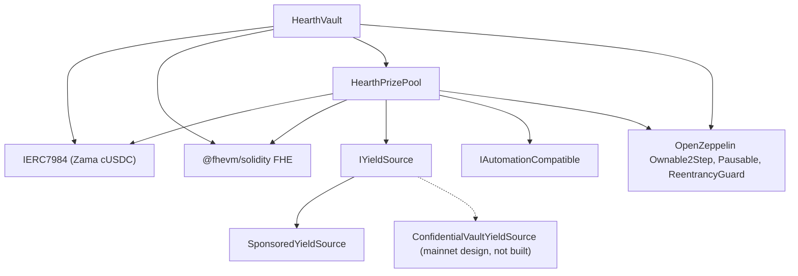

# Triển khai

Một script lặp lại được, không bao giờ bấm tay. Trang này là thứ tự, các tham số và ý nghĩa của
từng tham số, để người rà soát đọc các đối số khởi tạo đã triển khai là biết chúng khớp.

Hearth triển khai một pool cho mỗi token bảo mật: một vault, một quỹ giải thưởng và một nguồn
lợi suất cho mỗi token, không chia sẻ gì với pool nào khác. Một lượt chạy mở một pool, vì một
nonce của tài khoản triển khai chạy một lần triển khai, và token được chọn bằng `HEARTH_TOKEN`.
Mọi tác vụ sau đó đều nhận `--token`:

```
cd packages/contracts
HEARTH_TOKEN=weth npx hardhat deploy --network sepolia
npx hardhat hearth:verify  --network sepolia --token weth
npx hardhat hearth:seed    --network sepolia --token weth
npx hardhat hearth:status  --network sepolia --token weth
```

Bỏ trống cả hai thì bạn được `usdc`, token mặc định của mạng. Một slug lạ sẽ báo lỗi kèm danh
sách các pool mà mạng đó thật sự có. Tham số của mọi pool nằm trong một tệp,
`packages/contracts/hearth.config.ts`: cặp tài sản, độ dài kỳ, bộ hạng giải, bậc khởi đầu, tốc
độ nhỏ giọt, khoản tài trợ, năm khoản gửi mẫu và chỉ số tài khoản mà keeper của nó ký từ đó. Hãy
đọc tệp đó song song với các bảng bên dưới; vẫn là những con số ấy.

Lần triển khai sẽ dùng lại bất kỳ hợp đồng nào đã có bản ghi triển khai thay vì thay thế nó, nên
chạy lần thứ hai thì không làm gì cả. Một pool đang chạy, đang giữ tiền của người gửi và có
nhiều ngày lịch sử quay thưởng, không bao giờ bị dời sang địa chỉ mới chỉ vì chạy lại script.
Muốn thay một pool một cách có chủ ý thì hãy xoá tệp của nó dưới `deployments/<network>/`
trước.

Nó ghi ra `deployments/sepolia/hearth.<slug>.json`, là tệp mà một keeper được trỏ tới bằng
`HEARTH_ADDRESSES_FILE` và cũng là tệp dùng để sinh ra danh sách pool của ứng dụng.

## Cái gì phụ thuộc vào cái gì



Các cạnh liền là những hợp đồng có trong kho mã này. Nút nét đứt là con đường lợi suất trên
mainnet: bộ nối được đặc tả dựa trên giao diện batcher mà Zama đã công bố và ở đây chưa có hợp
đồng bộ nối nào được viết, nên bên dưới chỉ có `SponsoredYieldSource` được triển khai.

Vault và pool cần lẫn nhau, nên một trong hai liên kết được nối sau khi triển khai chứ không nối
trong hàm khởi tạo. Đó là lý do dưới đây có năm bước chứ không phải ba.

## Thứ tự

| Bước | Việc làm | Vì sao ở đây |
| --- | --- | --- |
| 1 | Triển khai `HearthVault` | Nó giữ tiền của người gửi và chỉ cần token là tồn tại được. |
| 2 | Triển khai `HearthPrizePool`, trỏ vào vault | Pool đọc đồng hồ của vault và con đếm thang của nó, rồi trả tiền cho vault. |
| 3 | Nối: `vault.setPrizePool(pool)` | Phát ra `PrizePoolSet`. Vault sẽ chỉ nhận cấp vốn từ địa chỉ này. |
| 4 | Triển khai nguồn lợi suất, trỏ vào pool làm bên nhận | Nó phải biết gửi các lần thu hoạch đi đâu. |
| 5 | Nối: `pool.setYieldSource(source)` | Phát ra `YieldSourceSet`. Trước khi bước này xong, một lần đóng không thu hoạch được gì và phát ra `HarvestFailed`. |

Sau bước 5, hãy mồi cho pool: `hearth:seed --token <slug>` tài trợ cho nguồn lợi suất để có giải
thưởng và đưa năm người gửi mẫu với quy mô khác nhau vào từ tài khoản 2 đến 6, để khách ghé lần
đầu rơi vào một pool đã có người chứ không phải một pool rỗng. Mọi bước của nó đều kiểm tra trên
chuỗi xem việc gì đã xong, nên một lượt mồi bị relayer trục trặc làm gián đoạn thì chạy lại vẫn
an toàn.

Keeper của pool đó cũng cần ETH Sepolia riêng, và năm người gửi mẫu cũng vậy:

```
npx hardhat hearth:spread-gas --network sepolia --token weth
npx hardhat hearth:spread-gas --network sepolia --keepers 10,11,12,13,14,15 --savers false
```

Lệnh đầu nạp cho keeper của một pool và cho những người gửi; lệnh thứ hai nạp cho nhiều tài
khoản keeper trong một lượt, đúng thứ cần khi mở sáu pool cùng lúc.

Rồi trỏ ứng dụng vào những gì vừa triển khai:

```
cd ../web
node scripts/sync-pools.mjs
```

## Các tham số

```
HearthVault(IERC7984 asset, uint256 periodLength, uint256 firstPeriodAt, address owner)
HearthPrizePool(IHearthVault vault, IERC7984 asset, Tier[3] tiers, uint8 initialScaleBits, address owner)
    Tier = { uint32 prizeCount; uint64 oddsNumerator; uint64 oddsDenominator; uint16 shares; uint16 reconcileEvery }
SponsoredYieldSource(IERC7984ERC20Wrapper asset, address recipient, uint64 ratePerSecond, address owner)
```

### HearthVault

| Tham số | Ý nghĩa | Đặt sai thì sao |
| --- | --- | --- |
| `asset` | Token bảo mật ERC-7984 mà người gửi nạp vào, một trong bảy token của Zama. | Mọi lớp bọc đều báo sáu chữ số thập phân, và lần triển khai sẽ dừng lại nếu chuỗi không khớp với cấu hình. Tỷ lệ so với token công khai bên dưới không phải pool nào cũng bằng 1: trên bản mock WETH 18 chữ số thập phân thì nó là một triệu triệu, nên bất cứ thứ gì đọc token công khai đều phải áp dụng nó. |
| `periodLength` (`L`) | Số giây trong một kỳ. Bất biến. | Nó cũng đặt luôn trần cho mỗi người gửi, `(2^64 - 1) / L`. `L` quá nhỏ thì trần rất lớn nhưng các kỳ quay nhiễu; `L` quá lớn thì trần siết lại. |
| `firstPeriodAt` | Dấu thời gian lúc kỳ 1 bắt đầu. Bất biến, và phải bằng hoặc trước lúc triển khai. | Một giá trị ở tương lai làm `period(now)` không xác định cho tới khi nó trôi qua. |
| `owner` | Chủ sở hữu hai bước. Chức năng từ bỏ quyền bị tắt. | Các quyền được liệt kê trong [mô hình mối đe doạ](../security/threat-model.md). |

`maxPrincipal` được suy ra từ `periodLength` chứ không phải được đặt. Với một giờ thì nó khoảng
5 tỷ token, sáu giờ khoảng 854 triệu, và một ngày khoảng 213 triệu.

Vault sở hữu cái đồng hồ. Pool nhận địa chỉ vault rồi đọc các kỳ từ đó, nên không có cách nào để
hai hợp đồng bất đồng về việc đang là kỳ nào.

### HearthPrizePool

| Tham số | Ý nghĩa |
| --- | --- |
| `vault` | Vault mà pool này phục vụ, và cái đồng hồ nó đọc. |
| `asset` | Cùng token bảo mật mà vault dùng. Hai bên phải khớp. |
| `prizeCount[t]` | Số giải mỗi kỳ quay ở hạng `t`. |
| `oddsNumerator[t]`, `oddsDenominator[t]` | Tỷ lệ của hạng dưới dạng phân số, một kỳ quay trong `oddsDenominator / oddsNumerator` kỳ. |
| `shares[t]` | Lát cắt của hạng trong mỗi lần thu hoạch. Phần chia là tương đối, nên 40/20/40 và 2/1/2 nghĩa như nhau. |
| `reconcileEvery[t]` | Bao nhiêu kỳ quay trôi qua giữa hai lần công bố phần dư của hạng đó. |
| `initialScaleBits` | Độ dài bit kỳ vọng của tổng trọng số ở kỳ đầu tiên, tức phỏng đoán khởi đầu cho bộ theo dõi bậc. |
| `owner` | Như trên. |

`UTILISATION` là hằng số chứ không phải đối số: 50 phần trăm, theo PoolTogether V5. Đó là phần
thanh khoản bản rõ của một hạng được dùng để định cỡ mỗi giải.

Hai tham số trong số đó đáng nói thêm.

`reconcileEvery` là một thiết lập về quyền riêng tư, không phải về gas, và nó đánh đổi với việc
cái quỹ giải thưởng trông thế nào. Công bố phần dư của một hạng làm cho số giải của hạng đó
thành công khai, và một số đếm trên một kỳ quay thì trỏ vào nhóm nhỏ người gửi đủ điều kiện
trong kỳ quay đó. Đặt nó cao hơn thì rải số đếm ra một quãng mà gần như ai cũng đủ điều kiện ở
lúc nào đó. Cái giá phải trả là giải độc đắc nhìn thấy được: một lần đóng chuyển toàn bộ thanh
khoản công khai của một hạng vào kỳ quay và nó chỉ quay lại ở một lần đối soát, nên một hạng
chạy nhịp 24 sẽ công bố một giải định cỡ theo phần thu hoạch của đúng một kỳ quay ở 23 trên 24
kỳ quay, còn cái quỹ tích luỹ chỉ lộ ra ở kỳ quay có đối soát. Số tiền đó vẫn được đem ra và vẫn
trúng được suốt thời gian ấy, bên trong phần dư mã hoá; chỉ là nó vô hình. Sepolia chạy cả ba
hạng ở nhịp 1 vì lý do đó và nêu con số đếm theo từng kỳ quay như một phần dư. Xem giới hạn số
14.

`initialScaleBits` chỉ cần gần đúng là được. Bộ theo dõi so tổng thật với năm luỹ thừa hai quanh
phỏng đoán hiện tại ở mỗi lần đóng và tự sửa mình với tốc độ tối đa ba bit mỗi kỳ quay, nên một
phỏng đoán lệch vài bit chỉ tốn một hai kỳ quay có tỷ lệ hơi lệch thang rồi ổn định lại.

### SponsoredYieldSource

| Tham số | Ý nghĩa |
| --- | --- |
| `asset` | Lớp bọc ERC-7984 mà nó nắm giữ và gửi đi. Token công khai mà nhà tài trợ nạp vào chính là token cơ sở của lớp bọc, nên nó không phải một đối số riêng. |
| `recipient` | Quỹ giải thưởng nhận các lần thu hoạch. |
| `ratePerSecond` | Số dư được tài trợ nhỏ giọt ra thành lợi suất nhanh cỡ nào. |
| `owner` | Đặt tốc độ, phát ra `RateChanged`. |

Việc tài trợ là một lệnh gọi riêng sau khi triển khai, không phải một đối số khởi tạo. Nó ghi sổ
đúng số mà lớp bọc đã mint chứ không phải số nhà tài trợ xin, và nó không huỷ được.

## Ba bộ tham số

Sepolia chạy hai bộ, vì các pool chạy trên hai đồng hồ.

| Thiết lập | Sepolia `usdc` | Sepolia, sáu pool còn lại | Mainnet, phương án đề xuất |
| --- | --- | --- | --- |
| Độ dài kỳ | 1 giờ | 6 giờ | 1 ngày |
| Cửa sổ | 2 giờ (hai kỳ) | 12 giờ | 2 ngày |
| Hạn chót đóng | 1 giờ 30 phút sau khi kỳ kết thúc | 9 giờ sau | 1 ngày 12 giờ sau |
| Trần mỗi người gửi | Khoảng 5 tỷ token | Khoảng 854 triệu | Khoảng 213 triệu |
| Hạng giải lớn | số lượng 1, tỷ lệ 1/24, phần chia 40, đối soát mỗi kỳ quay | số lượng 1, tỷ lệ 1/4, phần chia 40, đối soát mỗi kỳ quay | số lượng 1, tỷ lệ 1/30, phần chia 50, đối soát mỗi kỳ quay |
| Hạng giải vừa | số lượng 1, tỷ lệ 1/6, phần chia 20, đối soát mỗi kỳ quay | số lượng 1, tỷ lệ 1/2, phần chia 20, đối soát mỗi kỳ quay | số lượng 1, tỷ lệ 1/7, phần chia 25, đối soát mỗi kỳ quay |
| Hạng giải thường | số lượng 4, tỷ lệ 1, phần chia 40, đối soát mỗi kỳ quay | số lượng 4, tỷ lệ 1, phần chia 40, đối soát mỗi kỳ quay | số lượng 4, tỷ lệ 1, phần chia 25, đối soát mỗi kỳ quay |
| Tỷ lệ sử dụng | 50 phần trăm | 50 phần trăm | 50 phần trăm |
| Nguồn lợi suất | `SponsoredYieldSource` | `SponsoredYieldSource` | `ConfidentialVaultYieldSource` trên batcher của Zama |
| Giải lớn nổ | Khoảng một lần một ngày | Khoảng một lần một ngày | Tuỳ theo tỷ lệ đã chọn |

Các con số Sepolia tồn tại để khách ghé thăm thấy trọn một vòng trong một lần ngồi: bốn giải nhỏ
mỗi kỳ quay và một giải lớn khoảng mỗi ngày ở cả hai đồng hồ. Chúng không phải thứ một bản triển
khai thật sẽ dùng.

Vì sao lại hai đồng hồ. Một kỳ quay với năm người gửi tốn `8,456,388` gas, nên bảy pool cùng
quay theo giờ sẽ tiêu khoảng `1.43 ETH` một ngày trên Sepolia, mà faucet công khai không theo
nổi. Sáu giờ cắt xuống còn bốn kỳ quay một ngày cho mỗi pool, khoảng `0.41 ETH` một ngày cho cả
bảy. Tỷ lệ trúng được đặt theo chính kỳ của từng pool chứ không bê nguyên qua, và đó là lý do
cột giữa ghi 1/4 và 1/2 ở chỗ cột đầu ghi 1/24 và 1/6, cũng là lý do giải lớn vẫn rơi khoảng một
lần một ngày ở cả hai. Pool USDC giữ đồng hồ theo giờ vì nó được triển khai đầu tiên và lịch sử
quay thưởng của nó được lưu theo đồng hồ ấy.

Cột mainnet là một phương án đề xuất, không phải một bản triển khai. Quy tắc để điền nó cũng
đúng là quy tắc đã sinh ra cột Sepolia: chọn xem bạn muốn bao nhiêu kỳ quay giữa hai lần giải
lớn rồi đặt tỷ lệ của hạng giải lớn thành một trên con số đó, rồi đặt phần chia sao cho giá trị
giải suy ra đọc lên nghe hợp lý so với lợi suất mà nguồn thực sự kiếm được, rồi quyết định nhịp
đối soát của từng hạng bằng cách cân giữa một số đếm giải không gọi tên ai với một cái quỹ mà
người gửi xem được nó lớn dần. Sepolia chọn vế thứ hai; một bản triển khai mainnet có thể chọn
vế thứ nhất, và đoạn phía trên nói mỗi bên phải trả giá gì. Một kỳ một ngày với tỷ lệ giải lớn
1 trên 365 cho ra một giải lớn hằng năm, đúng hình dạng mà V5 dùng.

## Các địa chỉ đã triển khai

Bảy pool trên Sepolia, mọi hợp đồng đều đã xác minh trên Etherscan. Cặp token mà mỗi pool nắm
giữ là của Zama và được liệt kê trong [pool và token](../concepts/pools-and-tokens.md), cùng với
số vốn mồi và tốc độ nhỏ giọt của từng pool.

| Pool | HearthVault | HearthPrizePool | SponsoredYieldSource | Triển khai ở block |
| --- | --- | --- | --- | --- |
| `usdc` | `0x0F93e5db6027b4FB1C76566d24aA2D2E417fAF52` | `0xA0785AacF30B6FE46EDc53CD8A9db1d94FeF5Df2` | `0xCC49DF69eAB6884fD8DD9260902B8A0Abc9D6b91` | `11622398` |
| `usdt` | `0xe54F44dE64F8A7abc0647eaae547dD59ce0EFfac` | `0x6a83Beb2Dc3f258107Cad5e17BC57657fAd4fbd1` | `0x5bb1Cd5380Cb9f2B15569030fF0dB7a445cF54cA` | `11641314` |
| `weth` | `0x3D1A182782B68fE270A66294C9adaC7F005c4f14` | `0x1a11e7C689F244fA8Dd5f4abA8F2F3131090cc1C` | `0x40DF298f15c6136294eC651aD7b0c1C6F221DE8F` | `11641366` |
| `bron` | `0x18086DC8271f8A73c5Ea985fd519527Dbb991279` | `0x2Ed982979CD184494B947a1E38E597494a38ACe4` | `0x0cD1155D752bD81b3a437a6f0B3965CAA2A1C8e9` | `11641408` |
| `zama` | `0xEEC26386F273c6678cA538AcA18e1d9384eA9F09` | `0x873B285404199D46325a294Aa0EC7a79C30A7fF7` | `0xdD352D70311E834ab75307f53d5C276060081d23` | `11641447` |
| `tgbp` | `0xCe95dAa01f5354aA8887A5952E403D26d452c323` | `0xC531D54ee2c695e0eBfe8b8258e9Fd80fd507095` | `0xDEa2BD6351072F735B6ea83c357bF157d83c01af` | `11641484` |
| `xaut` | `0x77f701101d66FbD522A3bFdC2c00DB09a4F57daE` | `0x9a2888aca42c707A3BC0D561FdF6ff8Abfda5201` | `0x03fDdAA7C4323C53CE511CC49D4c33B26B492af7` | `11641523` |

Thời điểm bắt đầu kỳ đầu tiên: `1788386400 (2 September 2026, 22:00:00 UTC)` cho `usdc`,
`1788620400 (5 September 2026, 15:00:00 UTC)` cho `usdt`, và
`1788624000 (5 September 2026, 16:00:00 UTC)` cho năm pool còn lại. `firstPeriodAt` là bất biến
và phải bằng hoặc trước block triển khai, nên lần triển khai đọc chính đồng hồ của chuỗi và làm
tròn xuống đầu giờ, không bao giờ đọc đồng hồ của máy.

## Xác minh

Xác minh là một phần của việc triển khai, không phải chuyện làm sau cho có. Một người rà soát
không đọc được mã nguồn đã triển khai thì buộc phải tin lời chúng tôi cho toàn bộ tài liệu này.

1. Xác minh cả ba hợp đồng của pool đó trên Etherscan với các đối số khởi tạo mà script triển
   khai đã ghi lại: `hearth:verify --token <slug>` làm việc đó, từng hợp đồng một, và nói rõ
   những cái nào đã xác minh từ trước.
2. Kiểm rằng các đối số khởi tạo đã xác minh khớp với các bảng tham số phía trên. Đặc biệt là
   pool được gán đúng vault của nó và cùng một `asset`, và bộ hạng giải khớp với cột ứng với đồng
   hồ của pool đó.
3. Kiểm rằng `vault.prizePool()` đúng là quỹ giải thưởng của pool đó và `pool.yieldSource()`
   đúng là nguồn của pool đó, và không cái nào trỏ vào hợp đồng của một pool khác.
4. Kiểm token: `asset` phải là lớp bọc bảo mật của pool đó trong danh sách Sepolia mà Zama công
   bố, và `underlying()` phải là bản mock công khai nằm bên dưới. `rate()` của lớp bọc chỉ bằng 1
   ở chỗ token công khai cũng báo sáu chữ số thập phân; trên pool WETH thì nó là một triệu triệu,
   và một tỷ lệ khác 1 làm đổi ý nghĩa của một đơn vị cơ sở với bất cứ thứ gì chạm vào token công
   khai.
5. Đọc `pool.scaleBits()` sau vài kỳ quay và kiểm xem nó đã ổn định gần với độ dài bit mà quy mô
   thật của pool ngụ ý hay chưa. Một bộ theo dõi kẹt xa mức đó nghĩa là phỏng đoán ban đầu lệch
   quá xa và phần hiệu chỉnh chưa đuổi kịp.

## Bí mật

Không có gì nhạy cảm bị viết cứng trong mã. Lần triển khai đọc từ một tệp `.env`, và
`.env.example` liệt kê mọi khoá kèm một dòng chú thích về nơi lấy giá trị của nó. Khoá của tài
khoản triển khai và khoá của keeper là hai tài khoản riêng, nên khoá nóng của keeper không có
quyền chủ sở hữu nào.

## Đưa ứng dụng lên máy chủ

Ứng dụng là một gói workspace Next.js, không phải thư mục gốc của kho mã, và đó là thiết lập duy
nhất mà phần lớn nhà cung cấp hay làm sai.

| Thiết lập | Giá trị | Vì sao |
| --- | --- | --- |
| Framework preset | Next.js | Nhận ra từ `packages/web/package.json` |
| Root directory | `packages/web` | Ứng dụng nằm trong một npm workspace |
| Include source files outside the root directory | Bật | Các phụ thuộc được nâng lên thư mục gốc của kho mã, và bản build cần `package.json` cùng tệp lockfile ở gốc |
| Install command | mặc định, `npm install` | Chạy ở thư mục gốc của kho mã và cài cả workspace |
| Build command | mặc định, `next build` | Khi đã đặt root directory, nó chạy bên trong `packages/web` |
| Output directory | mặc định, `.next` | Xem cảnh báo bên dưới |
| Node version | 20 trở lên | `package.json` ở gốc đặt `engines.node` |

Đừng đặt `NEXT_DIST_DIR` trong môi trường máy chủ. `packages/web/next.config.ts` đọc nó và dời
đầu ra của bản build đi khi nó có mặt. Nó tồn tại để một bản build kiểm chứng ở máy cục bộ không
tranh cùng thư mục `.next` với một dev server đang chạy. Trong một bản build trên máy chủ, nó sẽ
dời đầu ra khỏi chỗ mà nhà cung cấp đi tìm, và lần triển khai sẽ hỏng mà chẳng có gì rõ ràng để
lần ra.

### Biến môi trường

| Biến | Công khai trong trình duyệt | Giá trị lấy từ đâu |
| --- | --- | --- |
| `SEPOLIA_RPC_URL` | Không | Điểm cuối Sepolia của riêng bạn. Trang chủ và route `/api/activity` đọc chuỗi ở phía máy chủ, nên biến này không bao giờ tới trình duyệt. Các truy vấn log cần nó, vì nút công khai miễn phí giới hạn khoảng của `eth_getLogs` thấp hơn hẳn một ngày block |
| `NEXT_PUBLIC_SEPOLIA_RPC_URL` | Có | Tuỳ chọn. Các lượt đọc từ ví dùng nó và lùi về `https://ethereum-sepolia-rpc.publicnode.com` khi nó không được đặt. Nó lộ ra trong bundle, nên phải là điểm cuối bạn sẵn lòng công bố |
| `NEXT_PUBLIC_CHAIN_ID` | Có | `11155111` cho Ethereum Sepolia. Ứng dụng mặc định về giá trị này nếu không đặt |
| `NEXT_PUBLIC_WALLETCONNECT_PROJECT_ID` | Có | Tuỳ chọn, và lấy miễn phí ở bảng điều khiển của Reown tại https://dashboard.reown.com. Đặt nó thì mọi màn hình kết nối sẽ đưa thêm "Quét bằng điện thoại" bên cạnh tiện ích mở rộng của trình duyệt, đó là lối vào cho ví trên điện thoại và cho máy không cài được tiện ích nào. Để trống thì connector không được dựng lên chút nào, nên không ai bị đưa cho một cái nút hỏng đúng lúc họ quét |

Không còn địa chỉ hợp đồng nào là biến môi trường nữa. Ứng dụng đọc mọi pool từ
`packages/web/src/lib/chain/pools.json`, tệp mà `node scripts/sync-pools.mjs` sinh ra từ các tệp
địa chỉ do script triển khai ghi, nên một địa chỉ ứng dụng hiển thị luôn truy ngược được về một
bản ghi triển khai chứ không phải về thứ ai đó gõ vào. Hãy chạy script đó sau mỗi lần triển khai
và commit kết quả. Ba biến công khai từng chứa địa chỉ vault, quỹ giải thưởng và nguồn lợi suất
của một pool duy nhất nay đã bỏ; hãy xoá chúng khỏi mọi môi trường còn đặt chúng, vì không gì
đọc chúng nữa.

Tài sản bảo mật và ERC-20 cơ sở của nó cũng được đọc từ vault và từ lớp bọc trên chuỗi, nên ứng
dụng không thể nói chuyện với một token mà vault sẽ từ chối.

### Sau lần triển khai đầu tiên

1. Mở URL sản phẩm trên điện thoại. Mọi trang đều phải chạy được ở bề ngang 375 pixel.
2. Kết nối một ví trên Sepolia và đi lại đường đi hai phút trong README trên chính trang đã
   triển khai chứ không phải trên localhost.
3. Mở `/verify?pool=<slug>` và dán địa chỉ của một người gửi vào. Các ngưỡng đến từ một lệnh gọi
   hợp đồng, nên nếu chúng hiện ra thì ứng dụng đã triển khai đang nói chuyện với vault đã triển
   khai của pool đó.
4. Mở bộ chọn pool và kiểm rằng mỗi slug đều nạp đúng bảng điều khiển của mình, và token bị giới
   hạn thì hiện trang từ chối của nó chứ không phải một màn hình hỏng.

---

## Trang này không nói tới điều gì

Nó không nói tới việc vận hành các pool sau khi triển khai, chuyện đó ở [keeper](keeper.md), và
mỗi pool một tiến trình keeper là một phần của trang đó. Nó không nói tới mức độ sẵn sàng vận
hành trên mainnet: bộ nối Confidential Vault được đặc tả dựa trên giao diện batcher mà Zama công
bố và chưa được cài đặt trong kho mã này, còn việc đưa nó lên chạy được mô tả trong
[nguồn lợi suất](../concepts/yield-source.md).
