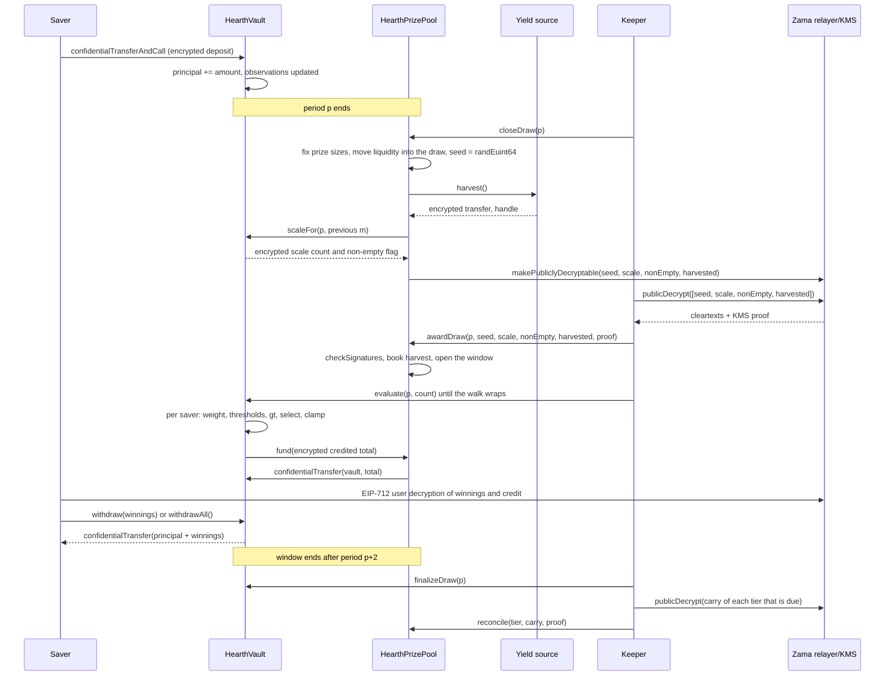

# 一次抽獎是怎麼跑的

抽獎就是資金池的收益變成獎金的那一刻。這一頁先用白話把整件事走一遍，再用一張圖說同一個故事。

## 期

時間被切成長度都是 `L` 秒的期。第 1 期從 `firstPeriodAt` 開始，那是部署時就定下、之後永不更動的
時間戳。從那裡開始，剩下的就只是除法：

```
period(t)      = (t - firstPeriodAt) / L + 1
periodStart(p) = firstPeriodAt + (p - 1) * L
periodEnd(p)   = periodStart(p + 1)
```

每個池有自己的 `L`。在 Sepolia 上，USDC 池跑一小時，其他六個跑六小時，好讓訪客在一次造訪裡看完
整個循環。在主網上，真實的部署會用一天，那也是 PoolTogether V5 用的長度。期長是建構子參數，所以
同一份程式碼三種都能跑，而每個池的層級機率都是依它自己的期長設定的。見
[資金池與代幣](pools-and-tokens.md)。

第 `p` 期的抽獎涵蓋第 `p` 期。它完全由第 `p` 期內持有的餘額決定。第 `p` 期結束之後發生的任何事，
都改變不了它的結果。

## 視窗，以及截止的期限

第 `p` 期抽獎的每一個步驟，都發生在第 `p+1` 和 `p+2` 期之間。那就是視窗，它在
`periodEnd(p + 2)` 結束。USDC 池是兩小時，其他池是半天。

截止的期限比視窗其他部分更緊：

```
closeDeadline(p) = periodStart(p + 2) + L / 2
```

那是視窗中第二期的中點，也就是整個視窗四分之三的地方。過了那個點就不准截止。

理由是截止和開獎不能擠在同一個區塊。截止會在鏈上把一些值標成可解密，明文在鏈下從 Zama 的中繼器
回來，然後開獎在鏈上驗證它們。若在視窗最後幾秒才截止，那趟來回就沒有落腳的地方，抽獎會永遠卡在
`Closed`。這個期限保證至少留下半期的時間，給那趟來回、開獎和每一批評估用。

視窗同時也限制了金庫必須記住多久以前的餘額，而那正是每位存戶只需要存三筆觀測值就夠的原因。見
[時間加權餘額](time-weighted-balance.md)。

## 五個步驟

每一步都無需許可。任何人都能呼叫其中任何一個，包括從 App 操作的存戶。keeper 只是通常最先到的那個
位址而已。

### 1. 截止

`closeDraw(p)`，在第 `p` 期結束之後、`closeDeadline(p)` 之前。

同一筆交易裡有五件事依序發生：

- **獎金金額被固定下來。** 每個層級這一期的獎金金額，以及它為這次抽獎拿出來的資金，都由該層級此刻
  持有的錢算出來，然後那筆資金移進這次抽獎。這件事發生在隨機種子存在之前。
- **抽出種子。** `FHE.randEuint64()` 在 Zama 的協同處理器裡執行，所以這個數字只以密文形式存在，
  沒有人看過它。
- **金庫回報這一期的總權重落在哪裡**，形式是一個加密的小型計數，加上一個加密旗標，說明到底有沒有
  人持有餘額。回報的不是總權重本身，也還不是明文。見下一節。
- **收成收益來源**，做法是一筆送到資金池的加密轉帳。如果來源失敗，截止照樣成功：那次收成被當成一個
  平凡加密的零，並發出 `HarvestFailed` 事件。壞掉的收益來源停不了這個時鐘。
- **四個 handle 被標記為可公開解密：** 種子、級距計數、非空旗標和收成金額。那是 Zama 存取控制清單上
  的一個單向旗標。從那一刻起，任何人都能向中繼器索取它們的明文，而這個旗標收不回來。這次抽獎的
  其他任何東西，永遠不會被這樣標記。

抽獎狀態轉為 `Closed`。截止只會成功一次，這就是沒有人能重擲種子的原因。

這筆交易內部的順序才是重點。獎金金額在種子存在之前就定了，所以沒有人能看著種子出現、算出自己中了
獎、再回頭重新安排池子的錢，好讓那次中獎更值錢。

### 金庫用什麼取代了總額的公布

該期資金池的時間加權餘額總和，寫作 `W`，永遠不會被公布。直到 2026 年 9 月 3 日之前，設計上是把它
精確公布的，然後一次審查把它打穿了：只要 `W` 在相鄰兩期都公開，再加上某位存戶自己存入或提領的
公開時間戳，那一期唯一動過錢的存戶，其確切金額就能被算術還原出來。不是推估範圍，是還原。這件事
記在[什麼保持私密](../security/what-stays-private.md)。

現在公布的是 `W` 落在哪個級距：大於或等於它的最小 2 的冪，寫作 `M = 2^m`。金庫在加密狀態下追蹤
它。每次截止時，它把 `W` 跟前一期 `m` 附近的五個 2 的冪做比較，把結果加總成一個加密的小型計數，
再把那個計數標成可公開解密。資金池從驗證過的計數算出新的 `m`。另一個獨立的加密比較（跟 1 比）給出
非空旗標，說明到底有沒有人持有餘額。

所以旁觀者每期只學到一件事：池子有沒有跨過一個 2 的冪。在兩次跨越之間，他們什麼新東西都學不到。
每一期都是拿 `M` 而不是 `W` 來跑的，這也是底下講的獎項數量之所以那樣加總的原因。

### 2. 開獎

`awardDraw(p, seed, scaleCount, nonEmpty, harvested, proof)`。

呼叫的人從 Zama 的中繼器取回那四個明文，中繼器連同金鑰管理服務（KMS，持有網路解密金鑰的那一組
參與方）的簽章一起回傳。合約在相信任何一個數字之前，會先用 `FHE.checkSignatures` 在鏈上驗證那個
簽章。證明綁定在固定順序的那些 handle 上，`[seed, scaleCount, nonEmpty, harvested]`，所以這四個值
無法被調換順序，也無法被重放到另一期抽獎。

接著：

- 驗證過的收成金額，依各層級的份額權重記進層級裡。這是獎金唯一的進場方式，而且它落在層級裡而不是
  這一期抽獎裡，所以會在下一次截止時才被拿出來。資金池絕不採信收益來源對自己的申報金額。
- 如果非空旗標說第 `p` 期沒有人持有餘額，這次抽獎被標為 `Empty`，它原本拿出來的資金直接退回層級。
- 否則抽獎開出。種子和級距 `M` 現在都是公開數字了。
- 如果有人來開獎時視窗已經關了，收成金額照樣入帳，拿出來的資金照樣退回層級，而這次抽獎被標為
  `Skipped`。那一期不派獎，但沒有任何收益或資金遺失。

抽獎的五種狀態是 `None`、`Closed`、`Awarded`、`Empty` 和 `Skipped`。

**這就是中獎者被決定的那一刻。** 從這裡開始，種子是公開數字、級距是公開數字，而每位存戶在第 `p`
期的權重再也不會變。每位存戶要超過的門檻，都是公開輸入上的算術。接下來的評估不決定任何事。它只是
把一個已經存在的結果寫下來。

### 3. 評估

在金庫上呼叫 `evaluate(p, count)`，只要視窗還開著，需要幾次就呼叫幾次。

呼叫者說要推進幾位存戶。他們不能說是哪幾位。金庫從一個逐期各自獨立的游標開始走過存戶名單，游標
起點是 `seed mod saverCount`，然後照名單順序往前走，最多做 `count` 位存戶，其中最多 `4` 位需要
加密運算。在第 `p` 期或之前沒有任何觀測值的存戶，權重為零，直接依他們的明文時間戳跳過，完全不花
加密運算的成本。

巡走走到的每一位存戶，金庫都會讀他們在第 `p` 期的加密權重，對照公開門檻跑中獎判定，並把結果加到
他們的加密獎金上。它會把該存戶在這一期的加密權重和加密入帳金額都存起來，兩者都只有該存戶讀得到，
這樣 App 才能顯示「你在第 p 期贏了 X」，也讓他們自己核對那次比較。然後它從獎金池把這一批入帳的
加密總額拉過來。

沒有人能選誰被評估、或以什麼順序被評估。想知道自己結果的存戶，推進的是大家共用的同一條巡走，所以
送出一筆 evaluate 交易，完全不代表你有沒有中獎。起點每一期都會移動，因為它來自該期的種子，所以
沒有哪個位址會永遠排在最後面。

對於狀態是 `Empty`、`Skipped` 或尚未開獎的抽獎，`evaluate` 會失敗。

### 4. 定案

`finalizeDraw(p)`，在視窗關閉之後。

每個層級拿出來卻沒派掉的部分，會摺進該層級的加密結轉金。結轉金是一個持續累加的總額，始終保持加密，
一期一期跟著走。它在每次截止時被加進該層級拿出來的資金裡，所以沒派掉的錢立刻回到場上，即使它的
大小仍然是祕密。

定案時也會公布一個全域加密計數器當下的 handle，那個計數器記的是資金池沒能撥付的任何金額。有了經過
驗證的收成，它永遠是零。

### 5. 對帳

在資金池上呼叫 `reconcile(tier, carry, proof)`，一次一個層級，而且只在該層級到期時。

每個層級依部署時設定的 `reconcileEvery[t]` 期數對帳一次。在 Sepolia 上，每個層級每期都到期。層級
到期時，`finalizeDraw` 會把它的結轉金標成可公開解密，並發出 `CarryPublished`。任何人取回明文，帶著
KMS 的證明呼叫 `reconcile`，驗證過的數字就被記回該層級的明文資金裡。金庫從結轉金裡扣掉同一個數字
（結轉金這段期間可能又長大了），然後發出 `TierReconciled`。

對帳就是讓該層級的獎項數量變公開的原因，因為結轉金正是拿出來卻沒人贏走的那一部分。當節奏是每期
一次時，每個層級的數量會在它所屬的那一期之後一期變公開，而且該層級整個獎池又回到檯面上，讓 App
可以顯示它長大。把節奏拉長會把數量藏住那麼多期，也連帶把長大中的獎池一起藏住，這個取捨寫在
[獎金與層級](prizes-and-tiers.md)。不管哪一種，都不會有東西蒸發，而且不管什麼節奏，你都不會知道
誰中了獎。

## 某一步永遠沒落地會怎樣

- **截止永遠沒落地。** 抽獎維持 `None` 並被略過。它的資金從來沒被移動過，所以留在層級裡，下一期再
  拿出來。收成則由下一次截止收走。
- **開獎沒在視窗內落地。** 遲到的開獎照樣把收成入帳、照樣把拿出來的資金退回層級，並把該期標為
  `Skipped`。
- **沒有人做評估。** 每個層級拿出來的整筆金額都會在定案時摺進它的結轉金，並在下一次對帳時回來。

不會有東西被卡住，也不會有東西遺失。停擺的 keeper 讓池子損失的是一期抽獎，不是錢。見
[keeper 頁](../operations/keeper.md)。

## 錢絕不會因為一句申報就移動

兩條規則讓這套帳很難被騙。

收益絕不被信任。來源對資金池做一筆加密轉帳，資金池是收款方、因此在那個密文上被授權，然後資金池才
把它公布出去，並記下經 KMS 驗證的明文。有 bug 或懷有惡意的收益來源可以送得比它宣稱的少；但它沒辦法
讓資金池相信一筆從未到帳的獎金存在。這件事很重要，因為虛構的獎金資金最終會從某個人的本金裡付出去。

派獎是被拉走的，不是被推過來的。每一批評估之後，金庫會就那批的加密總額給資金池一個短效授權額度，
資金池再給代幣同樣的額度，然後代幣把剛好那麼多從資金池搬到金庫。如果資金池不夠付，金庫會把缺口記進
全域的加密未撥付計數器，那個計數器在定案時會公布給任何人查核。有了經過驗證的收成，那個計數器永遠
是零。

## 一次抽獎的全程



## 這一頁沒有講到的

它沒有講一位存戶的權重在一期之內怎麼累積起來，那是[時間加權餘額](time-weighted-balance.md)；
也沒有講中獎判定的算術，那是[中獎判定](winner-selection.md)；也沒有講每份獎有多大，那是
[獎金與層級](prizes-and-tiers.md)。
