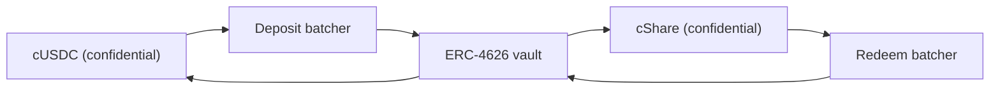

# 獎金從哪裡來

獎金就是收益。沒有任何人的本金會被當成獎金發出去，這就是這個池不賠本的原因。這一頁講每個來源都要
實作的那一個介面、今天跑在 Sepolia 上的那個來源、資金池為何一句話都不肯採信，以及 Zama 自己的機密
金庫在主網上怎麼接進來。

## 介面

```solidity
interface IYieldSource {
    function harvest() external returns (euint64 transferred); // confidential transfer to the recipient
    function harvestable() external view returns (uint64);      // display only
}
```

兩個函式。`harvest` 用一筆機密轉帳把累積的收益移到獎金池，並回傳實際移動的加密金額。`harvestable`
是給 App 顯示用的，資金池的帳目從不用它。

`harvest` 是同步的，這是刻意的。它移動來源在那一刻已經備妥的東西，而一個非同步賺取收益的來源，
應該事先把那筆金額準備好，而不是讓資金池等它。

換掉來源是資金池上一個擁有者呼叫 `setYieldSource`，並發出 `YieldSourceSet`。系統裡其他東西都不知道、
也不在乎接的是哪個來源。

一個會失敗的來源不會擋住抽獎。資金池接住這個失敗，把該期的收成當成一個平凡加密的零，並發出
`HarvestFailed`。截止照樣成功，抽獎照樣用各層級已經持有的資金跑，而沒能移動的那筆收益由後面某次
收成收走。壞掉或接錯的來源會餓死獎金那一側；但它停不了時鐘。

收成真的落地時，它會在該期開獎時記入，並在下一次截止時拿出來。所以第 `p` 期的收益支付的是第 `p+1`
期的獎金，不是第 `p` 期的。這正是獎金金額能在種子存在之前就固定下來的原因。

## Sepolia：贊助式來源

跑在每個上線資金池上的都是 `SponsoredYieldSource`，各一個實例，所以七個來源就是七種不同代幣的七筆
獨立餘額。USDC 池的那個在 `0xCC49DF69eAB6884fD8DD9260902B8A0Abc9D6b91`；其他六個在
[資金池與代幣](pools-and-tokens.md)。

贊助者拿該池的公開代幣呼叫來源自己的 `sponsor` 函式。來源把它包裝成機密版本，並記下包裝器實際鑄出
的金額，而不是贊助者要求的金額。從那裡開始，餘額以 `ratePerSecond` 滴出，在 USDC 池上是
`5,555 base units a second, which is 19.998 USDC a period`，
而 `harvest` 把已累積的部分送到資金池。每個池的速率都以「每小時整數顆代幣」設定，這樣兩個不同時鐘
的池一眼就能比較，而每筆贊助金的規模都足以涵蓋超過八十期。

贊助是捐贈。贊助者沒有任何路徑可以把它拿回去，而且只有來源的擁有者能改變滴出速率，那會發出
`RateChanged`。

贊助金額、滴出速率和每一次收成都是公開的。這不是妥協：在 PoolTogether 裡，一個金庫貢獻的收益金額
也是公開的，而每一份獎金金額都由它推導出來。Hearth 裡機密的是誰存了多少、誰中了獎，從來不是這個池
賺了多少錢。

如果池子有一陣子沒有存戶，收益照樣累積，並付給第一批真的有存戶的抽獎。空池裡不會有東西被卡住。

### 為什麼要用模擬來源

因為一個模擬來源只有在文件寫清楚它怎麼運作、以及真的來源怎麼接進來時才算誠實，這兩件事都在下面。
我們先找過真的：Sepolia 上沒有任何一個會為 Zama 的模擬代幣付收益的來源：

| 場所 | 為什麼不行 |
| --- | --- |
| Aave | 在 Sepolia 上拒絕 USDC 存入，供給上限已滿 |
| Compound | 要 Circle 自己的 USDC，不收 Zama 的模擬代幣 |
| Zama 的機密金庫 | Sepolia 上那個是只能閒置、沒有收益轉接器的 VaultV2，這是 Zama 自己的說法 |

所以誠實的選項只剩兩個：一個會往上跳的假數字，或一筆真的存在鏈上、真的會滴出的贊助餘額。我們選了
第二個。七個上線資金池上的每一單位獎金，都是真的被包裝過、真的被轉過、也真的被驗證過的。

## 資金池從不採信任何申報數字

這條規則讓贊助式來源不會變成軟肋。

來源對資金池做一筆加密轉帳。資金池身為收款方，在那個密文上被授權，所以它能自己把轉過來的金額標成
可公開解密。要一直等到開獎時、`FHE.checkSignatures` 驗證完金鑰管理服務對那份明文的簽章之後，資金池
才會把任何東西記進各層級。

一個謊報自己送了多少的來源，什麼也騙不到。資金池記的是實際到帳的金額，因為那是它唯一會看的金額。

這不是理論上的謹慎。在我們上一版設計裡，資金池是照呼叫者傳進來的金額記錄儲備補充的，而包裝器鑄出的
是 `amount / rate()`。在那次上線部署上，`rate()` 剛好是 1，所以兩者一致，這個 bug 就潛伏著。在一個
18 位小數的底層代幣上，包裝器的 rate 是一兆，資金池會相信有多達一兆倍於實際存在的獎金。我們在
2026 年 9 月 2 日拿一個 18 位小數的測試代幣實際跑了一次，親眼看它發生。在一個不賠本的池裡，虛構的
獎金資金最終會從某個人的本金裡付出去，而那正是這個產品唯一不能違背的承諾。驗證那筆轉帳，就把這整類
問題消掉了。

## 主網：Zama 的機密金庫

Zama 出了一套協定，它的全部工作就是為機密餘額賺取收益，那也是主網上最自然的來源。
`ConfidentialVaultYieldSource` 是那個設計裡的轉接器。以下是它的規格，不是本程式庫裡的合約。

跟這裡其他每樣東西一樣，它是一池一個轉接器，而每一個都需要對應自己那種代幣的批次器和收益金庫。
Zama 的主網部署目前涵蓋 USDC，所以主網版的 Hearth 會把 USDC 池開在機密金庫上，其他代幣就看它們各自
有什麼來源，或者根本沒有。

這個設計是一個坐在機密代幣和普通 ERC-4626 收益金庫中間的批次器。ERC-4626 金庫只收公開轉帳，所以
單獨的存款人會公布自己的確切金額。批次器改成把很多筆加密存款集合起來，只解密總和，對金庫做一筆
公開存入，再把機密份額發回去。用 Zama 自己的話說：「旁觀者看得到誰參與了，但看不到任何人貢獻了
多少。」



轉接器拿資金池的機密代幣加入存款批次器，並持有機密份額。贖回照自己的排程跑，走在收成前面：keeper
會定期向贖回批次器索取這段時間的成長，並把那個請求推過它的四個階段，所以等資金池下一次呼叫
`harvest` 時，贖回來的機密 USDC 已經躺在轉接器裡，收成就跟其他任何一筆一樣只是單一筆轉帳。這就是
非同步場所怎麼對接同步介面。那四個階段每一個都無需許可，所以沒有人得等 Zama 的營運方去跑它們。

### 位址

取自 Zama 自己的位址參考表，抓取日期為 2026 年 9 月 2 日。

**以太坊主網，chain id 1。** 底層資產是 USDC。收益來源：Morpho 的
「Steakhouse Confidential Prime USDC」VaultV2，設了門檻，讓存款批次器成為該金庫唯一的存款人。

| 合約 | 位址 |
| --- | --- |
| 存款批次器 | `0x324EA89FD3784036673BfE6Ffee2334A088F40Cc` |
| 贖回批次器 | `0x96Cd3Faa7483783Ac2Eb715f6333361500F1eec9` |
| cUSDC 包裝器 | `0xe978F22157048E5DB8E5d07971376e86671672B2` |
| cShare 包裝器 | `0x66Bf74E96900D1a19c7070D939D124f2F565C458` |
| ERC-4626 金庫 | `0xbEEF00A59B577423653A1526c7009bdE103F542B` |
| USDC | `0xA0b86991c6218b36c1d19D4a2e9Eb0cE3606eB48` |

**Sepolia，chain id 11155111。** 一個測試環境：這裡的 USDC 是帶公開 `mint` 的模擬代幣，而金庫只能
閒置，沒有收益轉接器。

| 合約 | 位址 |
| --- | --- |
| 存款批次器 | `0x48758559c14d4d92b4C74A99660B6a8dbe85F53b` |
| 贖回批次器 | `0xe94E9afdDd43a19C2914739e9279cb6Fe287BEb0` |
| cUSDC 包裝器 | `0x7c5BF43B851c1dff1a4feE8dB225b87f2C223639` |
| cShare 包裝器 | `0x7E93d5c150A2178B1fCde0278582Acf59478eA5f` |
| ERC-4626 金庫（閒置） | `0x6AB54988261AEC573a2CA13cF802d3B1114f864C` |
| Mock USDC | `0x9b5Cd13b8eFbB58Dc25A05CF411D8056058aDFfF` |

因為 Sepolia 上的金庫是閒置的，這個轉接器只是照 Zama 公布的批次器介面寫成規格，還沒有寫出來。在它
什麼都沒賺的時候說它已經上線，會是一個任何人一分鐘內就查得出來的謊。

### 實際接上去是什麼意思

批次器分四個階段推進：join、dispatch、finalize、claim。一批會等到達到最小等待時間，然後它的總和被
解密，接著金庫結算，最後參與者領取。這四個階段每一個都無需許可，所以資金池永遠不會卡著等 Zama 的
營運方，而領取也永不過期。

那個節奏比贊助式來源的即時滴出慢，這就是 keeper 要提前跑贖回、而不是在 `harvest` 裡跑的原因。資金池
的合約從不等待：它只向轉接器要那些已經領回來的東西。把這件事推上線真正還要做的工作，是轉接器合約
本身（本程式庫只寫了規格，沒有實作），以及它在 keeper 那一側的部分，也就是決定多久開始一次贖回、
每次贖回部位的多少，那是政策選擇，就算晚了也不會在鏈上造成後果。

### Hearth 會繼承什麼

把這些好好點名，正是對它保持可信的一部分。

- **金庫風險，全額承受。** 批次器把錢送進第三方的 ERC-4626 金庫。如果那個金庫價值下跌，資金池的
  生息餘額也跟著跌。這是「不賠本」唯一會取決於別人合約的地方，也是主網部署應該只在那裡放生息部分
  的原因。
- **批次層級的機密性，不是資金池層級的。** 批次器把金額藏在共同參與者之間，並解密總和。如果 Hearth
  是一批裡唯一的參與者，它的存入金額就會公開。這對我們沒有損失，因為 Hearth 的收成本來就會公布，
  但在假設批次器藏得比實際更多之前，值得知道這件事。
- **有邊界的擁有者權力。** 批次器的擁有者可以改最小批次等待時間（上限 7 天）、回呼期限（上限
  30 天）、存款滑價容忍度，也可以暫停 join 和 dispatch。Zama 的文件寫明擁有者不能移動或凍結使用者
  資金、不能審查結果、不能解密任何人的金額，也不能升級合約。贖回的滑價保護寫死為關閉，所以即使在
  金庫下跌期間也退得出來。

## 這一頁沒有講到的

它沒有講收益來源對洩漏表的影響，那在[什麼保持私密](../security/what-stays-private.md)。它沒有替
Morpho 金庫的收益率做評比，那是別人的數字而且每天在變。而且它不宣稱那個轉接器已經在跑：在 Sepolia
上接著的是贊助式來源，儀表板上「此刻的資金池」卡片會把它寫出來。
