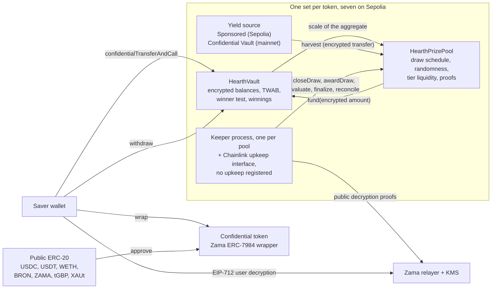

# Hearth 是什麼

Hearth 是一種儲蓄池：你不會賠掉本金，而且有機會贏得獎金。Sepolia 上有七個這樣的池，每一種
機密代幣各一個，你挑代幣的方式，就像在挑一個儲蓄帳戶。

你放進一種機密代幣：USDC、USDT、WETH、BRON、ZAMA、tGBP 或 XAUt。資金池把這筆錢拿去運用，
賺取收益。每一期結束時，池子賺到的收益就當成獎金發出去，而你的中獎機率跟你持有多少、持有多久
成正比。你隨時可以把本金全額領回。這就是 PoolTogether 發明的「不賠本樂透」，而 Hearth 是它的
機密版本。

跟 PoolTogether 的差別在於，一般區塊鏈上什麼都是公開的。任何人都能讀到每位存戶有多少錢、每個
錢包的中獎機率是多少、每期是誰中獎。這等於把大家的財富公告出去，也讓資金量大的人變成標靶。
Hearth 用 Zama Protocol 把整套流程跑在加密數字上，所以鏈上存的是你的密文餘額（沒有金鑰就讀不懂
的資料），而合約照樣能在上面做運算。你的餘額是一個從來沒人看過的數字，我們也沒看過，而抽獎過程
仍然可以被陌生人查核。

## 一張圖看懂整套系統

真正做事的是兩個合約。`HearthVault` 保管每位存戶的加密本金、加密獎金、他們持有多少多久的紀錄，
中獎判定也在這裡跑。`HearthPrizePool` 管時鐘、抽出隨機種子、收取收益，並把獎金分層保管。有一支
keeper 程序負責把抽獎往前推，而它做的每一步，任何人都可以代替它做。

圖中間那個方框是「一種代幣的池」。這樣的池有七個，彼此之間什麼都不共用：你的 USDC 部位和你的
WETH 部位，是兩座不同金庫裡的兩位不同存戶，其中一個池安靜下來，其他池照跑。你現在看的是哪一個
池，就寫在網址列的第一段，`/app/usdc` 或 `/app/weth`。完整清單和位址在
[資金池與代幣](../concepts/pools-and-tokens.md)。

## 四個動作

存戶會做四個動作。以下是每個動作做了什麼，又透露了什麼。

### 1. 存入

你用一筆交易，把該池的機密代幣送進它的金庫。金額是以密文 handle（一個指向加密值的指標，而不是
值本身）的形式傳送。金庫把它加到你的加密本金上，並更新你餘額隨時間變化的紀錄，全程不解密任何
東西。

- 隱藏：金額、你當下的餘額，因此也包括你在池中的佔比。
- 公開：你的位址、你送出交易的區塊，以及「有一筆存入發生了」這件事。

這裡有一道接縫。把普通的公開代幣換成機密代幣，是一筆公開的 ERC-20 轉帳，所以包裝的金額看得見。
如果你包裝了 5,000 USDC，兩個區塊之後就存入，旁觀者的猜測會非常準。Hearth 刻意把包裝和存入拆成
兩個步驟，就是為了讓你能在兩者之間拉開距離。見
[包裝接縫](../security/what-stays-private.md)。

### 2. 抽獎

每一期結束時，資金池會為該期截止。在同一筆交易裡，它先固定每個層級的獎金金額，然後在 Zama 的
協同處理器裡抽出一個加密隨機種子，接著問金庫這一期的池子有多大，最後收取該期的收益。順序很重要：
獎金金額在隨機數存在之前就定了，所以沒有人能先看到種子、再回頭調整中獎值多少錢。

「池子有多大」故意講得很含糊，這正是設計。金庫不會公布所有存戶時間加權餘額的總和。它只公布這個
總和落在哪一個 2 的冪級距裡，所以外界知道的是池子的大致規模，而不是精確數字。公布精確數字會讓人
把相鄰兩次抽獎相減，直接從差額讀出某位落單存戶的存入金額。

接著會有四個小數值連同 Zama 金鑰管理服務簽出的證明一起送出去，讓任何人都能查核：種子、級距、
池中到底有沒有人，以及收到的收益。那些數字一被驗證，每位存戶在該期的結果就已經定了。

- 隱藏：每位存戶各自的權重、池子的精確總額，以及每個人各自的結果。
- 公開：種子、級距、收到的收益、每個層級的獎金金額，以及下一期該層級對帳時，它一共派出幾份獎。

### 3. 領獎

沒有領獎交易，而這正是重點。App 裡確實有一顆領獎按鈕，就在「我的抽獎」中該期的卡片上，上面還標著
金額：它就是把你剛剛打開的獎金提領出來，在鏈上看起來跟任何一筆提領一模一樣。

抽獎評估的過程中，獎金會記到金庫裡一個獨立的加密餘額上。這件事不需要你做任何動作，也不會因為你
做了什麼而曝光。想知道自己有沒有中，你簽一則 EIP-712 訊息（一種有型別的鏈下簽章，用來證明你控制
這個位址），Zama 的中繼器就會把你自己那份獎金的明文送回你的瀏覽器。那個簽章完全不上鏈，所以不花
任何費用，也不留下痕跡。儀表板上的餘額和某一期的結果各有自己的眼睛圖示，兩個可以同時開著，而且
第一個的簽章可以直接給第二個用。

- 隱藏：全部。讀自己的獎金是一個鏈下操作。
- 公開：無。

多數獎金協議裡，中獎者必須送一筆領獎交易，沒中的人沒理由送，於是交易紀錄就悄悄把中獎者點名了。
Hearth 根本沒有這種交易可送。負責把獎金記上去的交易 `evaluate` 沒辦法瞄準自己：它從該期種子決定
的位置開始走過存戶名單，呼叫者只能說要往前推進多遠。

### 4. 提領

只有一個函式能把錢拿出來：`withdraw`。它先付你的獎金，再動你的本金，並取「你持有的金額」和
「金庫持有的金額」兩者中較小的一個為上限。不管你是要領獎、把存款帶回家，還是兩件事一起做，都是
同一個呼叫、同樣的形狀、同樣的事件，以及一個加密的金額。

上限的後半段之所以存在，是因為機密轉帳要嘛整筆過、要嘛完全不過。它絕不會只送出被要求金額的一部分。
所以金庫會先算出自己實際付得出多少，才去叫代幣付款，而不是事後再回頭補洞。

- 隱藏：金額，以及其中有沒有獎金。
- 公開：你的位址、區塊，以及「有一筆提領發生了」這件事。

你的本金從不被鎖住。抽獎進行中，存入和提領照樣開放，這一點在這個領域的好幾種設計裡都做不到。

## 它憑什麼公平

兩件事，而且陌生人不需要任何特權就能查核。

隨機種子來自 `FHE.randEuint64`，在 Zama 的協同處理器裡、以網路的 FHE 金鑰、從一個公開種子生成。
沒有人預測得到，也沒有人能抽第二次：一期的截止動作只會成功一次。該期結束後，資金池會把種子連同
池子總額所落的級距一起公布，兩者都帶著合約會在鏈上驗證的證明。

有了這兩個公開數字，任何人都能重算出任一位址在任一層級、任一期必須超過的確切門檻，而且金庫把
同一套算術以 view 函式公開出來，所以沒有人必須信任別人重寫的版本。他們做不到的，是看見被拿來比較
的那個加密權重。所以規則是公開可稽核的，只有輸入是私密的。細節見
[隨機性與驗證](../security/randomness-and-verification.md)。

## Hearth 沒有隱藏什麼

簡短版如下，完整版在[什麼保持私密](../security/what-stays-private.md)：

- 存戶是誰，以及他們各自在什麼時候存入、提領或被評估。
- 每一期池子總額落在哪個級距、種子，以及收到的收益。
- 每個層級的獎金金額，以及它派出幾份獎（延後一期公布）。
- 你包裝進機密代幣、或從中解除包裝的金額。
- 只有一位存戶時，公布的級距就是這位存戶的權重，誤差在兩倍以內。有兩位時，彼此都能推估對方的
  範圍。這裡的隱私需要三位以上的存戶，App 裡也是這麼寫的。
- 門檻是公開的，所以任何能鎖定你餘額的人，都能算出你從那時起每一期的結果。最常見的失守方式，
  就是包裝之後幾分鐘內存入同樣的金額，這也是 App 要把兩者拉開的原因。
- 全額包裝進來、又全額解除包裝出去，等於公布了你歷來贏得金額的下限，因為這兩個動作在代幣層都是
  公開的。
- 一位每次中獎後就馬上提領的存戶，會透過自己的行為洩漏統計上的線索。這一項沒有任何合約補得起來。
