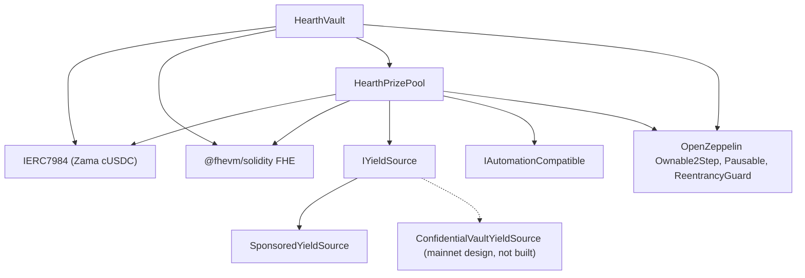

# 部署

一支可重複執行的腳本，絕不手動點擊。這一頁講順序、參數，以及每一個參數的意思，好讓審查者讀得懂已
部署的建構子參數，並確認它們對得上。

Hearth 每一種機密代幣部署一個池：每種代幣各有一個金庫、一個獎金池和一個收益來源，跟其他任何池都不
共用東西。一次執行開一個池，因為一個部署者 nonce 跑一次部署，而代幣由 `HEARTH_TOKEN` 指定。之後的
每一項任務都接 `--token`：

```
cd packages/contracts
HEARTH_TOKEN=weth npx hardhat deploy --network sepolia
npx hardhat hearth:verify  --network sepolia --token weth
npx hardhat hearth:seed    --network sepolia --token weth
npx hardhat hearth:status  --network sepolia --token weth
```

兩個都不給，就會得到 `usdc`，也就是該網路的預設代幣。未知的代號會失敗，並列出該網路實際有哪些池。
每個池的參數都放在同一個檔案 `packages/contracts/hearth.config.ts` 裡：資產配對、期長、層級組合、
初始級距、滴出速率、贊助金、五筆示範存款，以及它的 keeper 用哪個帳戶索引簽名。請對照底下的表格一起
讀那個檔案；那是同一組數字。

部署對於已經有部署紀錄的合約會直接沿用而不是取代，所以第二次執行不會做任何事。一個正持有存戶的錢、
帶著好幾天抽獎歷史的線上池，絕不可能因為重跑腳本就被搬到一個新位址。如果要刻意換掉某一個，請先刪掉
它在 `deployments/<network>/` 底下的檔案。

它會寫出 `deployments/sepolia/hearth.<slug>.json`，那正是用 `HEARTH_ADDRESSES_FILE` 指給 keeper 的
檔案，也是 App 的池清單生成時所依據的檔案。

## 什麼依賴什麼



實線邊代表本程式庫裡的合約。虛線節點是主網的收益路徑：那個轉接器是照 Zama 公布的批次器介面寫成規格，
這裡沒有寫出任何轉接器合約，所以底下部署的只有 `SponsoredYieldSource`。

金庫和資金池彼此都需要對方，所以兩條連結中的一條是在部署後才接上的，不是寫在建構子裡。這就是底下有
五個步驟而不是三個的原因。

## 順序

| 步驟 | 動作 | 為什麼排在這裡 |
| --- | --- | --- |
| 1 | 部署 `HearthVault` | 它保管存戶的錢，而且除了代幣之外什麼都不需要就能存在。 |
| 2 | 部署 `HearthPrizePool`，指向那個金庫 | 資金池會讀金庫的時鐘和它的尺度計數，也會付錢給金庫。 |
| 3 | 接線：`vault.setPrizePool(pool)` | 發出 `PrizePoolSet`。金庫只會接受來自這個位址的撥款。 |
| 4 | 部署收益來源，把資金池指定為收款方 | 它必須知道要把收成送去哪裡。 |
| 5 | 接線：`pool.setYieldSource(source)` | 發出 `YieldSourceSet`。在這一步落地之前，截止收不到任何收成，並會發出 `HarvestFailed`。 |

第 5 步之後，替這個池放種子資料：`hearth:seed --token <slug>` 會贊助收益來源，讓獎金存在，並從帳戶
2 到 6 放進五位不同規模的示範存戶，好讓第一位訪客落在一個有人的池，而不是空的。它的每一步都會先查鏈
上已經完成了什麼，所以一次被中繼器打嗝中斷的 seed，可以安全地重跑。

該池的 keeper 也需要自己的 Sepolia ETH，五位示範存戶同樣需要：

```
npx hardhat hearth:spread-gas --network sepolia --token weth
npx hardhat hearth:spread-gas --network sepolia --keepers 10,11,12,13,14,15 --savers false
```

第一個替一個池的 keeper 和存戶加值；第二個一次替好幾個 keeper 帳戶加值，那正是一口氣開六個池所需要
的。

接著把 App 指向剛剛部署好的東西：

```
cd ../web
node scripts/sync-pools.mjs
```

## 參數

```
HearthVault(IERC7984 asset, uint256 periodLength, uint256 firstPeriodAt, address owner)
HearthPrizePool(IHearthVault vault, IERC7984 asset, Tier[3] tiers, uint8 initialScaleBits, address owner)
    Tier = { uint32 prizeCount; uint64 oddsNumerator; uint64 oddsDenominator; uint16 shares; uint16 reconcileEvery }
SponsoredYieldSource(IERC7984ERC20Wrapper asset, address recipient, uint64 ratePerSecond, address owner)
```

### HearthVault

| 參數 | 意思 | 弄錯會怎樣 |
| --- | --- | --- |
| `asset` | 存戶存入的那個 ERC-7984 機密代幣，Zama 那七種之一。 | 每個包裝器都讀作六位小數，而如果鏈上跟設定不一致，部署會拒絕繼續。到底下公開代幣的換算率並不是每個池都是 1：在 18 位小數的 WETH 模擬代幣上，它是一兆，所以任何要讀公開代幣的東西都必須套用它。 |
| `periodLength`（`L`） | 一期幾秒。不可變更。 | 它同時決定每位存戶的上限 `(2^64 - 1) / L`。`L` 太小，上限很大但抽獎會很吵；太大則上限收緊。 |
| `firstPeriodAt` | 第 1 期開始的時間戳。不可變更，而且必須早於或等於部署時間。 | 設成未來的值，會讓 `period(now)` 在它到來之前無定義。 |
| `owner` | 兩階段的擁有者。放棄功能被關閉。 | 它的權力列在[威脅模型](../security/threat-model.md)。 |

`maxPrincipal` 是由 `periodLength` 推導出來的，不是設定的。一小時大約是 50 億顆代幣，六小時大約
8.54 億顆，一天大約 2.13 億顆。

時鐘屬於金庫。資金池接收金庫的位址並從它那裡讀取期別，所以兩份合約不可能對「現在是第幾期」有分歧。

### HearthPrizePool

| 參數 | 意思 |
| --- | --- |
| `vault` | 這個資金池服務的金庫，也是它讀取的時鐘。 |
| `asset` | 跟金庫用的同一個機密代幣。兩者必須一致。 |
| `prizeCount[t]` | 層級 `t` 每期的獎項數。 |
| `oddsNumerator[t]`、`oddsDenominator[t]` | 該層級以分數表示的機率，也就是 `oddsDenominator / oddsNumerator` 期中的一期。 |
| `shares[t]` | 該層級在每一次收成裡分到的那一塊。份額是相對的，所以 40/20/40 和 2/1/2 意思相同。 |
| `reconcileEvery[t]` | 該層級兩次公布結轉金之間隔幾期。 |
| `initialScaleBits` | 第一期總權重預期的位元長度，也就是級距追蹤器的起始猜測值。 |
| `owner` | 同上。 |

`UTILISATION` 是一個常數而不是參數：50%，沿用 PoolTogether V5。它是用來決定每份獎金額時，取用某層級
明文資金的比例。

其中兩項值得多說一句。

`reconcileEvery` 是隱私設定，不是 gas 設定，而且它跟獎池看起來如何互相取捨。公布某層級的結轉金會讓
該層級的獎項數量變公開，而涵蓋單一期的數量，指向的是該期有資格的那一小群存戶。把它調高，會把數量攤
到一段幾乎每個人都曾經有資格的期間上。它的代價是看得見的頭獎：一次截止會把一個層級全部的公開資金
移進該期抽獎，而它只有在對帳時才回來，所以節奏為 24 的層級，在 24 期裡有 23 期公布的獎金金額都是照
一期的收成份額算的，而累積起來的獎池只在對帳那一期才出現在檯面上。那筆錢全程都在加密結轉金裡被拿
出來、也贏得到；只是看不見。Sepolia 因為這個理由把三個層級都設成 1，並把逐期的數量列為殘留風險。
見限制 14。

`initialScaleBits` 只要接近就行。追蹤器每次截止都會把真實總額跟目前猜測值周圍的五個 2 的冪比較，
每期最多自我修正三個位元，所以一個差幾個位元的猜測值，只會讓一兩期的機率略微不準，然後就穩定下來。

### SponsoredYieldSource

| 參數 | 意思 |
| --- | --- |
| `asset` | 它持有並送出的 ERC-7984 包裝器。贊助者付進來的公開代幣就是這個包裝器自己的底層代幣，所以不是另一個參數。 |
| `recipient` | 接收收成的那個獎金池。 |
| `ratePerSecond` | 贊助餘額以多快的速度當成收益滴出。 |
| `owner` | 設定速率，並發出 `RateChanged`。 |

贊助是部署之後的另一個呼叫，不是建構子參數。它記的剛好是包裝器鑄出的金額，而不是贊助者要求的金額，
而且無法撤銷。

## 三組參數

Sepolia 跑其中兩組，因為那些池跑在兩種時鐘上。

| 設定 | Sepolia `usdc` | Sepolia 其他六個 | 主網候選 |
| --- | --- | --- | --- |
| 期長 | 1 小時 | 6 小時 | 1 天 |
| 視窗 | 2 小時（兩期） | 12 小時 | 2 天 |
| 截止期限 | 該期結束後 1 小時 30 分 | 結束後 9 小時 | 結束後 1 天 12 小時 |
| 每位存戶上限 | 約 50 億顆代幣 | 約 8.54 億顆 | 約 2.13 億顆 |
| 頭獎層級 | 數量 1、機率 1/24、份額 40、每期對帳 | 數量 1、機率 1/4、份額 40、每期對帳 | 數量 1、機率 1/30、份額 50、每期對帳 |
| 中型獎層級 | 數量 1、機率 1/6、份額 20、每期對帳 | 數量 1、機率 1/2、份額 20、每期對帳 | 數量 1、機率 1/7、份額 25、每期對帳 |
| 常態獎層級 | 數量 4、機率 1、份額 40、每期對帳 | 數量 4、機率 1、份額 40、每期對帳 | 數量 4、機率 1、份額 25、每期對帳 |
| 使用率 | 50% | 50% | 50% |
| 收益來源 | `SponsoredYieldSource` | `SponsoredYieldSource` | 架在 Zama 批次器上的 `ConfidentialVaultYieldSource` |
| 頭獎多久派一次 | 大約一天一次 | 大約一天一次 | 由所選的機率決定 |

Sepolia 這些數字的存在，是為了讓訪客在一次造訪裡看完整個循環：每期四份小獎，而兩種時鐘下頭獎都大約
一天一次。它們不是真實部署會用的數字。

為什麼有兩種時鐘。五位存戶的一期抽獎要花 `8,456,388` gas，所以七個池都每小時抽，在 Sepolia 上一天會
花掉約 `1.43 ETH`，公開水龍頭跟不上。改成六小時，每個池一天四期，七個池加起來一天約 `0.41 ETH`。
機率是依各池自己的期長設定的，不是硬套過來，所以第一欄寫 1/24 和 1/6 的地方，中間那欄寫 1/4 和 1/2，
而兩者的頭獎仍然大約一天派一次。USDC 池保留了每小時的時鐘，因為它最早部署，而它的抽獎歷史都記在
那個時鐘之下。

主網那一欄是候選方案，不是已部署的東西。填它的規則跟做出 Sepolia 那一欄的規則相同：先決定你希望
兩次頭獎之間隔幾期，把頭獎層級的機率設成那個數字分之一；再設份額，讓算出來的獎金金額對照來源實際
賺到的收益讀起來合理；最後決定每個層級的對帳節奏，在「一個不點名任何人的獎項數量」和「一個存戶看得
到它累積的獎池」之間權衡。Sepolia 選了後者；主網部署也許會選前者，而上面那一段說了兩邊各自的代價。
一天一期、頭獎機率 365 分之 1，就會得到一年一次的頭獎，那也是 V5 採用的形狀。

## 已部署的位址

Sepolia 上七個池，每一份合約都在 Etherscan 上驗證過。每個池持有的那組代幣配對是 Zama 的，列在
[資金池與代幣](../concepts/pools-and-tokens.md)，同一頁也有各池的示範存款和滴出速率。

| 資金池 | HearthVault | HearthPrizePool | SponsoredYieldSource | 部署區塊 |
| --- | --- | --- | --- | --- |
| `usdc` | `0x0F93e5db6027b4FB1C76566d24aA2D2E417fAF52` | `0xA0785AacF30B6FE46EDc53CD8A9db1d94FeF5Df2` | `0xCC49DF69eAB6884fD8DD9260902B8A0Abc9D6b91` | `11622398` |
| `usdt` | `0xe54F44dE64F8A7abc0647eaae547dD59ce0EFfac` | `0x6a83Beb2Dc3f258107Cad5e17BC57657fAd4fbd1` | `0x5bb1Cd5380Cb9f2B15569030fF0dB7a445cF54cA` | `11641314` |
| `weth` | `0x3D1A182782B68fE270A66294C9adaC7F005c4f14` | `0x1a11e7C689F244fA8Dd5f4abA8F2F3131090cc1C` | `0x40DF298f15c6136294eC651aD7b0c1C6F221DE8F` | `11641366` |
| `bron` | `0x18086DC8271f8A73c5Ea985fd519527Dbb991279` | `0x2Ed982979CD184494B947a1E38E597494a38ACe4` | `0x0cD1155D752bD81b3a437a6f0B3965CAA2A1C8e9` | `11641408` |
| `zama` | `0xEEC26386F273c6678cA538AcA18e1d9384eA9F09` | `0x873B285404199D46325a294Aa0EC7a79C30A7fF7` | `0xdD352D70311E834ab75307f53d5C276060081d23` | `11641447` |
| `tgbp` | `0xCe95dAa01f5354aA8887A5952E403D26d452c323` | `0xC531D54ee2c695e0eBfe8b8258e9Fd80fd507095` | `0xDEa2BD6351072F735B6ea83c357bF157d83c01af` | `11641484` |
| `xaut` | `0x77f701101d66FbD522A3bFdC2c00DB09a4F57daE` | `0x9a2888aca42c707A3BC0D561FdF6ff8Abfda5201` | `0x03fDdAA7C4323C53CE511CC49D4c33B26B492af7` | `11641523` |

第一期開始時間：`usdc` 是 `1788386400 (2 September 2026, 22:00:00 UTC)`，`usdt` 是
`1788620400 (5 September 2026, 15:00:00 UTC)`，其餘五個是
`1788624000 (5 September 2026, 16:00:00 UTC)`。`firstPeriodAt` 不可變更，而且必須早於或等於部署區塊，
所以部署讀的是鏈上自己的時鐘、無條件捨去到整點，絕不是機器的時鐘。

## 驗證

驗證是部署的一部分，不是事後補的。一個讀不到已部署原始碼的審查者，只能整份文件照單全收相信我們。

1. 用部署腳本記錄下來的建構子參數，把該池那三份合約都在 Etherscan 上驗證：`hearth:verify --token
   <slug>` 會逐份做，並告訴你哪些已經驗證過了。
2. 檢查驗證過的建構子參數是否符合上面的參數表。特別是資金池拿到的是它自己的金庫和同一個 `asset`，
   而層級組合符合該池那個時鐘所對應的欄位。
3. 檢查 `vault.prizePool()` 是該池的獎金池、`pool.yieldSource()` 是該池的來源，而且兩者都沒有指向
   另一個池的合約。
4. 檢查代幣：`asset` 應該是 Zama 公布的 Sepolia 清單裡屬於該池的那個機密包裝器，而 `underlying()`
   應該是它底下那個公開模擬代幣。只有在公開代幣也讀作六位小數時，包裝器的 `rate()` 才是 1；在 WETH
   池上它是一兆，而 rate 不是 1 就會改變「一個基本單位」對任何接觸公開代幣的東西所代表的意義。
5. 跑幾期之後讀 `pool.scaleBits()`，檢查它是否已經穩定在該池實際規模所暗示的位元長度附近。一個離
   那個值很遠又卡住的追蹤器，代表初始猜測值錯得離譜，而修正還沒追上。

## 祕密

任何敏感資訊都絕不寫死。部署從一個 `.env` 檔案讀取，而 `.env.example` 列出了每一個鍵，並在註解裡說明
它的值從哪裡來。部署者的金鑰和 keeper 的金鑰是不同帳戶，所以 keeper 那把常在線上的金鑰沒有任何擁有者
權力。

## 託管這個 App

這個 App 是一個 Next.js 的 workspace 套件，不是程式庫根目錄，而那正是多數託管平台唯一會設錯的地方。

| 設定 | 值 | 為什麼 |
| --- | --- | --- |
| 框架預設 | Next.js | 由 `packages/web/package.json` 偵測 |
| 根目錄 | `packages/web` | App 住在一個 npm workspace 裡 |
| 包含根目錄以外的原始檔 | 開啟 | 相依套件被提升到程式庫根目錄，而建置需要根目錄的 `package.json` 和 lockfile |
| 安裝指令 | 預設值 `npm install` | 在程式庫根目錄執行，安裝整個 workspace |
| 建置指令 | 預設值 `next build` | 設好根目錄之後，它會在 `packages/web` 裡執行 |
| 輸出目錄 | 預設值 `.next` | 見底下的警告 |
| Node 版本 | 20 或更新 | 根目錄的 `package.json` 設了 `engines.node` |

在託管環境裡不要設 `NEXT_DIST_DIR`。`packages/web/next.config.ts` 會讀它，並在它存在時把建置輸出移
走。它存在的目的，是讓本地的驗證建置不要跟正在跑的開發伺服器搶同一個 `.next` 目錄。在託管建置裡，
它會把輸出移到平台找不到的地方，而部署會失敗，卻沒有明顯的線索可指。

### 環境變數

| 變數 | 在瀏覽器裡公開 | 它的值從哪裡來 |
| --- | --- | --- |
| `SEPOLIA_RPC_URL` | 否 | 你自己的 Sepolia 端點。首頁和 `/api/activity` 路由是在伺服器端讀鏈的，所以這一個永遠不會到達瀏覽器。日誌查詢需要它，因為免費的公開節點把 `eth_getLogs` 的範圍限制得遠低於一天的區塊量 |
| `NEXT_PUBLIC_SEPOLIA_RPC_URL` | 是 | 選填。錢包端的讀取會用它，沒設時退回 `https://ethereum-sepolia-rpc.publicnode.com`。它會出現在打包檔裡，所以必須是你願意公開的那一個 |
| `NEXT_PUBLIC_CHAIN_ID` | 是 | 以太坊 Sepolia 是 `11155111`。沒設時 App 會用這個預設值 |
| `NEXT_PUBLIC_WALLETCONNECT_PROJECT_ID` | 是 | 選填，在 Reown 的後台 https://dashboard.reown.com 免費申請。設了它，每一個連接畫面都會在瀏覽器擴充功能旁邊給出「用手機掃描」，手機錢包和一台裝不了擴充功能的機器就是這樣進來的。留白的話這個連接器根本不會被建出來，就不會有人拿到一個掃描那一刻才失敗的按鈕 |

已經沒有任何合約位址是環境變數了。App 從 `packages/web/src/lib/chain/pools.json` 讀取每一個池，而那
是 `node scripts/sync-pools.mjs` 依部署腳本寫出的位址檔生成的，所以 App 顯示的任何位址，永遠追得回
一筆部署紀錄，而不是某個人手打的東西。每次部署後都跑那支腳本，並把結果提交進去。以前用來存單一個池
的金庫、獎金池和收益來源位址的那三個公開變數已經沒有了；如果哪個環境還設著它們，請刪掉，因為沒有
任何東西在讀。

機密資產和它底下的 ERC-20 也是從鏈上的金庫和包裝器讀出來的，所以 App 不可能跟一個金庫會拒收的代幣
說話。

### 第一次部署之後

1. 用手機打開正式站網址。每一頁都必須在 375 像素寬底下運作。
2. 用 Sepolia 上的錢包連線，並對著已部署的網站（而不是 localhost）走一遍 README 裡那條兩分鐘流程。
3. 打開 `/verify?pool=<slug>` 並貼上一位存戶的位址。門檻來自一次合約呼叫，所以只要它渲染得出來，
   就代表已部署的 App 正在跟該池已部署的金庫對話。
4. 打開池選單，檢查每個代號都能載入自己的儀表板，而受限的那個代幣顯示的是它的拒收頁面，不是壞掉的
   畫面。

---

## 這一頁沒有講到的

它沒有講部署之後怎麼營運那些池，那是 [keeper](keeper.md)，而「一池一支 keeper」也是那一頁的一部分。
它也沒有講主網的營運準備度：機密金庫的轉接器只是照 Zama 公布的批次器介面寫成規格，本程式庫並沒有
實作它，而把它推上線的過程寫在[收益來源](../concepts/yield-source.md)。
