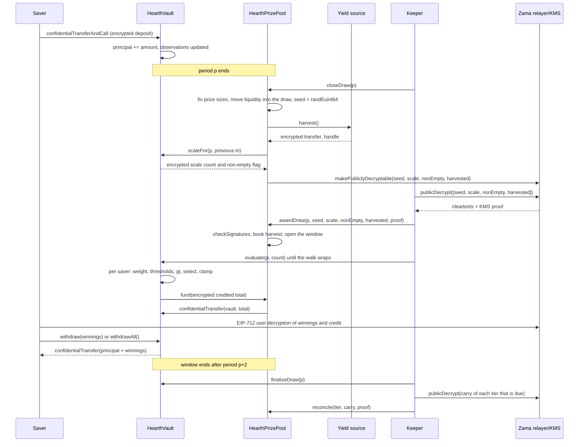

# 一次开奖是怎么进行的

一次开奖，就是资金池的收益变成奖金的那一刻。本页先用平实的话把整件事走一遍，再把同一个故事画成图。

## 周期

时间被切成长度都是 `L` 秒的等长周期。周期 1 从 `firstPeriodAt` 开始，
那是一个在部署时定死、此后再不改动的时间戳。从那里开始，剩下的就只是除法：

```
period(t)      = (t - firstPeriodAt) / L + 1
periodStart(p) = firstPeriodAt + (p - 1) * L
periodEnd(p)   = periodStart(p + 1)
```

每个池有自己的 `L`。在 Sepolia 上，USDC 池是一小时，其余六个是六小时，
所以访客坐一次就能看完一个完整循环。在主网上，真实部署会用一天，也就是 PoolTogether V5 用的长度。
周期长度是一个构造函数参数，所以同一套代码能服务这三种情形，
而且每个池的档位概率都是按它自己的周期设定的。见[资金池与代币](pools-and-tokens.md)。

第 `p` 期开奖对应周期 `p`。它完全由周期 `p` 内持有的余额决定。
周期 `p` 结束之后发生的任何事情，都改变不了它的结果。

## 窗口，以及关闭的截止时间

第 `p` 期开奖的每一步都发生在周期 `p+1` 和 `p+2` 之内。那就是窗口，它在 `periodEnd(p + 2)` 结束。
在 USDC 池上是两小时，在其余池上是半天。

关闭的截止时间比整个窗口更紧：

```
closeDeadline(p) = periodStart(p + 2) + L / 2
```

那是窗口第二个周期的中点，也就是整个窗口走完四分之三的地方。晚于此的关闭会被拒绝。

原因是关闭和发奖没法挤在同一个区块里。关闭在链上把一些值标记为可解密，
明文从 Zama 的中继器在链下返回，发奖再在链上验证它们。
如果关闭发生在窗口最后几秒，这趟往返就没有落脚的地方，那期开奖就会永远卡在 `Closed` 状态。
这个截止时间保证了往返、发奖和每一批评估至少还有半个周期可用。

窗口同时也限定了金库必须往回记住多久的余额，这正是每位储户存三条观测点就够用的原因。见
[时间加权余额](time-weighted-balance.md)。

## 五个步骤

每一步都无需许可。任何人都能调用其中任何一步，包括储户从应用里调。
keeper 只不过是通常最先到场的那个地址。

### 1. 关闭

`closeDraw(p)`，在周期 `p` 已经结束、并且在 `closeDeadline(p)` 之前。

在这一笔交易里发生五件事，顺序如下：

- **奖金金额被定死。** 每个档位这一期的奖金金额和它拿出来的流动性，
  都按该档位此刻持有的钱算出来，那笔流动性随即移入本期开奖。这发生在随机种子存在之前。
- **摇出种子。** `FHE.randEuint64()` 在 Zama 的协处理器内部运行，所以这个数只以密文形式存在，没有人见过它。
- **金库报告本周期的总权重落在哪里**，形式是一个加密的小计数，外加一个说明当期究竟有没有人持有余额的加密标志。
  不是总权重本身，也还不是明文。见下一节。
- **收割收益来源**，形式是向资金池的一次加密转账。如果来源回滚，关闭依然成功：
  这次收割被当作一个平凡加密零处理，并发出一条 `HarvestFailed` 事件。坏掉的收益来源不能让时钟停摆。
- **四个句柄被标记为可公开解密：** 种子、规模计数、非空标志和收割额。
  这是 Zama 访问控制列表上的一个单向标志。从那一刻起，任何人都能向中继器索取它们的明文，
  而且这个标志无法撤销。这期开奖的其余一切从来不会被这样标记。

开奖状态转为 `Closed`。关闭恰好只能成功一次，这正是没人能重摇种子的原因。

这笔交易内部的顺序才是重点。奖金金额在种子存在之前就定死，
所以没人能看着种子出现、算出自己中了、然后把池子里的钱挪来挪去让那次中奖更值钱。

### 金库用什么代替了总额

资金池在该周期的时间加权余额总额，写作 `W`，从不公布。
直到 2026 年 9 月 3 日之前，这套设计一直是精确公布它的，而一次评审把它打破了：
只要 `W` 在相邻两个周期都公开，再加上某位储户自己存入或提取的公开时间戳，
一位在某周期内唯一动过钱的储户，其确切金额可以被算术还原出来。不是框住范围，是还原。这在
[什么保持私密](../security/what-stays-private.md)里有描述。

现在公布的是 `W` 所落入的区间：刚好不小于它的那个 2 的幂，写作 `M = 2^m`。
金库在加密状态下追踪它。每次关闭时，它把 `W` 与上一期 `m` 周围的五个 2 的幂做比较，
把结果加成一个加密的小计数，并把这个计数标记为可公开解密。
资金池从验证过的计数里算出新的 `m`。另外一次与 1 的加密比较给出非空标志，
说明当期究竟有没有人持有余额。

所以观察者每期只学到一件事：这个池有没有跨过某个 2 的幂。在两次跨越之间，他们什么新东西都学不到。
每一期开奖都是针对 `M` 而不是 `W` 跑的，这正是下面描述的中奖数量能那样对上账的原因。

### 2. 发奖

`awardDraw(p, seed, scaleCount, nonEmpty, harvested, proof)`。

调用者从 Zama 的中继器取回那四个明文，中继器返回时带上密钥管理服务（KMS）的签名，
KMS 就是持有网络解密密钥的那组参与方。合约在相信任何一个数字之前，
先用 `FHE.checkSignatures` 在链上验证那个签名。证明按固定顺序
`[seed, scaleCount, nonEmpty, harvested]` 与句柄绑定，
所以这四个值既不能被打乱，也不能被重放到另一期开奖上。

然后：

- 验证过的收割额按份额权重记入各档位。这是奖金进入系统的唯一途径，
  而且它落在档位里而不是本期开奖里，所以要到下一次关闭时才拿出来发。
  资金池从不记入收益来源对自己的申报数字。
- 如果非空标志说周期 `p` 里没有人持有余额，本期开奖被标记为 `Empty`，
  它拿出来的流动性直接退回档位。
- 否则本期开奖开放。种子和区间 `M` 现在是公开数字。
- 如果有人发奖时窗口已经关闭，收割额照样入账，拿出来的流动性照样退回档位，
  而这期开奖被标记为 `Skipped`。那个周期不派奖，但没有任何收益或流动性丢失。

开奖的五种状态是 `None`、`Closed`、`Awarded`、`Empty` 和 `Skipped`。

**这就是中奖者被决定的那一刻。** 从这里开始，种子是一个公开数字，区间是一个公开数字，
而每位储户在周期 `p` 的权重再也不会变。每位储户必须超过的阈值，是公开输入上的算术。
接下来的评估不决定任何事情。它只是把一个已经存在的结果写下来。

### 3. 评估

在金库上调用 `evaluate(p, count)`，需要几次就调几次，只要窗口还开着。

调用者说明要推进多少位储户。他们说不了推进哪些。
金库从一个每期独立的游标开始遍历储户名单，游标起点是 `seed mod saverCount`，按名单顺序往前走，
最多处理 `count` 位储户，其中最多 `4` 位需要做加密运算。
在周期 `p` 或之前没有任何观测点的储户，权重为零，
系统从他们的明文时间戳直接跳过，不产生任何加密开销。

对遍历走到的每一位储户，金库读取他们在周期 `p` 的加密权重，
针对公开阈值执行中奖判定，并把结果加到他们的加密中奖余额上。
它会存下该储户在这一期的加密权重和加密入账额，两者都只有该储户本人可读，
这样应用就能显示「你在第 p 期赢了 X」，并让他们核对那次比较。
接着，它从奖池里拉走这一批所记入的加密总额。

没有人能选择评估谁、按什么顺序评估。一位想要自己结果的储户，推进的是所有人共用的那条遍历，
所以发出一笔 evaluate 交易，说明不了你到底有没有中奖。
起点每期都会变，因为它来自该期的种子，所以没有哪个地址会永远排在队尾。

对于状态为 `Empty`、`Skipped` 或尚未发奖的开奖，`evaluate` 会回滚。

### 4. 终结

`finalizeDraw(p)`，在窗口关闭之后。

每个档位拿出来但没派出去的部分，被折进该档位的加密结转额。
结转额是一个始终保持加密、从这一期带到下一期的累计数。
它在每次关闭时都会加到该档位拿出来的流动性上，所以没派出去的钱立刻回到了牌桌上，尽管它的大小仍是秘密。

终结时还会公布一个全局加密计数器当前的句柄，那个计数器记的是资金池未能足额支付的部分。
在收割额都经过验证的情况下，它永远是零。

### 5. 对账

在资金池上调用 `reconcile(tier, carry, proof)`，一次一个档位，而且只在那个档位到期时。

每个档位按部署时设定的 `reconcileEvery[t]` 期的节奏对账。在 Sepolia 上每个档位每期都到期。
一个档位到期时，`finalizeDraw` 会把它的结转额标记为可公开解密并发出 `CarryPublished`。
任何人取回明文，带着 KMS 证明调用 `reconcile`，验证过的数字就被记回该档位的明文流动性里。
金库从结转额中减去同一个数字，尽管结转额在这期间可能已经增长，随后发出 `TierReconciled`。

对账正是让某个档位的中奖数量变公开的那一步，因为结转额恰好就是拿出来但没人赢走的那部分。
在节奏为一的情况下，每个档位的数量会在它所属的那一期之后一期变公开，
每个档位的整个奖池也回到明面上，让应用可以展示它在长大。
把节奏调高会把这个数量藏上那么多期，也会把长大的奖池一并藏起来，这个取舍写在
[奖金与档位](prizes-and-tiers.md)里。无论哪种方式都没有东西蒸发掉，
而且在任何节奏下你都学不到是谁中的奖。

## 某一步一直没落地会怎样

- **关闭一直没落地。** 这期开奖停在 `None` 并被跳过。它的流动性从来没被移走过，
  所以留在档位里，下一期再拿出来发。收割额由下一次关闭收走。
- **发奖没能在窗口内落地。** 一次迟到的发奖照样记入收割额、照样把拿出来的流动性退回档位，
  并把这期标记为 `Skipped`。
- **没有人做评估。** 每个档位拿出来的全部金额在终结时折进它的结转额，并在下一次对账时回来。

没有东西被搁浅，也没有东西丢失。keeper 卡住会让资金池损失一期开奖，不会损失钱。见
[keeper 页面](../operations/keeper.md)。

## 钱从不因为一句申报而移动

有两条规则让这套账目很难被骗。

收益从不被当作可信输入。来源方向资金池执行一次加密转账，资金池作为收款方因而在那份密文上有权限，
只有到这时资金池才会公布它，并记入经 KMS 验证的明文。
一个有 bug 的或者怀有恶意的收益来源可以少发一点；它没法让资金池相信从未到账的奖金存在。
这件事很重要，因为虚幻的奖金流动性最终会从某个人的本金里付出去。

支付是拉取式的，不是推送式的。每批评估之后，金库为资金池在这一批加密总额上授予一个短暂的额度，
资金池再把同样的额度授予代币，代币把恰好那个金额从资金池转到金库。
如果资金池不够付，金库把差额记进那个全局加密的未足额计数器，
它会在终结时公布，任何人都能核查。在收割额都经过验证的情况下，那个计数器永远是零。

## 一整期开奖，从头到尾



## 本页没有覆盖什么

它没有讲一位储户的权重在一个周期里是怎么累积起来的，那是
[时间加权余额](time-weighted-balance.md)；也没有讲中奖判定的算术，
那是[中奖判定](winner-selection.md)；更没有讲每份奖有多大，那是
[奖金与档位](prizes-and-tiers.md)。
