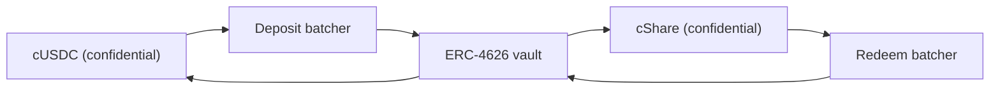

# 奖金从哪来

奖金就是收益。没有任何人的本金会被当作奖金付出去，这正是这个池子无损的原因。
本页讲每个收益来源都实现的那一个接口、今天在 Sepolia 上运行的那个来源、
为什么资金池不肯就任何事情相信来源的一面之词，以及 Zama 自己的机密金库在主网上如何接入。

## 接口

```solidity
interface IYieldSource {
    function harvest() external returns (euint64 transferred); // confidential transfer to the recipient
    function harvestable() external view returns (uint64);      // display only
}
```

两个函数。`harvest` 把累积的收益作为一次机密转账移交给奖池，并返回实际移动的加密金额。
`harvestable` 是给应用展示用的，资金池从不拿它来记账。

`harvest` 是同步的，这是有意的。它移动来源方在那一刻已经准备好的任何金额，
而一个异步赚取收益的来源，被期望提前把那笔金额准备好，而不是让资金池等它。

更换来源是在资金池上的一次拥有者调用 `setYieldSource`，它会发出 `YieldSourceSet`。
系统里其他任何东西都不知道也不关心当前接的是哪个来源。

一个回滚的来源不会让开奖停下。资金池捕获这次失败，把该期的收割额当作一个平凡加密零，
并发出 `HarvestFailed`。关闭成功，开奖照样用各档位已有的流动性来跑，
而那笔没能移动的收益，会被之后的一次收割收走。
一个坏掉的或者接错的来源会饿着奖金那一面；但它没法让时钟停摆。

当一次收割确实落地时，它在该期发奖时记入，在下一次关闭时拿出来发。
所以周期 `p` 的收益供的是第 `p+1` 期的奖，而不是第 `p` 期。
这正是奖金金额能在种子存在之前就定死的原因。

## Sepolia：赞助型来源

`SponsoredYieldSource` 是每个线上池实际跑的东西，各一个实例，
所以这七个来源是七种不同代币的七笔独立余额。USDC 池的那个在
`0xCC49DF69eAB6884fD8DD9260902B8A0Abc9D6b91`；其余六个见
[资金池与代币](pools-and-tokens.md)。

赞助方用该池的公开代币调用来源自己的 `sponsor` 函数。来源把它包装成机密代币，
并且恰好记入包装合约铸出的数额，而不是赞助方要求的数额。
从那里开始，这笔余额按 `ratePerSecond` 滴出，在 USDC 池上是
`5,555 base units a second, which is 19.998 USDC a period`，
而 `harvest` 把已累积的部分发给资金池。每个池的速率都设成每小时整数枚代币，
好让两个不同时钟上的池一眼就能对比，而且每笔赞助的规模都够覆盖八十期以上。

赞助是一次捐赠。赞助方没有任何途径把它取回，而且只有来源的拥有者能改滴出速率，改动会发出 `RateChanged`。

赞助金额、滴出速率和每一次收割都是公开的。这不是妥协：
在 PoolTogether 里，一个金库贡献了多少收益也是公开的，而每一份奖的大小都由它推出。
Hearth 里机密的是谁存了多少、谁中了奖，而不是这个池子赚了多少钱。

如果池子有一阵子没有储户，收益照样累积，并支付给之后第一批有储户的开奖。
空池子里不会有东西被搁浅。

### 为什么用一个 mock

因为一个 mock 来源只有在文档说清它怎么工作、以及真实的来源怎么接入时，才算诚实，这两点下面都有。
我们先找过真实的来源，而 Sepolia 上没有任何一个会为 Zama 的 mock 代币支付收益：

| 场所 | 为什么不行 |
| --- | --- |
| Aave | 在 Sepolia 上拒收 USDC 存款，供应上限已满 |
| Compound | 要的是 Circle 自己的 USDC，不是 Zama 的 mock |
| Zama 的机密金库 | Sepolia 上那个金库是一个只闲置、没有收益适配器的 VaultV2，这是 Zama 自己对它的描述 |

所以诚实的选项只有两个：一个往上涨的假数字，或者一笔真实存在于链上、真的在滴出的赞助资金。
我们选了后者。七个线上池上的每一单位奖金，都是真的被包装过、真的被转过、也真的被验证过的。

## 资金池从不记入一个自报的数字

这就是让赞助型来源不成为软肋的那条规则。

来源方向资金池执行一次加密转账。资金池作为收款方，在那份密文上有权限，
所以它可以自己把转账金额标记为可公开解密。
只有到发奖时，在 `FHE.checkSignatures` 验证了密钥管理服务对该明文的签名之后，
资金池才会向各档位记入任何东西。

一个谎报自己发了多少的来源什么便宜都占不到。资金池记入的是到账的金额，
因为那是它唯一会去看的金额。

这不是理论上的谨慎。在我们上一版设计里，资金池是按调用方传进来的金额记入储备补充的，
而包装合约铸出的是 `amount / rate()`。在实际部署上 `rate()` 恰好是 1，
所以两者一致，这个 bug 是潜伏的。而在一种 18 位小数的底层代币上，包装合约的比例是一万亿，
资金池会相信存在的奖金比实际多一万亿倍。我们在 2026 年 9 月 2 日
对一个 18 位小数的测试代币执行了这个攻击，眼看着它发生了。
在一个无损池里，虚幻的奖金流动性最终会从某个人的本金里付出去，
而那正是这个产品唯一不能违背的承诺。验证转账把这一整类问题都拿掉了。

## 主网：Zama 的机密金库

Zama 交付了一套协议，它的全部工作就是在机密余额上赚取收益，它是主网上天然的来源。
`ConfidentialVaultYieldSource` 就是那套设计里的适配器。
下面写的是它的规格说明，而不是本仓库里的一个合约。

它和这里所有东西一样是一池一个适配器，而每一个都需要为自己那种代币配一个批处理器和一个收益金库。
Zama 的主网部署今天覆盖 USDC，所以一个主网 Hearth 会在机密金库上开 USDC 池，
其他代币则用它们各自存在的来源，或者干脆没有来源。

这套设计是一个坐在机密代币和一个普通 ERC-4626 收益金库之间的批处理器。
一个 ERC-4626 金库只接受公开转账，所以一位孤单的存款人会公布自己的确切金额。
批处理器改为把许多笔加密存款汇集起来，只解密它们的和，
向金库做一次公开存款，再把机密份额发回去。用 Zama 自己的话说：
「观察者能看到谁参与了，但看不到任何人各自贡献了多少。」



适配器用该池的机密代币加入存款批处理器，并持有机密份额。
赎回按它自己的时间表跑，跑在收割之前：keeper 定期向赎回批处理器申请提取增值部分，
并把那个请求推过它的四个阶段，这样等资金池下一次调用 `harvest` 时，
赎回出来的机密 USDC 已经躺在适配器里，那次收割就和其他任何一次转账一样只是一次转账。
这就是一个异步场所如何对接一个同步接口。那四个阶段每一个都无需许可，
所以没有人需要等 Zama 的运营方来跑它们。

### 地址

来自 Zama 自己的地址参考表，抓取于 2026 年 9 月 2 日。

**以太坊主网，链 id 1。** 底层资产 USDC。收益来源：Morpho
「Steakhouse Confidential Prime USDC」VaultV2，做了门禁，使存款批处理器成为该金库唯一的存款人。

| 合约 | 地址 |
| --- | --- |
| 存款批处理器 | `0x324EA89FD3784036673BfE6Ffee2334A088F40Cc` |
| 赎回批处理器 | `0x96Cd3Faa7483783Ac2Eb715f6333361500F1eec9` |
| cUSDC 包装合约 | `0xe978F22157048E5DB8E5d07971376e86671672B2` |
| cShare 包装合约 | `0x66Bf74E96900D1a19c7070D939D124f2F565C458` |
| ERC-4626 金库 | `0xbEEF00A59B577423653A1526c7009bdE103F542B` |
| USDC | `0xA0b86991c6218b36c1d19D4a2e9Eb0cE3606eB48` |

**Sepolia，链 id 11155111。** 一个预发布环境：这里的 USDC 是一个带公开 `mint` 的 mock，
金库只闲置，没有收益适配器。

| 合约 | 地址 |
| --- | --- |
| 存款批处理器 | `0x48758559c14d4d92b4C74A99660B6a8dbe85F53b` |
| 赎回批处理器 | `0xe94E9afdDd43a19C2914739e9279cb6Fe287BEb0` |
| cUSDC 包装合约 | `0x7c5BF43B851c1dff1a4feE8dB225b87f2C223639` |
| cShare 包装合约 | `0x7E93d5c150A2178B1fCde0278582Acf59478eA5f` |
| ERC-4626 金库（闲置） | `0x6AB54988261AEC573a2CA13cF802d3B1114f864C` |
| Mock USDC | `0x9b5Cd13b8eFbB58Dc25A05CF411D8056058aDFfF` |

因为 Sepolia 上那个金库是闲置的，这里的适配器是照着 Zama 公布的批处理器接口写成规格的，
还没有实现出来。在它一分钱都赚不到的时候说它已经上线，是一句任何人一分钟内就能戳破的谎。

### 接入它在实践中意味着什么

批处理器分四个阶段推进：加入、派发、终结、领取。一个批次要等到它达到最短存放时间，
然后它的总额被解密，然后金库结算，然后参与者领取。
那四个阶段每一个都无需许可，所以资金池永远不会卡在等 Zama 运营方那里，而且领取永不过期。

那个节奏比赞助型来源的即时滴出要慢，这就是 keeper 提前跑赎回、而不是把它塞进 `harvest` 的原因。
资金池的合约从不等待：它向适配器索取的是已经领回来的部分。
把这条路真正做上线还剩下的实际工作，一是适配器合约本身，本仓库为它写了规格但没有实现，
二是它的 keeper 那一侧，也就是决定多久启动一次赎回、赎回头寸的多大比例，
这是一个政策选择，晚一点也不会有链上后果。

### Hearth 会继承什么

把这件事说清楚，是对它保持可信的一部分。

- **金库风险，完整继承。** 批处理器把钱转进一个第三方 ERC-4626 金库。
  如果那个金库亏了钱，资金池的生息余额也跟着亏。
  这是唯一一处「无损」要依赖别人合约的地方，
  也是为什么主网部署只应该把生息的那一部分放进去。
- **批次内的机密性，不是资金池级的机密性。** 批处理器把金额隐藏在同批参与者之中，并解密它们的和。
  如果 Hearth 是某一批里唯一的参与者，它的存款额就是公开的。
  这对我们没有任何损失，因为 Hearth 的收割额本来就是公开的，
  但在假设批处理器隐藏得比它实际隐藏的更多之前，值得知道这一点。
- **有边界的拥有者权力。** 批处理器的拥有者可以改最短批次存放时间（上限 7 天）、
  回调截止时间（上限 30 天）、存款滑点容忍度，并且可以暂停加入和派发。
  Zama 的文档说明，拥有者不能移动或冻结用户资金、不能审查某个结果、不能解密任何人的金额，
  也不能升级合约。赎回滑点保护被硬编码为关闭，这样即使金库处于回撤中也能退出。

## 本页没有覆盖什么

它没有讲收益来源对泄漏表的影响，那在
[什么保持私密](../security/what-stays-private.md)里。它没有对 Morpho 金库的收益率做基准测试，
那是别人的数字，而且天天都在变。它也不宣称适配器正在运行：
在 Sepolia 上接着的是赞助型来源，仪表盘上的「资金池现况」卡片会写明这一点。
