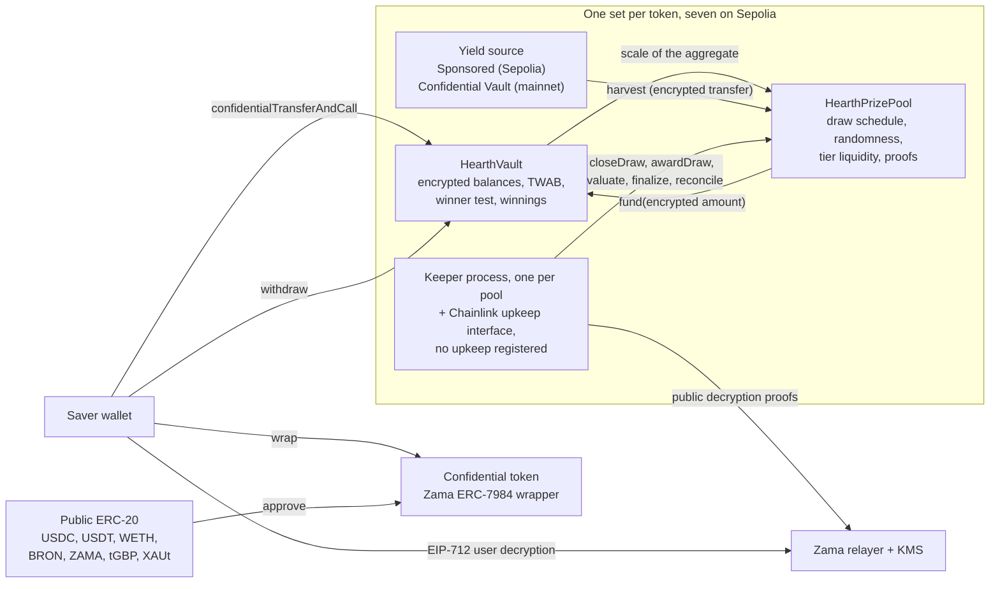

# Hearth 是什么

Hearth 是一个储蓄池，你不会亏钱，还有机会赢奖金。Sepolia 上跑着七个这样的池，
每种机密代币一个，你可以像挑储蓄账户一样挑一种代币。

你存进一种机密代币：USDC、USDT、WETH、BRON、ZAMA、tGBP 或 XAUt。资金池把这笔钱投出去赚取收益。
每个周期，池子赚到的收益会作为奖金发出去，
你的中奖概率与你持有多少、持有多久成正比。你可以随时全额取回本金。
这就是 PoolTogether 发明的「无损彩票」思路，而 Hearth 是它的机密版本。

与 PoolTogether 的区别在于：在普通区块链上一切都是公开的。
任何人都能查到每位储户有多少钱、每个钱包的中奖概率是多少、每期是谁中的奖。
那等于把人们的财富公之于众，也等于给所有大额持有者画上了靶子。Hearth 用 Zama 协议把整套流程跑在加密数字上，
所以链上保存的是你余额的密文（没有密钥就读不懂的数据），而合约照样能在密文上做算术。
你的余额是一个从来没有人见过的数字，我们也没见过，而开奖过程陌生人依然可以核查。

## 一张图看懂整个系统

干活的是两个合约。`HearthVault` 保管每位储户的加密本金、加密中奖余额、
持有时长的记录，并且执行中奖判定。
`HearthPrizePool` 负责计时、摇出随机种子、收取收益，并按档位保管奖金。
一个 keeper 进程推动开奖流程往前走，而它做的每一步，换成任何其他人来做都可以。

图中间那个方框是一种代币的池子。这样的池子有七个，彼此不共享任何东西：
你的 USDC 头寸和 WETH 头寸是两个不同金库里的两位不同储户，一个池子停摆，其余六个照常运行。
你正在看哪个池子，写在地址栏的第一段里，比如 `/app/usdc` 或 `/app/weth`。
完整清单和地址见[资金池与代币](../concepts/pools-and-tokens.md)。

## 四个动作

储户要做四个动作。下面是每个动作做了什么、又暴露了什么。

### 1. 存入

你用一笔交易把该池的机密代币发给它的金库。金额以密文句柄的形式传输，
也就是一个指向加密值的指针，而不是值本身。
金库把它加到你的加密本金上，并更新你余额随时间变化的记录，全程不做任何解密。

- 隐藏的：金额、你的实时余额，因而也包括你在池中的占比。
- 公开的：你的地址、你操作所在的区块，以及「发生了一次存入」这件事。

这里有一道接缝。把普通公开代币换成机密代币是一次公开的 ERC-20 转账，所以包装的金额是可见的。
如果你包装了 5,000 USDC，两个区块之后就存入，观察者猜得八九不离十。
Hearth 之所以把包装和存入拆成两个独立步骤，正是为了让你能在两者之间拉开距离。见
[包装接缝](../security/what-stays-private.md)。

### 2. 开奖

每个周期结束时，资金池关闭该周期的开奖。在一笔交易里，它先定死每个档位的奖金金额，
然后在 Zama 的协处理器内部摇出一个加密随机种子，接着问金库这个池子有多大，最后收取本周期的收益。
顺序很关键：奖金金额是在随机数存在之前就定下来的，所以没人能先看到种子、再回头调整中奖值多少钱。

「这个池子有多大」是故意说得含糊的，这正是设计所在。金库不会公布所有储户加起来的时间加权余额总额。
它只公布这个总额落在哪个 2 的幂区间里，所以外界知道的是池子的大致规模，而不是精确规模。
如果公布精确数字，别人就能把相邻两期一减，从差值里读出某位孤单储户的存款额。

随后有四个小数值连同 Zama 密钥管理服务签名的证明一起发布出来，任何人都可以核对：
种子、区间、池中当期是否有人，以及收取到的收益。
这些数字一经验证，每位储户在该期的结果就已经定死了。

- 隐藏的：每位储户各自的权重、池子的精确总额，以及每个人各自的结果。
- 公开的：种子、区间、收取到的收益、每个档位的奖金金额，以及下一期档位对账时，该档位派出了多少份奖。

### 3. 领奖

没有领奖交易，这正是关键。应用里确实有一个领奖按钮，在「我的开奖」页面那一期的卡片上，
上面写着金额：它就是把你刚打开的中奖余额做一次普通提取，在链上看起来和任何其他提取一模一样。

在开奖被评估的过程中，奖金会记入金库里一个独立的加密余额。
这件事不需要你做任何动作，也不会因为你做了任何动作而暴露。要知道自己有没有中奖，你签一条 EIP-712 消息，
也就是一条能证明你控制该地址的链下结构化签名，然后 Zama 的中继器会把你自己中奖余额的明文返回到你的浏览器。
那条签名从不上链，所以它不花钱，也不留痕迹。
仪表盘上的余额和某一期的开奖结果各有各的眼睛图标，两个可以同时打开，
而第一次的签名对第二个也管用。

- 隐藏的：一切。读取你自己的中奖余额是一个链下操作。
- 公开的：无。

在大多数有奖协议里，中奖者必须发一笔领奖交易，而没中奖的人没有理由发，
于是交易列表就悄悄把中奖者点名了。Hearth 根本没有这样一笔交易可发。
真正把奖金记入账户的那笔交易叫 `evaluate`，而它无法瞄准你自己：
它从该期种子决定的位置开始遍历储户名单，调用者只能说明往前推进多远。

### 4. 提取

只有一个函数能把钱取出来：`withdraw`。它先从你的中奖余额里付，再从本金里付，
并且会取「你持有的」和「金库持有的」两者中较小的那个数。无论你是在领奖、是在把储蓄拿回家，
还是两件事一起做，都是同一个调用、同样的形状、同样的事件，以及一个加密的金额。

那个取较小值的动作之所以存在，是因为一次机密转账要么把整笔钱转走，要么一分不动。
它绝不会只发出请求金额的一部分。所以金库会先算清楚自己实际能付多少，再去让代币付款，
而不是事后再想办法弥补缺口。

- 隐藏的：金额，以及其中有没有奖金。
- 公开的：你的地址、区块，以及「发生了一次提取」这件事。

你的本金永远不会被锁定。开奖进行期间存取都照常开放，这一点在这个领域的好几种设计里是做不到的。

## 是什么让它公平

两样东西，而且陌生人不需要任何特权就能核查这两样。

随机种子来自 `FHE.randEuint64`，在 Zama 的协处理器内部、用网络的 FHE 密钥、
从一个公开种子生成。没人能预测它，也没人能摇第二次：关闭一期开奖恰好只能成功一次。
周期结束之后，资金池会把这个种子连同池子总额所落入的区间一起公布，两者都带着合约在链上验证的证明。

有了这两个公开数字，任何人都能重算出任何地址在任何档位里必须超过的精确阈值，
而且金库把同一套算术也开放成了一个视图函数，所以谁都不必去信任别人的重新实现。
他们做不到的，是看见被拿来比较的那个加密权重。所以规则是公开可审计的，只有输入是私密的。
细节见[随机性与可验证性](../security/randomness-and-verification.md)。

## Hearth 没有隐藏什么

简短版本如下，完整版在[什么保持私密](../security/what-stays-private.md)：

- 储户是谁，以及他们各自何时存入、提取或被评估。
- 每期池子总额所落入的区间、种子，以及收取到的收益。
- 每个档位的奖金金额，以及它派出了多少份奖，晚一期公布。
- 你包装进机密代币、或从中解包装出来的金额。
- 只有一位储户时，公布的区间就是那位储户的权重，误差在两倍以内。
  有两位时，彼此都能框住对方。这里的隐私需要三位或更多储户，应用里也是这么写的。
- 阈值是公开的，所以任何能锁定你余额的人，都能算出你在此后每一期的结果。
  通常的锁定方式是：包装之后隔几分钟又存入同样的金额，这就是应用要把两者拉开的原因。
- 全额包装进来、又全额解包装出去，会公布出你有史以来所有中奖所得的一个下界，
  因为这两次移动在代币层都是公开的。
- 一位储户如果每次中奖后就立刻提取，会通过自己的行为泄漏出一点统计线索。这一条没有任何合约能修好。
