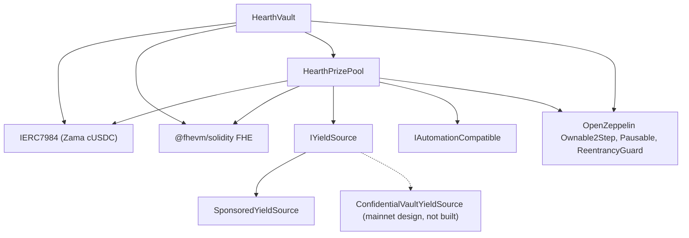

# 部署

一个可重复的脚本，绝不手动点击。本页讲的是顺序、参数，以及每一个参数的含义，
好让一位评审者读到已部署的构造函数参数时，能确认它们是对得上的。

Hearth 每种机密代币部署一个池：每种代币一个金库、一个奖池和一个收益来源，
和其他任何池都不共享任何东西。一次运行开一个池，因为一个部署者 nonce 跑一次部署，
而代币由 `HEARTH_TOKEN` 选定。之后每一个任务都接受 `--token`：

```
cd packages/contracts
HEARTH_TOKEN=weth npx hardhat deploy --network sepolia
npx hardhat hearth:verify  --network sepolia --token weth
npx hardhat hearth:seed    --network sepolia --token weth
npx hardhat hearth:status  --network sepolia --token weth
```

两个都不写，你得到的是 `usdc`，那个网络的默认代币。一个未知的标识会连同该网络确实拥有的池子清单一起失败。
每个池的参数都在同一个文件里，`packages/contracts/hearth.config.ts`：
资产对、周期、档位集合、初始区间、滴出速率、赞助额、五位演示储户的注资额，
以及它的 keeper 用来签名的账户序号。对照下面的表格来读那个文件；它们是同一套数字。

部署会复用任何已经有保存记录的合约，而不是替换它，所以第二次运行是空操作。
一个持有着储户的钱和好几天开奖历史的线上池子，绝不可能因为重跑脚本而被搬到一个新地址上。
要有意替换一个，先删掉它在 `deployments/<network>/` 下的文件。

它写出 `deployments/sepolia/hearth.<slug>.json`，那就是用
`HEARTH_ADDRESSES_FILE` 指给某个 keeper 的东西，也是应用的池子清单据以生成的东西。

## 什么依赖什么



实线边是本仓库里的合约。虚线那个节点是主网收益路径：
那个适配器是照着 Zama 公布的批处理器接口写成规格的，本仓库里没有写出适配器合约，
所以下面只部署 `SponsoredYieldSource`。

金库和资金池彼此都需要对方，所以两条连接里有一条是在部署之后接上的，而不是在构造函数里。
这就是下面有五个步骤而不是三个的原因。

## 顺序

| 步骤 | 动作 | 为什么在这里 |
| --- | --- | --- |
| 1 | 部署 `HearthVault` | 它保管储户的钱，而且除了那个代币存在之外什么都不需要。 |
| 2 | 部署 `HearthPrizePool`，指向那个金库 | 资金池读金库的时钟和它的规模计数，并向金库付款。 |
| 3 | 接线：`vault.setPrizePool(pool)` | 发出 `PrizePoolSet`。金库只接受来自这个地址的拨款。 |
| 4 | 部署收益来源，把资金池作为收款方 | 它必须知道把收割额发到哪里。 |
| 5 | 接线：`pool.setYieldSource(source)` | 发出 `YieldSourceSet`。在这一步落地之前，一次关闭什么都收割不到，并发出 `HarvestFailed`。 |

第 5 步之后，给这个池注入初始数据：`hearth:seed --token <slug>` 会赞助收益来源好让奖金存在，
并从账户 2 到 6 放进五位规模不同的演示储户，
好让第一位访客落在一个已经有人的池子里，而不是一个空池子。
它的每一步都会去链上查什么已经做完了，所以一次被中继器打嗝打断的注入，可以安全地重跑。

那个池的 keeper 也需要它自己的 Sepolia ETH，五位演示储户同样需要：

```
npx hardhat hearth:spread-gas --network sepolia --token weth
npx hardhat hearth:spread-gas --network sepolia --keepers 10,11,12,13,14,15 --savers false
```

第一条给一个池的 keeper 和那些储户供资；第二条一次给好几个 keeper 账户供资，
一次开六个池就需要这个。

然后把应用指向刚部署的东西：

```
cd ../web
node scripts/sync-pools.mjs
```

## 参数

```
HearthVault(IERC7984 asset, uint256 periodLength, uint256 firstPeriodAt, address owner)
HearthPrizePool(IHearthVault vault, IERC7984 asset, Tier[3] tiers, uint8 initialScaleBits, address owner)
    Tier = { uint32 prizeCount; uint64 oddsNumerator; uint64 oddsDenominator; uint16 shares; uint16 reconcileEvery }
SponsoredYieldSource(IERC7984ERC20Wrapper asset, address recipient, uint64 ratePerSecond, address owner)
```

### HearthVault

| 参数 | 含义 | 弄错了会怎样 |
| --- | --- | --- |
| `asset` | 储户存入的那种 ERC-7984 机密代币，Zama 那七种之一。 | 每个包装合约都读作六位小数，而如果链上和配置不一致，部署会拒绝继续。到底下公开代币的比例并不是每个池都为 1：在 18 位小数的 WETH mock 上它是一万亿，所以任何读取那个公开代币的东西都必须应用它。 |
| `periodLength`（`L`） | 一个周期的秒数。不可变。 | 它同时也决定每储户上限 `(2^64 - 1) / L`。`L` 太小，上限很大但开奖很吵；太大，上限就收紧了。 |
| `firstPeriodAt` | 周期 1 开始的时间戳。不可变，而且必须早于或等于部署时刻。 | 一个未来的值会让 `period(now)` 在它到来之前无定义。 |
| `owner` | 两步转移的拥有者。放弃已禁用。 | 这些权力列在[威胁模型](../security/threat-model.md)里。 |

`maxPrincipal` 是从 `periodLength` 推导出来的，不是设定的。一小时约 50 亿枚代币，
六小时约 8.54 亿，一天约 2.13 亿。

时钟归金库所有。资金池拿着金库地址并从它那里读周期，
所以这两个合约不可能对「现在是第几个周期」产生分歧。

### HearthPrizePool

| 参数 | 含义 |
| --- | --- |
| `vault` | 这个池服务的金库，以及它所读的那个时钟。 |
| `asset` | 金库所用的那同一种机密代币。两者必须一致。 |
| `prizeCount[t]` | 档位 `t` 每期的奖项数。 |
| `oddsNumerator[t]`、`oddsDenominator[t]` | 该档位的中奖概率，写成分数，即 `oddsDenominator / oddsNumerator` 期里有一期。 |
| `shares[t]` | 该档位在每笔收割额里的切片。份额是相对的，所以 40/20/40 和 2/1/2 是一个意思。 |
| `reconcileEvery[t]` | 该档位两次公布结转额之间要过多少期。 |
| `initialScaleBits` | 第一个周期总权重的预期比特长度，区间追踪器的起始猜测值。 |
| `owner` | 同上。 |

`UTILISATION` 是一个常量而不是参数：50%，沿用 PoolTogether V5。
它是一个档位的明文流动性中用来定每份奖大小的那个比例。

其中两个值得说一句。

`reconcileEvery` 是一项隐私设置，不是 gas 设置，而它换的是奖池看起来怎么样。
公布一个档位的结转额，会让该档位的中奖数量变公开，
而一个覆盖单期的数量指向的是那一期里符合条件的那一小群储户。
把它设得更高，会把这个数量摊到一段几乎所有人都在某个时刻符合过条件的跨度上。
它的代价是可见的大奖：一次关闭会把一个档位全部的公开流动性移进本期开奖，
而这笔钱只有在对账时才回来，所以一个节奏为 24 的档位，
24 期里有 23 期公布的奖金是按一期的收割份额定的大小，
而累积起来的奖池只在对账那一期才出现在明面上。
这笔钱全程都在加密结转额里被拿出来发、可以被赢走；它只是不可见。
Sepolia 上三个档位全都设为 1 就是这个原因，并且把逐期的数量作为一项残余风险写明。见局限 14。

`initialScaleBits` 只要接近就行。追踪器在每次关闭时把真实总额与当前猜测周围的五个 2 的幂做比较，
并每期最多自我纠正三个比特，所以一个差了几个比特的猜测只会让一两期的概率稍稍偏了尺度，然后就稳定下来。

### SponsoredYieldSource

| 参数 | 含义 |
| --- | --- |
| `asset` | 它持有并发送的那个 ERC-7984 包装合约。赞助方付进来的公开代币就是这个包装合约自己的底层，所以它不是一个单独的参数。 |
| `recipient` | 接收收割额的那个奖池。 |
| `ratePerSecond` | 赞助余额作为收益滴出去的速度。 |
| `owner` | 设定速率，发出 `RateChanged`。 |

赞助是部署之后一个单独的调用，不是构造函数参数。它恰好记入包装合约铸出的数额，
而不是赞助方要求的数额，而且它无法撤销。

## 三套参数

Sepolia 跑其中两套，因为这些池跑在两种时钟上。

| 设置 | Sepolia `usdc` | Sepolia，其余六个 | 主网，候选方案 |
| --- | --- | --- | --- |
| 周期长度 | 1 小时 | 6 小时 | 1 天 |
| 窗口 | 2 小时（两个周期） | 12 小时 | 2 天 |
| 关闭截止时间 | 周期结束后 1 小时 30 分 | 之后 9 小时 | 之后 1 天 12 小时 |
| 每储户上限 | 约 50 亿枚代币 | 约 8.54 亿 | 约 2.13 亿 |
| 大奖档 | 数量 1，概率 1/24，份额 40，每期对账 | 数量 1，概率 1/4，份额 40，每期对账 | 数量 1，概率 1/30，份额 50，每期对账 |
| 中档 | 数量 1，概率 1/6，份额 20，每期对账 | 数量 1，概率 1/2，份额 20，每期对账 | 数量 1，概率 1/7，份额 25，每期对账 |
| 高频档 | 数量 4，概率 1，份额 40，每期对账 | 数量 4，概率 1，份额 40，每期对账 | 数量 4，概率 1，份额 25，每期对账 |
| 使用率 | 50% | 50% | 50% |
| 收益来源 | `SponsoredYieldSource` | `SponsoredYieldSource` | 架在 Zama 批处理器之上的 `ConfidentialVaultYieldSource` |
| 大奖触发频率 | 大约每天一次 | 大约每天一次 | 由所选概率决定 |

这些 Sepolia 数字的存在是为了让访客坐一次就看完一个完整循环：每期四份小奖，
两种时钟上都大约每天一份大奖。它们不是一个真实部署会用的数字。

为什么用两种时钟。五位储户下一次开奖要花 `8,456,388` gas，
所以七个池按小时开奖在 Sepolia 上一天要花大约 `1.43 ETH`，公开水龙头跟不上。
六小时把它降到每池每天四次，七个池一天大约 `0.41 ETH`。
概率是按各池自己的周期设定而不是照搬的，这就是为什么中间那一列写着 1/4 和 1/2，
而第一列写着 1/24 和 1/6，也是为什么大奖在两种时钟上都还是大约每天落一次。
USDC 池保留它的小时时钟，因为它是最先部署的，而且它的开奖历史归档在这个时钟之下。

主网那一列是一个候选方案，不是一次部署。填它的规则和产出 Sepolia 那一列的规则是同一条：
先定你想要每隔多少期出一次大奖，把大奖档的概率设成那个数字的倒数，
再设定各份额，让得出的奖金金额相对来源实际赚到的收益读起来合理，
最后通过权衡「一个谁都点不出来的中奖数量」与「一个储户能看着它累积的奖池」，
决定每个档位的对账节奏。Sepolia 选了后者；一个主网部署可以选前者，
而上面那一段说明了每一边各要付什么代价。一天周期配上 365 分之 1 的大奖概率，
就得到一份年度大奖，那正是 V5 用的形状。

## 已部署的地址

Sepolia 上七个池，每个合约都已在 Etherscan 上验证。每个池持有的那对代币是 Zama 的，
列在[资金池与代币](../concepts/pools-and-tokens.md)里，那里还有每个池的注资额和滴出速率。

| 池 | HearthVault | HearthPrizePool | SponsoredYieldSource | 部署所在区块 |
| --- | --- | --- | --- | --- |
| `usdc` | `0x0F93e5db6027b4FB1C76566d24aA2D2E417fAF52` | `0xA0785AacF30B6FE46EDc53CD8A9db1d94FeF5Df2` | `0xCC49DF69eAB6884fD8DD9260902B8A0Abc9D6b91` | `11622398` |
| `usdt` | `0xe54F44dE64F8A7abc0647eaae547dD59ce0EFfac` | `0x6a83Beb2Dc3f258107Cad5e17BC57657fAd4fbd1` | `0x5bb1Cd5380Cb9f2B15569030fF0dB7a445cF54cA` | `11641314` |
| `weth` | `0x3D1A182782B68fE270A66294C9adaC7F005c4f14` | `0x1a11e7C689F244fA8Dd5f4abA8F2F3131090cc1C` | `0x40DF298f15c6136294eC651aD7b0c1C6F221DE8F` | `11641366` |
| `bron` | `0x18086DC8271f8A73c5Ea985fd519527Dbb991279` | `0x2Ed982979CD184494B947a1E38E597494a38ACe4` | `0x0cD1155D752bD81b3a437a6f0B3965CAA2A1C8e9` | `11641408` |
| `zama` | `0xEEC26386F273c6678cA538AcA18e1d9384eA9F09` | `0x873B285404199D46325a294Aa0EC7a79C30A7fF7` | `0xdD352D70311E834ab75307f53d5C276060081d23` | `11641447` |
| `tgbp` | `0xCe95dAa01f5354aA8887A5952E403D26d452c323` | `0xC531D54ee2c695e0eBfe8b8258e9Fd80fd507095` | `0xDEa2BD6351072F735B6ea83c357bF157d83c01af` | `11641484` |
| `xaut` | `0x77f701101d66FbD522A3bFdC2c00DB09a4F57daE` | `0x9a2888aca42c707A3BC0D561FdF6ff8Abfda5201` | `0x03fDdAA7C4323C53CE511CC49D4c33B26B492af7` | `11641523` |

第一个周期开始时间：`usdc` 是 `1788386400 (2 September 2026, 22:00:00 UTC)`，
`usdt` 是 `1788620400 (5 September 2026, 15:00:00 UTC)`，
其余五个是 `1788624000 (5 September 2026, 16:00:00 UTC)`。`firstPeriodAt`
不可变，而且必须早于或等于部署区块，所以部署脚本读的是链自己的时钟并向下取整到整点，
从来不是这台机器的时钟。

## 验证

验证是部署的一部分，不是事后补的。一位读不到已部署源码的评审者，
只能对这整份文档照单全收。

1. 用部署脚本记录下来的构造函数参数，在 Etherscan 上验证该池全部三个合约：
   `hearth:verify --token <slug>` 会一个合约一个合约地做，并说明哪些已经验证过了。
2. 检查验证过的构造函数参数与上面的参数表对得上。特别要检查这个池拿到的是它自己的金库、
   以及同一个 `asset`，并且档位集合与该池时钟所对应的那一列一致。
3. 检查 `vault.prizePool()` 是那个池的奖池、`pool.yieldSource()` 是那个池的来源，
   而且两者都没有指向另一个池的合约。
4. 检查代币：`asset` 应该是 Zama 公布的 Sepolia 清单里该池对应的那个机密包装合约，
   而 `underlying()` 应该是它下面的那个公开 mock。
   只有在公开代币也读作六位小数时，包装合约的 `rate()` 才是 1；
   在 WETH 池上它是一万亿，而一个不为 1 的比例，
   会改变任何接触公开代币的东西对「一个基础单位」的理解。
5. 跑过几期之后读一下 `pool.scaleBits()`，检查它是否已经稳定在该池真实规模所对应的比特长度附近。
   一个卡在离那里很远的追踪器，意味着初始猜测偏得离谱，而纠正还没赶上。

## 密钥

任何敏感信息都绝不硬编码。部署从一个 `.env` 文件读取，
而 `.env.example` 列出了每一个键，并注明它的值从哪来。
部署者的密钥和 keeper 的密钥是两个不同的账户，所以 keeper 那把热密钥没有任何拥有者权力。

## 托管这个应用

这个应用是一个 Next.js 工作区包，不是仓库根目录，而这正是大多数托管平台唯一会搞错的设置。

| 设置 | 值 | 为什么 |
| --- | --- | --- |
| 框架预设 | Next.js | 从 `packages/web/package.json` 检测出来 |
| 根目录 | `packages/web` | 这个应用住在一个 npm 工作区里 |
| 包含根目录之外的源文件 | 开 | 依赖被提升到了仓库根目录，而构建需要根目录的 `package.json` 和锁文件 |
| 安装命令 | 默认的 `npm install` | 它在仓库根目录运行，并安装整个工作区 |
| 构建命令 | 默认的 `next build` | 在根目录设好之后，它会在 `packages/web` 内部运行 |
| 输出目录 | 默认的 `.next` | 见下面的警告 |
| Node 版本 | 20 或更高 | 根目录的 `package.json` 设置了 `engines.node` |

不要在托管环境里设置 `NEXT_DIST_DIR`。`packages/web/next.config.ts` 会读它，
并在它存在时把构建输出挪走。它存在是为了让一次本地验证构建不会和一个正在跑的开发服务器
争抢同一个 `.next` 目录。在一次托管构建里，它会把输出挪到托管平台不去看的地方，
而部署会失败，且没有任何明显的线索可查。

### 环境变量

| 变量 | 在浏览器里公开 | 它的值从哪来 |
| --- | --- | --- |
| `SEPOLIA_RPC_URL` | 否 | 你自己的 Sepolia 端点。落地页和 `/api/activity` 路由在服务端读链，所以这一个从不会到达浏览器。日志查询需要它，因为免费的公共节点把 `eth_getLogs` 的区块范围限制得远低于一天的区块量 |
| `NEXT_PUBLIC_SEPOLIA_RPC_URL` | 是 | 可选。钱包相关的读取会用它，未设置时回落到 `https://ethereum-sepolia-rpc.publicnode.com`。它在打包产物里可见，所以必须是一个你乐意公开的端点 |
| `NEXT_PUBLIC_CHAIN_ID` | 是 | 以太坊 Sepolia 是 `11155111`。未设置时应用默认用它 |

现在没有任何合约地址是环境变量。应用从
`packages/web/src/lib/chain/pools.json` 读取每一个池，
而那个文件由 `node scripts/sync-pools.mjs` 从部署脚本写出的地址文件生成，
所以应用显示的任何一个地址，永远都能追溯到一条部署记录，而不是某个人手打的东西。
每次部署之后跑那个脚本并提交结果。
过去用来存放单个池的金库、奖池和收益来源地址的那三个公开变量已经没有了；
把它们从任何还在设置它们的环境里删掉，因为没有任何东西会读它们。

机密资产和它的底层 ERC-20 也是从链上的金库和包装合约读出来的，
所以这个应用不可能去和一个金库会拒绝的代币打交道。

### 第一次部署之后

1. 在手机上打开生产环境网址。每一个页面都必须在 375 像素宽下正常工作。
2. 在 Sepolia 上连接钱包，对着已部署的站点而不是 localhost，走一遍 README 里的两分钟路径。
3. 打开 `/verify?pool=<slug>` 并粘进一位储户的地址。阈值来自一次合约调用，
   所以只要它们渲染出来，就说明已部署的应用正在和那个池已部署的金库对话。
4. 打开池子选择器，检查每个标识都能加载它自己的仪表盘，
   并且那个受限代币显示的是它的拒绝页面，而不是一个坏掉的屏幕。

---

## 本页没有覆盖什么

它没有讲部署之后怎么运行这些池，那是
[keeper](keeper.md)，而一池一个 keeper 进程也是那一页的内容。
它没有讲主网的运营就绪度：机密金库适配器是照着 Zama 公布的批处理器接口写成规格的，
本仓库里没有实现它，而把它做上线的过程描述在
[收益来源](../concepts/yield-source.md)里。
