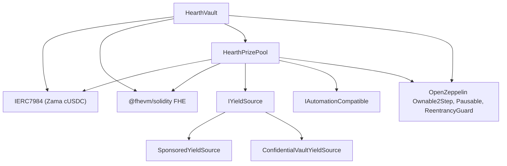

# Deploying

One repeatable script, never manual clicking. This page is the order, the parameters and
what each of them means, so that a reviewer can read the deployed constructor arguments
and know they match.

## What depends on what



The vault and the pool each need the other, so one of the two links is made after
deployment rather than in a constructor. That is why there are five steps below and not
three.

## The order

| Step | Action | Why here |
| --- | --- | --- |
| 1 | Deploy `HearthVault` | It holds savers' money and needs nothing but the token to exist. |
| 2 | Deploy `HearthPrizePool`, pointing at the vault | The pool reads the vault's clock and its scale count, and pays the vault. |
| 3 | Wire: `vault.setPrizePool(pool)` | Emits `PrizePoolSet`. The vault will only accept funding from this address. |
| 4 | Deploy the yield source, pointing at the pool as recipient | It has to know where to send harvests. |
| 5 | Wire: `pool.setYieldSource(source)` | Emits `YieldSourceSet`. Until this lands, a close harvests nothing and emits `HarvestFailed`. |

After step 5, seed the pool: sponsor the yield source so prizes exist, and run the demo
seeding script so a judge lands on a populated pool rather than an empty one.

## The parameters

```
HearthVault(IERC7984 asset, uint256 periodLength, uint256 firstPeriodAt, address owner)
HearthPrizePool(IHearthVault vault, IERC7984 asset, Tier[3] tiers, uint8 initialScaleBits, address owner)
    Tier = { uint32 prizeCount; uint64 oddsNumerator; uint64 oddsDenominator; uint16 shares; uint16 reconcileEvery }
SponsoredYieldSource(IERC7984ERC20Wrapper asset, address recipient, uint64 ratePerSecond, address owner)
```

### HearthVault

| Parameter | Meaning | Getting it wrong |
| --- | --- | --- |
| `asset` | The ERC-7984 confidential token savers deposit. Zama's cUSDC. | A token with a wrapper rate other than 1 changes what a unit means. |
| `periodLength` (`L`) | Seconds in a period. Immutable. | Also sets the per-saver cap, `(2^64 - 1) / L`. Too small an `L` and the cap is huge but draws are noisy; too large and the cap tightens. |
| `firstPeriodAt` | Timestamp when period 1 starts. Immutable, and must be at or before deployment. | A future value makes `period(now)` undefined until it passes. |
| `owner` | Two-step owner. Renouncing is disabled. | The powers are listed in the [threat model](../security/threat-model.md). |

`maxPrincipal` is derived from `periodLength`, not set. At one hour it is about 5 billion
USDC. At a day it is about 213 million USDC.

The vault owns the clock. The pool takes the vault address and reads periods from it, so
there is no way for the two contracts to disagree about what period it is.

### HearthPrizePool

| Parameter | Meaning |
| --- | --- |
| `vault` | The vault this pool serves, and the clock it reads. |
| `asset` | The same confidential token the vault uses. They must match. |
| `prizeCount[t]` | Prizes per draw in tier `t`. |
| `oddsNumerator[t]`, `oddsDenominator[t]` | The tier's odds as a fraction, one draw in `oddsDenominator / oddsNumerator`. |
| `shares[t]` | The tier's slice of every harvest. Shares are relative, so 40/20/40 and 2/1/2 mean the same thing. |
| `reconcileEvery[t]` | How many draws pass between publications of that tier's carry. |
| `initialScaleBits` | The expected bit length of the first period's total weight, the starting guess for the bracket tracker. |
| `owner` | As above. |

`UTILISATION` is a constant rather than an argument: 50 percent, following PoolTogether V5.
It is the fraction of a tier's plaintext liquidity used to size each prize.

Two of those deserve a word.

`reconcileEvery` is a privacy setting, not a gas setting, and it trades against how the
prize pot looks. Publishing a tier's carry makes that tier's prize count public, and a
count over one draw points at the small set of savers eligible in that draw. Setting it
higher spreads the count over a span in which nearly everybody was eligible at some point.
What that costs is the visible jackpot: a close moves all of a tier's public liquidity
into the draw and it comes back only at a reconcile, so a tier at a cadence of 24
publishes a prize sized off one draw's harvest share on 23 draws out of 24, with the
accumulated pot showing in the open only on the reconcile draw. The money is offered and
winnable the whole time inside the encrypted carry; it is just invisible. Sepolia runs all
three tiers at 1 for that reason and states the per-draw count as a residual. See
limitation 14.

`initialScaleBits` only has to be close. The tracker compares the real total against five
powers of two around the current guess at every close and corrects itself by up to three
bits per draw, so a guess that is a few bits off costs a draw or two of slightly mis-scaled
odds and then settles.

### SponsoredYieldSource

| Parameter | Meaning |
| --- | --- |
| `asset` | The ERC-7984 wrapper it holds and sends. The public token sponsors pay in is the wrapper's own underlying, so it is not a separate argument. |
| `recipient` | The prize pool that receives harvests. |
| `ratePerSecond` | How fast the sponsored balance drips out as yield. |
| `owner` | Sets the rate, emitting `RateChanged`. |

Sponsoring is a separate call after deployment, not a constructor argument. It books
exactly what the wrapper minted rather than what the sponsor asked for, and it cannot be
undone.

## Two parameter sets

| Setting | Sepolia, live | Mainnet, candidate |
| --- | --- | --- |
| Period length | 1 hour | 1 day |
| Window | 2 hours (two periods) | 2 days |
| Close deadline | 1 hour 30 minutes after the period ends | 1 day 12 hours after |
| Per-saver cap | About 5 billion USDC | About 213 million USDC |
| Grand tier | count 1, odds 1/24, shares 40, reconcile every draw | count 1, odds `{{MAINNET_GRAND_ODDS}}`, shares `{{MAINNET_GRAND_SHARES}}`, reconcile every `{{MAINNET_GRAND_RECONCILE}}` |
| Mid tier | count 1, odds 1/6, shares 20, reconcile every draw | count 1, odds `{{MAINNET_MID_ODDS}}`, shares `{{MAINNET_MID_SHARES}}`, reconcile every `{{MAINNET_MID_RECONCILE}}` |
| Frequent tier | count 4, odds 1, shares 40, reconcile every draw | count 4, odds 1, shares `{{MAINNET_FREQUENT_SHARES}}`, reconcile every draw |
| Utilisation | 50 percent | 50 percent |
| Yield source | `SponsoredYieldSource` | `ConfidentialVaultYieldSource` over Zama's batcher |
| Grand prize fires | About once a day | Set by the odds chosen |

The Sepolia numbers exist so a visitor sees a full cycle in one sitting: a draw every hour,
four small prizes every time, a grand prize about daily. They are not what a real
deployment would use.

The mainnet column is a candidate, not a deployment. The rule for filling it is the same
one that produced the Sepolia column: pick how many draws you want between grand prizes and
set the grand tier's odds to one over that number, then set shares so the resulting prize
sizes read sensibly against the yield the source actually earns, then decide each tier's
reconcile cadence by weighing a prize count that names nobody against a pot savers can
watch accumulate. Sepolia took the second; a mainnet deployment may take the first, and the
paragraph above says what each side costs. A daily period
with grand odds of 1 in 365 gives an annual grand prize, which is the shape V5 uses.

## Deployed addresses

| Contract | Network | Address | Verified |
| --- | --- | --- | --- |
| HearthVault | Sepolia | `{{ADDRESS_VAULT}}` | [Etherscan](https://sepolia.etherscan.io/address/{{ADDRESS_VAULT}}#code) |
| HearthPrizePool | Sepolia | `{{ADDRESS_POOL}}` | [Etherscan](https://sepolia.etherscan.io/address/{{ADDRESS_POOL}}#code) |
| SponsoredYieldSource | Sepolia | `{{ADDRESS_SOURCE}}` | [Etherscan](https://sepolia.etherscan.io/address/{{ADDRESS_SOURCE}}#code) |
| Confidential USDC (Zama) | Sepolia | `0x7c5BF43B851c1dff1a4feE8dB225b87f2C223639` | Zama's deployment |
| Mock USDC (Zama) | Sepolia | `0x9b5Cd13b8eFbB58Dc25A05CF411D8056058aDFfF` | Zama's deployment |

Deployment block: `{{DEPLOY_BLOCK}}`. First period start: `{{FIRST_PERIOD_AT}}`.

## Verification

Verification is part of the deploy, not an afterthought. A reviewer who cannot read the
deployed source has to take our word for the whole of this documentation.

1. Verify all three contracts on Etherscan with the constructor arguments recorded by the
   deploy script.
2. Check that the verified constructor arguments match the parameter tables above. In
   particular that the pool was given the deployed vault and the same `asset`, and that
   the tier set matches the Sepolia column.
3. Check that `vault.prizePool()` is the deployed pool and `pool.yieldSource()` is the
   deployed source.
4. Check the token: `asset` should be Zama's cUSDC at
   `0x7c5BF43B851c1dff1a4feE8dB225b87f2C223639`, whose `rate()` is 1 and whose
   `underlying()` is Zama's mock USDC. A wrapper rate other than 1 changes what a base
   unit means throughout.
5. Read `pool.scaleBits()` after a few draws and check it has settled near the bit length
   the pool's real size implies. A tracker stuck far from that would mean the initial guess
   was wildly off and the correction has not caught up.

## Secrets

Nothing sensitive is ever hardcoded. The deploy reads from a `.env` file, and
`.env.example` lists every key with a comment on where its value comes from. The
deployer's key and the keeper's key are separate accounts, so the keeper's hot key has no
owner powers.

## What this page does not cover

It does not cover running the pool after deployment, which is
[the keeper](keeper.md). It does not cover mainnet operational readiness: the Confidential
Vault adapter is documented and tested against the batcher interface, not wired to a live
pool, and taking it live is described in [yield source](../concepts/yield-source.md).
