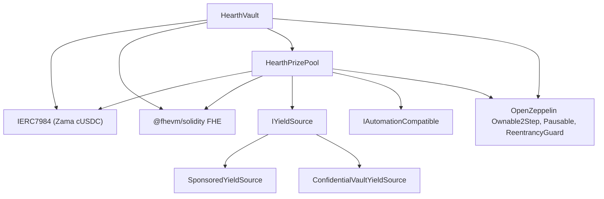

# Deploying

One repeatable script, never manual clicking. This page is the order, the parameters and
what each of them means, so that a reviewer can read the deployed constructor arguments
and know they match.

## What depends on what

The vault and the pool each need the other, so one of the two links is made after
deployment rather than in a constructor. That is why there are five steps below and not
three.

## The order

| Step | Action | Why here |
| --- | --- | --- |
| 1 | Deploy `HearthVault` | It holds savers' money and needs nothing but the token to exist. |
| 2 | Deploy `HearthPrizePool`, pointing at the vault | The pool reads the vault's aggregate weight and pays it. |
| 3 | Wire: `vault.setPrizePool(pool)` | Emits `PrizePoolSet`. The vault will only accept funding from this address. |
| 4 | Deploy the yield source, pointing at the pool as recipient | It has to know where to send harvests. |
| 5 | Wire: `pool.setYieldSource(source)` | Emits `YieldSourceSet`. Until this lands, closing a draw has nowhere to harvest from. |

After step 5, seed the pool: sponsor the yield source so prizes exist, and run the demo
seeding script so a judge lands on a populated pool rather than an empty one.

The exact constructor signatures live in the contracts' NatSpec and in
`packages/contracts/deploy`. The table below is what each argument means, not a claim
about argument order.

## The parameters

### HearthVault

| Parameter | Meaning | Getting it wrong |
| --- | --- | --- |
| `asset` | The ERC-7984 confidential token savers deposit. Zama's cUSDC. | A token with a wrapper rate other than 1 changes what a unit means. |
| `periodLength` (`L`) | Seconds in a period. Immutable. | Also sets the per-saver cap, `(2^64 - 1) / L`. Too small an `L` and the cap is huge but draws are noisy; too large and the cap tightens. |
| `firstPeriodAt` | Timestamp when period 1 starts. Immutable, and must be at or before deployment. | A future value makes `period(now)` undefined until it passes. |
| `owner` | Two-step owner. Renouncing is disabled. | The powers are listed in the [threat model](../security/threat-model.md). |

`maxPrincipal` is derived from `periodLength`, not set. At 30 minutes it is about 10
billion USDC. At a day it is about 213 million USDC.

### HearthPrizePool

| Parameter | Meaning |
| --- | --- |
| `vault` | The vault this pool serves. |
| `asset` | The same confidential token the vault uses. They must match. |
| `periodLength`, `firstPeriodAt` | The same clock as the vault. If these disagree, draws and weights refer to different periods. |
| Tier `count[t]` | Prizes per draw in tier `t`. |
| Tier `oddsNum[t]`, `oddsDen[t]` | The tier's odds as a fraction, one draw in `oddsDen / oddsNum`. |
| Tier `shares[t]` | The tier's slice of every harvest. Shares are relative, so 40/20/40 and 2/1/2 mean the same thing. |
| `UTILISATION` | The fraction of a tier's liquidity used to size each prize. 50 percent, following PoolTogether V5. |
| `owner` | As above. |

Tier parameters are chosen with V5's odds formula, and a tier's odds are what set how
often it fires: odds of `1/n` means about one draw in `n`.

### SponsoredYieldSource

| Parameter | Meaning |
| --- | --- |
| `asset` | The confidential token it holds and sends. |
| `underlying` | The public ERC-20 sponsors pay in, which it wraps. |
| `recipient` | The prize pool that receives harvests. |
| `ratePerSecond` | How fast the sponsored balance drips out as yield. |
| `owner` | Sets the rate, emitting `RateChanged`. |

Sponsoring is a separate call after deployment, not a constructor argument, and it books
exactly what the wrapper minted rather than what the sponsor asked for.

## Two parameter sets

| Setting | Sepolia, live | Mainnet, candidate |
| --- | --- | --- |
| Period length | 30 minutes | 1 day |
| Window | 1 hour (two periods) | 2 days |
| Per-saver cap | About 10 billion USDC | About 213 million USDC |
| Grand tier | count 1, odds 1/48, shares 40 | count 1, odds `{{MAINNET_GRAND_ODDS}}`, shares `{{MAINNET_GRAND_SHARES}}` |
| Mid tier | count 1, odds 1/6, shares 20 | count 1, odds `{{MAINNET_MID_ODDS}}`, shares `{{MAINNET_MID_SHARES}}` |
| Frequent tier | count 4, odds 1, shares 40 | count 4, odds 1, shares `{{MAINNET_FREQUENT_SHARES}}` |
| Utilisation | 50 percent | 50 percent |
| Yield source | `SponsoredYieldSource` | `ConfidentialVaultYieldSource` over Zama's batcher |
| Grand prize fires | About once a day | Set by the odds chosen |

The Sepolia numbers exist so a visitor sees a full cycle in one sitting: a draw every 30
minutes, four small prizes every time, a grand prize about daily. They are not what a real
deployment would use.

The mainnet column is a candidate, not a deployment. The rule for filling it is the same
one that produced the Sepolia column: pick how many draws you want between grand prizes
and set the grand tier's odds to one over that number, then set shares so the resulting
prize sizes read sensibly against the yield the source actually earns. A daily period with
grand odds of 1 in 365 gives an annual grand prize, which is the shape V5 uses.

## Deployed addresses

| Contract | Network | Address | Verified |
| --- | --- | --- | --- |
| HearthVault | Sepolia | `{{ADDRESS_VAULT}}` | [Etherscan](https://sepolia.etherscan.io/address/{{ADDRESS_VAULT}}#code) |
| HearthPrizePool | Sepolia | `{{ADDRESS_POOL}}` | [Etherscan](https://sepolia.etherscan.io/address/{{ADDRESS_POOL}}#code) |
| SponsoredYieldSource | Sepolia | `{{ADDRESS_SOURCE}}` | [Etherscan](https://sepolia.etherscan.io/address/{{ADDRESS_SOURCE}}#code) |
| Confidential USDC (Zama) | Sepolia | `0x7c5BF43B851c1dff1a4feE8dB225b87f2C223639` | Zama's deployment |
| Mock USDC (Zama) | Sepolia | `0x9b5Cd13b8eFbB58Dc25A05CF411D8056058aDFfF` | Zama's deployment |

Deployment block: `{{DEPLOY_BLOCK}}`. First period start: `{{FIRST_PERIOD_AT}}`.

## Verification

Verification is part of the deploy, not an afterthought. A reviewer who cannot read the
deployed source has to take our word for the whole of this documentation.

1. Verify all three contracts on Etherscan with the constructor arguments recorded by the
   deploy script.
2. Check that the verified constructor arguments match the parameter tables above. In
   particular that the vault and the pool were given the same `periodLength` and
   `firstPeriodAt`, and the same `asset`.
3. Check that `vault.prizePool()` is the deployed pool and `pool.yieldSource()` is the
   deployed source.
4. Check the token: `asset` should be Zama's cUSDC at
   `0x7c5BF43B851c1dff1a4feE8dB225b87f2C223639`, whose `rate()` is 1 and whose
   `underlying()` is Zama's mock USDC. A wrapper rate other than 1 changes what a base
   unit means throughout.

## Secrets

Nothing sensitive is ever hardcoded. The deploy reads from a `.env` file, and
`.env.example` lists every key with a comment on where its value comes from. The
deployer's key and the keeper's key are separate accounts, so the keeper's hot key has no
owner powers.

## What this page does not cover

It does not cover running the pool after deployment, which is
[the keeper](keeper.md). It does not cover mainnet operational readiness: the Confidential
Vault adapter is documented and tested against the batcher interface, not wired to a live
pool, and taking it live is described in [yield source](../concepts/yield-source.md).
