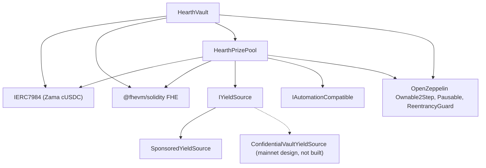

# Deploying

One repeatable script, never manual clicking. This page is the order, the parameters and
what each of them means, so that a reviewer can read the deployed constructor arguments
and know they match.

Hearth deploys one pool per confidential token: a vault, a prize pool and a yield source
per token, sharing nothing with any other pool. One run opens one pool, because one
deployer nonce runs one deploy, and the token is chosen with `HEARTH_TOKEN`. Every task
afterwards takes `--token`:

```
cd packages/contracts
HEARTH_TOKEN=weth npx hardhat deploy --network sepolia
npx hardhat hearth:verify  --network sepolia --token weth
npx hardhat hearth:seed    --network sepolia --token weth
npx hardhat hearth:status  --network sepolia --token weth
```

Leave both off and you get `usdc`, the network's default token. An unknown slug fails with
the list of pools that network does have. Every pool's parameters live in one file,
`packages/contracts/hearth.config.ts`: the asset pair, the period, the tier set, the
initial bracket, the drip rate, the sponsorship, the five demo stakes and the account index
its keeper signs from. Read that file next to the tables below; it is the same numbers.

The deploy reuses any contract that already has a saved deployment rather than replacing
it, so a second run is a no-op. A live pool holding savers' money and days of draw history
can never be moved to a fresh address by rerunning the script. To replace one deliberately,
delete its file under `deployments/<network>/` first.

It writes `deployments/sepolia/hearth.<slug>.json`, which is what a keeper is pointed at
with `HEARTH_ADDRESSES_FILE` and what the app's pool list is generated from.

## What depends on what



Solid edges are contracts in this repository. The dotted node is the mainnet yield path:
the adapter is specified against Zama's published batcher interface and no adapter contract
is written here, so only `SponsoredYieldSource` is deployed below.

The vault and the pool each need the other, so one of the two links is made after
deployment rather than in a constructor. That is why there are five steps below and not
three.

## The order

| Step | Action | Why here |
| --- | --- | --- |
| 1 | Deploy `HearthVault` | It holds savers' money and needs nothing but the token to exist. |
| 2 | Deploy `HearthPrizePool`, pointing at the vault | The pool reads the vault's clock and its scale count, and pays the vault. |
| 3 | Wire: `vault.setPrizePool(pool)` | Emits `PrizePoolSet`. The vault will only accept funding from this address. |
| 4 | Deploy the yield source, pointing at the pool as recipient | It has to know where to send harvests. |
| 5 | Wire: `pool.setYieldSource(source)` | Emits `YieldSourceSet`. Until this lands, a close harvests nothing and emits `HarvestFailed`. |

After step 5, seed the pool: `hearth:seed --token <slug>` sponsors the yield source so
prizes exist and puts five demo savers of different sizes in from accounts 2 to 6, so a
first visitor lands on a populated pool rather than an empty one. Every step of it checks
the chain for what is already done, so a seed interrupted by a relayer hiccup is safe to
run again.

The keeper for that pool also needs its own Sepolia ETH, and so do the five demo savers:

```
npx hardhat hearth:spread-gas --network sepolia --token weth
npx hardhat hearth:spread-gas --network sepolia --keepers 10,11,12,13,14,15 --savers false
```

The first funds one pool's keeper and the savers; the second funds several keeper accounts
in one pass, which is what opening six pools at once needs.

Then point the app at what was deployed:

```
cd ../web
node scripts/sync-pools.mjs
```

## The parameters

```
HearthVault(IERC7984 asset, uint256 periodLength, uint256 firstPeriodAt, address owner)
HearthPrizePool(IHearthVault vault, IERC7984 asset, Tier[3] tiers, uint8 initialScaleBits, address owner)
    Tier = { uint32 prizeCount; uint64 oddsNumerator; uint64 oddsDenominator; uint16 shares; uint16 reconcileEvery }
SponsoredYieldSource(IERC7984ERC20Wrapper asset, address recipient, uint64 ratePerSecond, address owner)
```

### HearthVault

| Parameter | Meaning | Getting it wrong |
| --- | --- | --- |
| `asset` | The ERC-7984 confidential token savers deposit, one of Zama's seven. | Every wrapper reads six decimals, and the deploy refuses to continue if the chain disagrees with the config. The rate to the public token underneath is not 1 on every pool: on the 18-decimal WETH mock it is a million million, so anything reading the public token must apply it. |
| `periodLength` (`L`) | Seconds in a period. Immutable. | Also sets the per-saver cap, `(2^64 - 1) / L`. Too small an `L` and the cap is huge but draws are noisy; too large and the cap tightens. |
| `firstPeriodAt` | Timestamp when period 1 starts. Immutable, and must be at or before deployment. | A future value makes `period(now)` undefined until it passes. |
| `owner` | Two-step owner. Renouncing is disabled. | The powers are listed in the [threat model](../security/threat-model.md). |

`maxPrincipal` is derived from `periodLength`, not set. At one hour it is about 5 billion
tokens, at six hours about 854 million, and at a day about 213 million.

The vault owns the clock. The pool takes the vault address and reads periods from it, so
there is no way for the two contracts to disagree about what period it is.

### HearthPrizePool

| Parameter | Meaning |
| --- | --- |
| `vault` | The vault this pool serves, and the clock it reads. |
| `asset` | The same confidential token the vault uses. They must match. |
| `prizeCount[t]` | Prizes per draw in tier `t`. |
| `oddsNumerator[t]`, `oddsDenominator[t]` | The tier's odds as a fraction, one draw in `oddsDenominator / oddsNumerator`. |
| `shares[t]` | The tier's slice of every harvest. Shares are relative, so 40/20/40 and 2/1/2 mean the same thing. |
| `reconcileEvery[t]` | How many draws pass between publications of that tier's carry. |
| `initialScaleBits` | The expected bit length of the first period's total weight, the starting guess for the bracket tracker. |
| `owner` | As above. |

`UTILISATION` is a constant rather than an argument: 50 percent, following PoolTogether V5.
It is the fraction of a tier's plaintext liquidity used to size each prize.

Two of those deserve a word.

`reconcileEvery` is a privacy setting, not a gas setting, and it trades against how the
prize pot looks. Publishing a tier's carry makes that tier's prize count public, and a
count over one draw points at the small set of savers eligible in that draw. Setting it
higher spreads the count over a span in which nearly everybody was eligible at some point.
What that costs is the visible jackpot: a close moves all of a tier's public liquidity
into the draw and it comes back only at a reconcile, so a tier at a cadence of 24
publishes a prize sized off one draw's harvest share on 23 draws out of 24, with the
accumulated pot showing in the open only on the reconcile draw. The money is offered and
winnable the whole time inside the encrypted carry; it is just invisible. Sepolia runs all
three tiers at 1 for that reason and states the per-draw count as a residual. See
limitation 14.

`initialScaleBits` only has to be close. The tracker compares the real total against five
powers of two around the current guess at every close and corrects itself by up to three
bits per draw, so a guess that is a few bits off costs a draw or two of slightly mis-scaled
odds and then settles.

### SponsoredYieldSource

| Parameter | Meaning |
| --- | --- |
| `asset` | The ERC-7984 wrapper it holds and sends. The public token sponsors pay in is the wrapper's own underlying, so it is not a separate argument. |
| `recipient` | The prize pool that receives harvests. |
| `ratePerSecond` | How fast the sponsored balance drips out as yield. |
| `owner` | Sets the rate, emitting `RateChanged`. |

Sponsoring is a separate call after deployment, not a constructor argument. It books
exactly what the wrapper minted rather than what the sponsor asked for, and it cannot be
undone.

## Three parameter sets

Sepolia runs two of them, because the pools run on two clocks.

| Setting | Sepolia `usdc` | Sepolia, the other six | Mainnet, candidate |
| --- | --- | --- | --- |
| Period length | 1 hour | 6 hours | 1 day |
| Window | 2 hours (two periods) | 12 hours | 2 days |
| Close deadline | 1 hour 30 minutes after the period ends | 9 hours after | 1 day 12 hours after |
| Per-saver cap | About 5 billion tokens | About 854 million | About 213 million |
| Grand tier | count 1, odds 1/24, shares 40, reconcile every draw | count 1, odds 1/4, shares 40, reconcile every draw | count 1, odds 1/30, shares 50, reconcile every draw |
| Mid tier | count 1, odds 1/6, shares 20, reconcile every draw | count 1, odds 1/2, shares 20, reconcile every draw | count 1, odds 1/7, shares 25, reconcile every draw |
| Frequent tier | count 4, odds 1, shares 40, reconcile every draw | count 4, odds 1, shares 40, reconcile every draw | count 4, odds 1, shares 25, reconcile every draw |
| Utilisation | 50 percent | 50 percent | 50 percent |
| Yield source | `SponsoredYieldSource` | `SponsoredYieldSource` | `ConfidentialVaultYieldSource` over Zama's batcher |
| Grand prize fires | About once a day | About once a day | Set by the odds chosen |

The Sepolia numbers exist so a visitor sees a full cycle in one sitting: four small prizes
every draw and a grand prize about daily on either clock. They are not what a real
deployment would use.

Why two clocks. A draw at five savers costs `8,456,388` gas, so seven pools drawing hourly
would spend about `1.43 ETH` a day on Sepolia, which public faucets cannot keep up with. Six
hours cuts that to four draws a day per pool, about `0.41 ETH` a day for all seven. The
odds are set against each pool's own period rather than carried over, which is why the
middle column reads 1/4 and 1/2 where the first reads 1/24 and 1/6, and why the grand prize
still lands about once a day in both. The USDC pool kept its hourly clock because it was
deployed first and its draw history is filed under it.

The mainnet column is a candidate, not a deployment. The rule for filling it is the same
one that produced the Sepolia column: pick how many draws you want between grand prizes and
set the grand tier's odds to one over that number, then set shares so the resulting prize
sizes read sensibly against the yield the source actually earns, then decide each tier's
reconcile cadence by weighing a prize count that names nobody against a pot savers can
watch accumulate. Sepolia took the second; a mainnet deployment may take the first, and the
paragraph above says what each side costs. A daily period
with grand odds of 1 in 365 gives an annual grand prize, which is the shape V5 uses.

## Deployed addresses

Seven pools on Sepolia, every contract verified on Etherscan. The token pair each one holds
is Zama's and is listed in [pools and tokens](../concepts/pools-and-tokens.md), together
with the seeded stakes and drip rate per pool.

| Pool | HearthVault | HearthPrizePool | SponsoredYieldSource | Deployed in block |
| --- | --- | --- | --- | --- |
| `usdc` | `0x0F93e5db6027b4FB1C76566d24aA2D2E417fAF52` | `0xA0785AacF30B6FE46EDc53CD8A9db1d94FeF5Df2` | `0xCC49DF69eAB6884fD8DD9260902B8A0Abc9D6b91` | `11622398` |
| `usdt` | `0xe54F44dE64F8A7abc0647eaae547dD59ce0EFfac` | `0x6a83Beb2Dc3f258107Cad5e17BC57657fAd4fbd1` | `0x5bb1Cd5380Cb9f2B15569030fF0dB7a445cF54cA` | `11641314` |
| `weth` | `0x3D1A182782B68fE270A66294C9adaC7F005c4f14` | `0x1a11e7C689F244fA8Dd5f4abA8F2F3131090cc1C` | `0x40DF298f15c6136294eC651aD7b0c1C6F221DE8F` | `11641366` |
| `bron` | `0x18086DC8271f8A73c5Ea985fd519527Dbb991279` | `0x2Ed982979CD184494B947a1E38E597494a38ACe4` | `0x0cD1155D752bD81b3a437a6f0B3965CAA2A1C8e9` | `11641408` |
| `zama` | `0xEEC26386F273c6678cA538AcA18e1d9384eA9F09` | `0x873B285404199D46325a294Aa0EC7a79C30A7fF7` | `0xdD352D70311E834ab75307f53d5C276060081d23` | `11641447` |
| `tgbp` | `0xCe95dAa01f5354aA8887A5952E403D26d452c323` | `0xC531D54ee2c695e0eBfe8b8258e9Fd80fd507095` | `0xDEa2BD6351072F735B6ea83c357bF157d83c01af` | `11641484` |
| `xaut` | `0x77f701101d66FbD522A3bFdC2c00DB09a4F57daE` | `0x9a2888aca42c707A3BC0D561FdF6ff8Abfda5201` | `0x03fDdAA7C4323C53CE511CC49D4c33B26B492af7` | `11641523` |

First period start: `1788386400 (2 September 2026, 22:00:00 UTC)` for `usdc`,
`1788620400 (5 September 2026, 15:00:00 UTC)` for `usdt`, and
`1788624000 (5 September 2026, 16:00:00 UTC)` for the remaining five. `firstPeriodAt` is
immutable and must be at or before the deployment block, so the deploy reads the chain's
own clock and rounds down to the top of the hour, never the machine's clock.

## Verification

Verification is part of the deploy, not an afterthought. A reviewer who cannot read the
deployed source has to take our word for the whole of this documentation.

1. Verify all three of that pool's contracts on Etherscan with the constructor arguments
   recorded by the deploy script: `hearth:verify --token <slug>` does it, contract by
   contract, and says which were already verified.
2. Check that the verified constructor arguments match the parameter tables above. In
   particular that the pool was given its own vault and the same `asset`, and that the tier
   set matches the column for that pool's clock.
3. Check that `vault.prizePool()` is that pool's prize pool and `pool.yieldSource()` is
   that pool's source, and that neither points at another pool's contracts.
4. Check the token: `asset` should be the confidential wrapper for that pool from Zama's
   published Sepolia list, and `underlying()` should be the public mock beneath it. The
   wrapper's `rate()` is 1 only where the public token also reads six decimals; on the WETH
   pool it is a million million, and a rate other than 1 changes what a base unit means for
   anything touching the public token.
5. Read `pool.scaleBits()` after a few draws and check it has settled near the bit length
   the pool's real size implies. A tracker stuck far from that would mean the initial guess
   was wildly off and the correction has not caught up.

## Secrets

Nothing sensitive is ever hardcoded. The deploy reads from a `.env` file, and
`.env.example` lists every key with a comment on where its value comes from. The
deployer's key and the keeper's key are separate accounts, so the keeper's hot key has no
owner powers.

## Hosting the app

The app is a Next.js workspace package, not the repository root, which is the only setting
most hosts get wrong.

| Setting | Value | Why |
| --- | --- | --- |
| Framework preset | Next.js | Detected from `packages/web/package.json` |
| Root directory | `packages/web` | The app lives in an npm workspace |
| Include source files outside the root directory | On | Dependencies are hoisted to the repository root, and the build needs the root `package.json` and lockfile |
| Install command | the default, `npm install` | Runs at the repository root and installs the whole workspace |
| Build command | the default, `next build` | With the root directory set, it runs inside `packages/web` |
| Output directory | the default, `.next` | See the warning below |
| Node version | 20 or newer | The root `package.json` sets `engines.node` |

Do not set `NEXT_DIST_DIR` in a hosted environment. `packages/web/next.config.ts` reads it
and moves the build output when it is present. It exists so a local verification build does
not fight a running dev server over the same `.next` directory. In a hosted build it would
move the output away from where the host looks for it, and the deploy would fail with
nothing obvious to point at.

### Environment variables

| Variable | Public in the browser | Where its value comes from |
| --- | --- | --- |
| `SEPOLIA_RPC_URL` | No | Your own Sepolia endpoint. The landing page and the `/api/activity` route read the chain on the server, so this one never reaches a browser. Log queries need it, because the free public node caps `eth_getLogs` ranges far below a day of blocks |
| `NEXT_PUBLIC_SEPOLIA_RPC_URL` | Yes | Optional. The wallet reads use it and fall back to `https://ethereum-sepolia-rpc.publicnode.com` when it is unset. Visible in the bundle, so it must be one you are happy to publish |
| `NEXT_PUBLIC_CHAIN_ID` | Yes | `11155111` for Ethereum Sepolia. The app defaults to it if unset |
| `NEXT_PUBLIC_WALLETCONNECT_PROJECT_ID` | Yes | Optional, and free from Reown's dashboard at https://dashboard.reown.com. Set it and every connect screen offers "Scan with a phone" beside the browser extension, which is how a phone wallet and a machine with no extension get in. Left blank the connector is not built at all, so nobody is offered a button that fails at the moment they scan |

No contract address is an environment variable any more. The app reads every pool from
`packages/web/src/lib/chain/pools.json`, which `node scripts/sync-pools.mjs` generates from
the address files the deploy script wrote, so an address the app shows can always be traced
to a deployment record rather than to something somebody typed. Run that script after every
deploy and commit the result. The three public variables that used to hold one pool's
vault, prize pool and yield source addresses are gone; delete them from any environment
that still sets them, because nothing reads them.

The confidential asset and its underlying ERC-20 are also read from the vault and the
wrapper on chain, so the app cannot talk to a token the vault would refuse.

### After the first deploy

1. Open the production URL on a phone. Every page has to work at 375 pixels wide.
2. Connect a wallet on Sepolia and walk the two-minute path from the README against the
   deployed site rather than localhost.
3. Open `/verify?pool=<slug>` and paste a saver's address. The thresholds come from a
   contract call, so if they render, the deployed app is talking to that pool's deployed
   vault.
4. Open the pool picker and check every slug loads its own dashboard, and that the
   restricted token shows its refusal page rather than a broken screen.

---

## What this page does not cover

It does not cover running the pools after deployment, which is
[the keeper](keeper.md), and one keeper process per pool is part of that page. It does not cover mainnet operational readiness: the Confidential
Vault adapter is specified against Zama's published batcher interface and is not implemented
in this repository, and taking it live is described in
[yield source](../concepts/yield-source.md).
